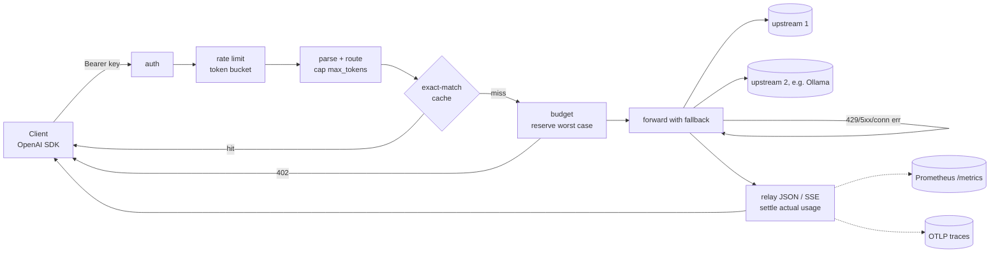

# 🚦 Tollgate

> LLM gateway in Go. Budgets, rate limits and caching enforced before any request leaves.

**An OpenAI-compatible LLM gateway in Go that adds 0.13 ms p50 / 0.43 ms p99 and cut cost 91% on a replayed 1000-request workload, while enforcing every budget before a byte leaves.**

<!-- readme-header -->
[](https://github.com/sathwikbairaboina2/tollgate/actions/workflows/ci.yml)   

| Measured | Source |
|---|---|
| **+0.129 ms p50** | `bench/results/latest.json` |
| **91.5% cost cut** | `bench/results/latest.json` |

> The model proposes, the deterministic core disposes. Keys, money and limits are decided by
> code with tests, before any upstream sees the request.

## What it does
- `/v1/chat/completions`, streaming (SSE) and non-streaming, OpenAI wire format in and out
- Routes a public model name to an ordered list of upstreams (OpenAI, Groq, vLLM, Ollama, ...) and falls back on 429, 5xx and transport errors
- Per-key **budgets** in tokens and USD, enforced by worst-case reservation (`402 budget_exceeded`)
- Per-key **token-bucket rate limits** (`429` + `Retry-After`)
- A per-key **output cap**: `max_tokens` is rewritten so the worst case is always known
- A per-key **exact-match cache** (hits cost nothing, still rate-limited)
- **OpenTelemetry** spans using GenAI semantic conventions, and **Prometheus** metrics at `/metrics`

## Architecture


## Limits and the tests that prove them
| Limit | Enforced | Test |
|---|---|---|
| Token budget | before forwarding | `TestBudget_RejectsBeforeForwardingWhenReservationExceedsTokens` |
| USD budget (worst-priced target) | before forwarding | `TestBudget_EnforcesUSD`, `TestBudget_ReservesAgainstMostExpensiveTarget` |
| No overspend under concurrency | ledger lock | `TestBudget_ConcurrentRequestsNeverOverspend` |
| Rate limit | before reading the body | `TestRateLimit_RejectsBeyondBurstWithRetryAfter` |
| Output cap | request rewrite | `TestChat_CapsMaxTokens` |
| Fallback policy | per attempt | `TestFallback_*` |

## Benchmark (real run)
Tollgate bench: 1000 requests x 5 rounds, upstream delay 0s, go1.25.14 linux/amd64, 24 CPUs

| metric | p50 | p99 |
|---|---|---|
| direct to upstream (ms) | 0.141 | 0.321 |
| through Tollgate (ms) | 0.270 | 0.749 |
| **added by Tollgate (ms)** | **0.129** | **0.428** |

cache: 897/1000 hits (89.7%), cost $0.107102 -> $0.009152 (91.5% saved)

Method: `bench/` replays `bench/workload.jsonl` (1000 requests, a **synthetic** Zipf-distributed
support-FAQ workload generated by `bench/genworkload` with seed 42; not production traffic) against an
in-process fake upstream with 0s artificial delay. Direct and gateway calls are interleaved
over 5 rounds. Cost uses gpt-4o-mini list prices. Hardware: 24 CPUs, go1.25.14
in Docker (`golang:1.25`) on the author's Windows 11 laptop. Raw results: `bench/results/latest.json`.

## Quickstart
Prerequisite: Docker. No local Go is needed.

Full demo stack (gateway on host :5450, fake upstream, Prometheus on :5451, Jaeger on :5452; the gateway listens on :8787 inside its container):
```sh
docker compose up -d --build
curl http://localhost:5450/v1/chat/completions -H "Authorization: Bearer local-demo" \
  -H "Content-Type: application/json" -d '{"model":"chat-default","messages":[{"role":"user","content":"hi"}]}'
docker compose --profile bench run --rm bench   # re-measure; writes bench/results/latest.json
```
Key `local-tiny` has a 1,000-token budget and 1 req/s, to show `402` and `429`. Route `local-ollama`
targets `gemma4:12b` on the host's Ollama (any pulled model works; edit `deploy/compose.tollgate.yaml`) and falls
back to the fake upstream when Ollama is not running.

Demo: with the stack up, `make demo` (or `sh scripts/demo.sh`) walks through 200, cache hit, `402`, `429`, the
Ollama route and the metrics. Recorded output: `bench/results/demo-2026-10-04.txt`.

Individual targets:
```sh
make test      # go test -race ./... in golang:1.25
make bench     # regenerates bench/results/latest.json
make build     # docker image tollgate:dev
TOLLGATE_DEMO_KEY=local-demo make run   # serves on host :5450 (container :8787) using config.example.yaml
```
Without make (PowerShell): `powershell -NoProfile -File scripts/go.ps1 test -race ./...`

Call it with any OpenAI client:
```sh
curl http://localhost:5450/v1/chat/completions \
  -H "Authorization: Bearer local-demo" -H "Content-Type: application/json" \
  -d '{"model":"chat-default","messages":[{"role":"user","content":"hi"}]}'
```
With Ollama on the host, set `base_url: http://host.docker.internal:11434/v1` in the mounted config.

## Configuration
See `config.example.yaml`. Secrets are never in YAML: `api_key_env` and `key_env` name env vars.

## Decisions (what I gave up)
- [0001 Reservation budgets](docs/adr/0001-reservation-budgets.md): conservative byte bound, lower utilisation near the limit
- [0002 In-memory state](docs/adr/0002-in-memory-state.md): one replica only, spend resets on restart
- [0003 Fallback policy](docs/adr/0003-fallback-policy.md): no mid-stream failover
- [0004 Exact-match cache](docs/adr/0004-exact-match-cache.md): no semantic, streaming or cross-key hits
- [0005 Error statuses](docs/adr/0005-error-statuses.md): 402 instead of OpenAI's 429 for quota
- [0006 GenAI attribute keys](docs/adr/0006-genai-attribute-keys.md): hand-pinned keys
- [0007 OpenAI wire format only](docs/adr/0007-openai-wire-format-only.md): no native Anthropic yet
- [0008 Docker-only toolchain](docs/adr/0008-docker-only-toolchain.md): slower edit-test loop
- [0009 Host ports](docs/adr/0009-host-ports.md): demo uses 5450-5452, not the usual ports

Developer docs: [docs/DEVDOCS.md](docs/DEVDOCS.md).

## Status
v0.1. Roadmap: Anthropic adapter, semantic cache, Redis-backed ledger, budget periods, Helm chart.
