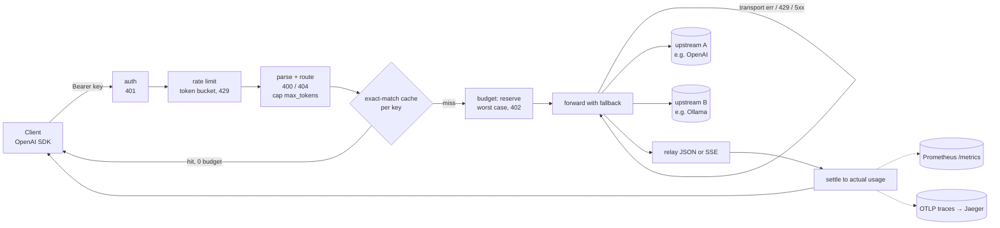

# Tollgate developer guide

## 1. What it is

Tollgate is an LLM gateway written in Go. It speaks the OpenAI chat-completions format.
It sits between your apps and model providers such as OpenAI, Groq, vLLM or Ollama.

It owns the keys, the money and the limits. Every budget, rate limit and output cap is checked
before a request leaves for an upstream. The model proposes; the gateway decides.

**Headline (measured):** Tollgate adds **0.129 ms at p50 and 0.428 ms at p99**. Its cache cut cost by **91.5%**
(897 of 1,000 requests were cache hits, $0.1071 down to $0.0092).
Source: `bench/results/latest.json`. The run used a synthetic Zipf workload of 1,000 requests × 5 rounds.
The fake upstream had 0 s delay. It ran in Docker on 24 CPUs with go1.25.14. This is not production traffic.

## 2. Quickstart (5 minutes)

You need Docker. You do not need Go on the host.

```sh
cd tollgate
docker compose up -d --build                      # gateway :5450, Prometheus :5451, Jaeger :5452
curl http://localhost:5450/healthz                # -> ok
curl http://localhost:5450/v1/chat/completions \
  -H "Authorization: Bearer local-demo" -H "Content-Type: application/json" \
  -d '{"model":"chat-default","messages":[{"role":"user","content":"hi"}]}'
sh scripts/demo.sh                                # 200, cache hit, 402, 429, Ollama route, metrics
docker compose down
```

Open http://localhost:5451 for Prometheus and http://localhost:5452 for Jaeger traces.

The demo has two keys. `local-demo` has a large budget. `local-tiny` has 1,000 tokens and 1 request/s.
It shows `402` and `429`. The route `local-ollama` calls `gemma4:12b` on the host's Ollama.
If Ollama is down, it falls back to the fake upstream.
The tiny key's budget lives in memory. Restart the stack before you run the demo again.
A recorded run is in `bench/results/demo-2026-10-04.txt`.

## 3. Architecture

A request passes these steps in order. Anything that can say "no" runs before the upstream call.



How the pieces work:
- **Budget.** Before forwarding, the gateway reserves the worst case. That is a prompt bound plus `max_tokens`, priced at the most expensive target. If the reservation does not fit, it answers 402. Afterwards it settles to the real usage.
- **Output cap.** If `max_tokens` is missing or above the key's cap, the gateway rewrites it to the cap. So the worst case is always bounded.
- **Fallback.** Transport errors, 429 and 5xx move on to the next target. Other 4xx pass through. Streams can only fall back before the first byte.
- **Cache.** Only non-streaming 200 responses are cached. The key is a SHA-256 of the key id, the route and the canonical body. A hit costs no budget but still uses a rate-limit token.
- **Telemetry.** Each request gets one span with GenAI attributes such as `gen_ai.usage.input_tokens`. Spans are exported over OTLP/HTTP when `OTEL_EXPORTER_OTLP_ENDPOINT` is set.

## 4. Project layout

| Path | What it holds |
|---|---|
| `cmd/tollgate` | The gateway binary: flags, config, tracing, HTTP server, graceful shutdown |
| `cmd/fakeupstream` | A deterministic OpenAI-compatible server for the demo and bench |
| `internal/config` | YAML loading, defaults, secrets from env vars, validation |
| `internal/ratelimit` | Token bucket with an injectable clock |
| `internal/budget` | Ledger with `Reserve`, `Settle` and `Release`, plus `Cost` |
| `internal/cache` | `Cache` interface, LRU+TTL store, request key |
| `internal/provider` | HTTP client for one OpenAI-compatible upstream |
| `internal/telemetry` | Prometheus collectors and the OTLP tracer |
| `internal/gateway` | The request pipeline (`chat.go`, `stream.go`, `request.go`) and its tests |
| `internal/fakeupstream` | Shared fake handler with usage derived from the prompt |
| `bench/` | Workload generator, replay harness, results (`bench/results/`) |
| `deploy/` | Compose gateway config and Prometheus scrape config |
| `scripts/` | `go.ps1` / `go.sh` (Go in Docker), `demo.sh` (live demo checks) |
| `docs/adr/` | Architecture decision records 0001-0009 |
| `docs/superpowers/` | Spec and plans |

## 5. Run, test and benchmark

All Go commands run in the `golang:1.25` container.

| Task | Make | PowerShell |
|---|---|---|
| Unit tests (race) | `make test` | `powershell -NoProfile -File scripts/go.ps1 test -race ./...` |
| Vet | `make vet` | `powershell -NoProfile -File scripts/go.ps1 vet ./...` |
| Format check | `make fmt-check` | `docker run --rm -v "${PWD}:/src" -w /src golang:1.25 gofmt -l .` |
| Build image | `make build` | `docker build -t tollgate:dev .` |
| Run with example config | `TOLLGATE_DEMO_KEY=local-demo make run` | — |
| Benchmark | `make bench` | `docker compose --profile bench run --rm bench` |
| Bench smoke (no file written) | — | `powershell -NoProfile -File scripts/go.ps1 run ./bench -rounds 1` |
| Live demo checks | `make demo` | `sh scripts/demo.sh` (Git Bash) |

Live Ollama test (opt-in; it skips when the env var is unset):

```powershell
docker run --rm -e TOLLGATE_IT_OLLAMA_URL=http://host.docker.internal:11434/v1 `
  -v "${PWD}:/src" -v tollgate-gomod:/go/pkg/mod -w /src golang:1.25 `
  go test -run Ollama -v -count=1 ./internal/gateway
```

`TOLLGATE_IT_OLLAMA_MODEL` picks the model (default `gemma4:12b`).
Change ports with `TOLLGATE_PORT`, `TOLLGATE_PROM_PORT` and `TOLLGATE_JAEGER_PORT`.

## 6. Key decisions and what they gave up

| ADR | Decision | Gave up |
|---|---|---|
| [0001](adr/0001-reservation-budgets.md) | Reserve the worst case before forwarding | A byte-based prompt bound is conservative, so keys near their limit get refused early |
| [0002](adr/0002-in-memory-state.md) | Ledgers, buckets and cache live in memory | One replica only; spend resets on restart |
| [0003](adr/0003-fallback-policy.md) | Fall back on transport errors, 429 and 5xx, before the first byte | No mid-stream failover |
| [0004](adr/0004-exact-match-cache.md) | Exact-match cache per key, non-streaming only | No semantic hits, no streaming hits, no sharing across keys |
| [0005](adr/0005-error-statuses.md) | 402 for budgets, 429 + `Retry-After` for rate limits | Differs from OpenAI, which uses 429 for quota |
| [0006](adr/0006-genai-attribute-keys.md) | GenAI attribute keys as string constants | Keys are pinned by hand, not by the semconv package |
| [0007](adr/0007-openai-wire-format-only.md) | OpenAI wire format only | No native Anthropic API yet |
| [0008](adr/0008-docker-only-toolchain.md) | Go runs in Docker | Slower edit-test loop |
| [0009](adr/0009-host-ports.md) | Demo on host ports 5450-5452 | Ports differ from the usual 8787/9090/16686 |

## 7. Known limits and what's left

Known limits:
- Settlement uses the usage the upstream reports. If an upstream ignores `max_tokens`, the spend can go slightly past the budget.
- Streams without a usage chunk are charged by content bytes, capped at `max_tokens`. Reasoning text is not counted there.
- Thinking models (such as gemma4 on Ollama) may spend the whole small `max_tokens` on reasoning and return empty `content`.
- Budgets never reset and do not survive a restart.
- The benchmark is synthetic, with a zero-delay fake upstream. It measures gateway overhead, not provider latency.
- Jaeger traces were checked through its API and HTTP status, not by eye in the UI.

Left for the user:
- Create a remote, push, and turn on GitHub CI.
- Publish the image to a registry.
- Run against paid providers and measure real traffic.

Stretch work from the spec: Anthropic adapter, semantic cache, Redis budget store, budget reset periods,
Helm chart, streaming cache replay, tool-call-aware token counting, admin API, per-route rate limits.
