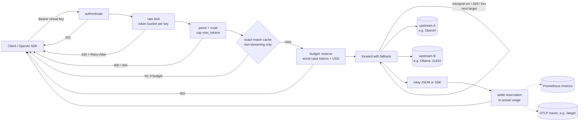
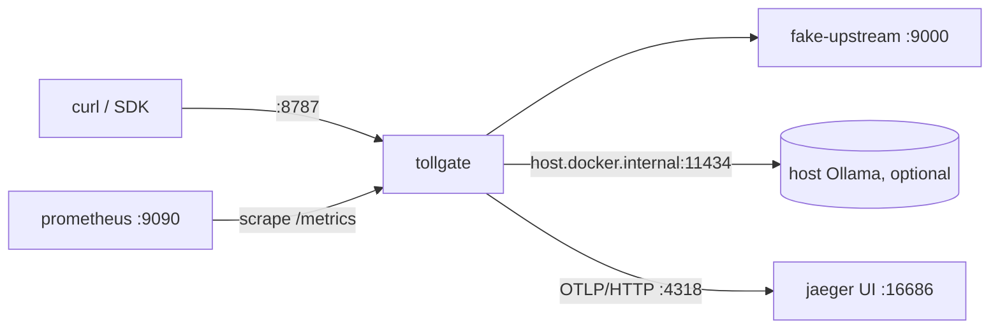

# Tollgate developer documentation

Status: v0.1 built and verified (2026-10-03); not yet committed. Every number here comes
from a real run. Any number not yet measured says so.

## Overview & goals

Tollgate is an OpenAI-compatible LLM gateway written in Go. Clients point any OpenAI SDK at it.
Tollgate decides whether each request may go out at all (key, budget, rate limit, output cap). It
then routes the request to an ordered list of upstreams with fallback, serves repeats from a cache,
and records what was spent.

Thesis: **the model proposes, the deterministic core disposes.** Money and limits are owned by
plain code with a test per declared limit, and are enforced *before* a byte leaves the gateway.

Goals for v0.1:
- `POST /v1/chat/completions`, streaming (SSE) and non-streaming, in OpenAI wire format
- Provider routing with fallback across any OpenAI-compatible upstream (OpenAI, Groq, vLLM, Ollama)
- Per-key budgets (tokens and USD) enforced by worst-case reservation
- Per-key token-bucket rate limits
- Exact-match response cache behind an interface
- OpenTelemetry spans using GenAI semantic conventions, and Prometheus metrics
- A benchmark harness reporting the added p50/p99 latency and the cache savings, with real numbers only
- Everything runs in Docker: tests, build, demo stack and bench

Non-goals for v0.1: Anthropic-native adapter, semantic cache, multi-replica shared state, budget
reset periods, admin API, Helm chart.

## Architecture

Demo stack (`docker-compose.yml`):

## Components & responsibilities

| Package | Responsibility |
|---|---|
| `cmd/tollgate` | Binary: flags, config load, tracing setup, HTTP server on `:8787`, graceful shutdown |
| `cmd/fakeupstream` | Deterministic OpenAI-compatible server for the demo and bench |
| `internal/config` | YAML decode (unknown fields rejected), defaults, secret resolution from env, validation |
| `internal/ratelimit` | Token bucket with an injectable clock, safe for concurrent use |
| `internal/budget` | Ledger with `Reserve`/`Settle`/`Release`, plus the `Cost` pricing function |
| `internal/cache` | `Cache` interface, LRU+TTL implementation, canonical request `Key` |
| `internal/provider` | HTTP client for an OpenAI-compatible upstream (`/chat/completions`), header timeout |
| `internal/telemetry` | Prometheus collectors on an injected registry; OTLP/HTTP tracer provider or no-op |
| `internal/gateway` | The request pipeline: auth, limits, routing, fallback, relay, settle, spans, metrics |
| `internal/fakeupstream` | Shared fake handler with deterministic usage from the prompt |
| `bench/` | Workload generator and replay harness; writes `bench/results/latest.json` |

## Data model / config schema

All state is in memory (ADR 0002). Per key:
- `Ledger`: `LimitTokens`, `SpentTokens`, `HeldTokens`, `LimitUSD`, `SpentUSD`, `HeldUSD`
- `Bucket`: `rate`, `burst`, `tokens`, `last`
- Cache entry: `key (sha256 hex) -> response body`, with expiry

Config (YAML):

| Field | Type | Default | Notes |
|---|---|---|---|
| `listen` | string | `:8787` | |
| `providers[].name` | string | required | unique |
| `providers[].base_url` | string | required | e.g. `http://localhost:11434/v1` |
| `providers[].api_key_env` | string | none | env var holding the upstream key; must be non-empty if set |
| `providers[].timeout` | duration | `60s` | time to response headers, not the whole stream |
| `routes[].model` | string | required | public model name clients send |
| `routes[].targets[]` | `{provider, model}` | at least one | tried in order |
| `pricing.<model>` | `{input, output}` | none | USD per 1M tokens; required for every routed model if any key has a USD budget |
| `keys[].id` | string | required | label used in metrics and spans |
| `keys[].key_env` / `keys[].key` | string | one required | `key` literal is for tests and local demos only |
| `keys[].budget` | `{usd, tokens}` | 0 = unlimited | lifetime of the process |
| `keys[].rate_limit` | `{requests_per_second, burst}` | 0 = unlimited | |
| `keys[].max_output_tokens` | int | `4096` | output cap that bounds the worst case |
| `cache.enabled` | bool | `false` | |
| `cache.max_entries` | int | `10000` | |
| `cache.ttl` | duration | `10m` | |

## Public API / CLI surface

HTTP:

| Route | Behaviour |
|---|---|
| `POST /v1/chat/completions` | OpenAI chat completions; `stream: true` returns SSE |
| `GET /healthz` | `ok` |
| `GET /metrics` | Prometheus text format |

Response headers: `X-Tollgate-Provider` (provider that answered), `X-Tollgate-Attempts`, and
`X-Tollgate-Cache: hit|miss` (when the cache is enabled).

Errors use the shape `{"error":{"message","type","code"}}`:

| Condition | Status | `code` |
|---|---|---|
| missing or unknown key | 401 | `invalid_api_key` |
| malformed request | 400 | `invalid_request` |
| no route for model | 404 | `model_not_found` |
| rate limited | 429 + `Retry-After` | `rate_limited` |
| budget would be exceeded | 402 | `budget_exceeded` |
| every target failed | 502 | `upstream_unavailable` |
| upstream 4xx (non-429) | passed through | upstream body |

CLI:
- `tollgate -config <path>` (default `tollgate.yaml`)
- `fakeupstream -addr :9000 -delay 0s`
- `go run ./bench -workload bench/workload.jsonl -rounds 5 -upstream-delay 0s -out bench/results/latest.json`
- `go run ./bench/genworkload -n 1000 -seed 42 -out bench/workload.jsonl`

Environment: `OTEL_EXPORTER_OTLP_ENDPOINT` (enables trace export), plus whatever env vars the config names.

Metrics: `tollgate_requests_total{key,model,outcome}`, `tollgate_tokens_total{key,model,direction}`,
`tollgate_cost_usd_total{key,model}`, `tollgate_cache_hits_total{key}`,
`tollgate_fallbacks_total{provider,reason}`, `tollgate_rejections_total{key,reason}`,
`tollgate_upstream_duration_seconds{provider}`.

Span (one per request, named `chat <model>`): `gen_ai.operation.name`, `gen_ai.provider.name`,
`gen_ai.request.model`, `gen_ai.request.max_tokens`, `gen_ai.response.model`,
`gen_ai.usage.input_tokens`, `gen_ai.usage.output_tokens`, `gen_ai.response.finish_reasons`,
`tollgate.key_id`, `tollgate.cache_hit`, `tollgate.attempts`, `tollgate.cost_usd`.

## Key flows

**Request lifecycle (non-streaming)**
1. Authenticate the `Authorization: Bearer` token against the virtual keys, or return 401.
2. Take a rate-limit token, or return 429 with `Retry-After`. This happens before the body is read.
3. Read the body (10 MiB max), parse it, and require `model` and non-empty `messages`. Find the route, or return 404.
4. Cap `max_tokens`/`max_completion_tokens` to the key's `max_output_tokens`, injecting a value if absent.
5. If the cache is on: compute the key from (route, body minus `stream`/`stream_options`/`user`). On a hit, return it with no budget spent.
6. Reserve `promptBound + maxTokens` tokens and that amount priced at the most expensive target, or return 402.
7. For each target: POST with the model rewritten. On a transport error, 429 or 5xx, try the next target. On another non-200, release the reservation and pass the response through.
8. On 200: read the body and settle the reservation to `usage` (or to the worst case if usage is missing). Store it in the cache, then respond.
9. If every target failed: release the reservation and return 502.

**Streaming**
Steps 1–7 are the same, except the cache is skipped and the upstream body gets
`stream_options.include_usage = true`. Fallback is decided on the upstream status line, before the
first byte reaches the client. SSE lines are relayed as they arrive, with a flush per event. If the
client did not ask for usage, the usage-only chunk is dropped. After the stream ends, or the client
disconnects, the reservation is settled to the reported usage. Without reported usage, it is settled
to the prompt bound plus observed content bytes, capped at `max_tokens`.

## Limits & invariants and how tests enforce them

| Invariant | Test (package `internal/gateway` unless noted) |
|---|---|
| Over-budget request never reaches an upstream (tokens) | `TestBudget_RejectsBeforeForwardingWhenReservationExceedsTokens` |
| Over-budget request never reaches an upstream (USD) | `TestBudget_EnforcesUSD` |
| Reservation priced at the most expensive fallback target | `TestBudget_ReservesAgainstMostExpensiveTarget` |
| Settled spend counts against later requests | `TestBudget_RejectsOnceSettledSpendLeavesNoRoom` |
| Concurrent requests never overspend (20 racing for room for 3) | `TestBudget_ConcurrentRequestsNeverOverspend` |
| Ledger arithmetic, boundaries, idempotent settle | `internal/budget` `TestLedger_*` |
| Rate limit: burst honoured, then 429 + Retry-After, refill on clock | `TestRateLimit_RejectsBeyondBurstWithRetryAfter`, `TestRateLimit_RetryAfterRoundsUp` |
| Bucket exact under concurrency | `internal/ratelimit` `TestBucket_ConcurrentCallersGetExactlyBurst` |
| Output cap always applied | `TestChat_CapsMaxTokens`, `TestCapMaxTokens` |
| Missing usage never charges zero | `TestChat_ChargesWorstCaseWhenUsageMissing`, `TestStream_ChargesObservedBytesWhenUsageMissing` |
| Fallback on 5xx/429/transport only | `TestFallback_OnRetryableFailures`, `TestFallback_OnTransportError`, `TestFallback_NotOn4xx` |
| Total failure releases the reservation | `TestFallback_AllFail502ReleasesReservation` |
| Cache hit spends nothing but is rate limited | `TestCache_HitSkipsUpstreamAndBudget`, `TestCache_HitsStillCountAgainstRateLimit` |
| Unpriced model + USD budget refuses to start | `internal/config` `TestParse_Rejects/unpriced_model_with_usd_budget` |
| Auth before anything else | `TestChat_RejectsMissingOrUnknownKey` (upstream hits = 0) |

## Local dev setup & exact commands

Prerequisite: Docker Desktop running. Go is **not** installed on the host (ADR 0008).

| Task | PowerShell | Make |
|---|---|---|
| Run all tests with the race detector | `powershell -NoProfile -File scripts/go.ps1 test -race ./...` | `make test` |
| Vet | `powershell -NoProfile -File scripts/go.ps1 vet ./...` | `make vet` |
| Format check | `docker run --rm -v "${PWD}:/src" -w /src golang:1.25 gofmt -l .` | `make fmt-check` |
| Regenerate the workload | `powershell -NoProfile -File scripts/go.ps1 run ./bench/genworkload -out bench/workload.jsonl` | `make workload` |
| Benchmark | `docker compose --profile bench run --rm bench` | `make bench` |
| Image | `docker build -t tollgate:dev .` | `make build` |
| Demo stack | `docker compose up -d --build`, then `docker compose down` | |

Git Bash: `sh scripts/go.sh test -race ./...`. Ports: 8787 (gateway), 9090 (Prometheus), 16686 (Jaeger UI).
Demo keys in compose: `local-demo` (generous) and `local-tiny` (2,000 tokens, 1 req/s).

## Testing strategy

- TDD per task. Each limit gets a failing test before its implementation lands (see the plan).
- Every upstream is an `httptest.Server`. No test touches the network or Ollama.
- Time-dependent logic (bucket refill, cache TTL) uses an injected clock, never `time.Sleep`.
- Concurrency invariants (ledger, bucket, gateway budget) run under `go test -race`.
- Telemetry is asserted directly: an in-memory `tracetest.SpanRecorder` for spans, and the `/metrics` body for counters.
- Config examples (`config.example.yaml`, `deploy/compose.tollgate.yaml`) are parsed in tests so they cannot rot.
- CI (GitHub Actions): gofmt, vet, race tests, a one-round bench smoke run, and a Docker build.

## Benchmarks/metrics plan

Method: `bench/` replays `bench/workload.jsonl`, 1,000 synthetic requests with Zipf-distributed
repeats over 120 support-FAQ prompts (seed 42). The workload is labelled synthetic, not production
traffic. The fake upstream runs in-process with deterministic usage.
- **Latency:** direct-to-upstream and through-gateway calls are interleaved for the same request,
  cache off, 5 rounds. Reported: p50 and p99 of each, plus the added amount.
- **Cost:** one replay with the cache on. Cost without the cache prices every response at
  gpt-4o-mini list prices. Cost with the cache prices only misses. Reported: hit rate and % saved.

Targets (to verify, not results):
- Added latency: p50 < 1 ms and p99 < 5 ms on a laptop, against a zero-delay fake upstream.
- Cache: report whatever the workload's repeat rate gives. The savings follow from the workload and are not a property of the code.

Results (measured 2026-10-03T09:49:43Z via `docker compose --profile bench run --rm bench`, go1.25.14
linux/amd64 in Docker, 24 CPUs, 1,000 requests x 5 rounds, 0 s upstream delay; raw data in
[`bench/results/latest.json`](../bench/results/latest.json)):

| | p50 (ms) | p99 (ms) |
|---|---|---|
| direct to upstream | 0.141 | 0.321 |
| through Tollgate | 0.270 | 0.749 |
| **added by Tollgate** | **0.129** | **0.428** |

Cache: 897/1000 hits (89.7%). Cost $0.107102 without the cache, $0.009152 with it (91.5% saved, at
gpt-4o-mini prices on the synthetic workload). Two earlier `go run` replays gave an added
0.119/0.387 ms and 0.118/0.447 ms (p50/p99). Both latency targets above are met.

Tests: `go test -race ./...` passes in all 9 packages with tests (70 top-level tests, 96 including subtests).

## Milestones

v0.1 (plan: `docs/superpowers/plans/2026-10-03-tollgate.md`):
1. Scaffold module and dockerised toolchain
2. Config loading and validation
3. Token-bucket rate limiter
4. Reservation-based budget ledger
5. Exact-match LRU cache
6. OpenAI-compatible provider client
7. Prometheus metrics and OTLP tracing setup
8. Request parsing, output cap, prompt bound
9. Non-streaming proxy with usage settlement and spans
10. Budget enforcement before forwarding
11. Rate-limit enforcement
12. Provider fallback
13. Cache integration
14. SSE streaming and streamed usage settlement
15. Server binary, example config, Docker image
16. Deterministic workload generator
17. Benchmark harness
18. Fake upstream binary and docker-compose demo stack (Prometheus, Jaeger)
19. README with measured numbers
20. CI workflow
21. Handoff

Stretch (after v0.1):
- Anthropic Messages adapter behind the provider boundary
- Semantic cache (embeddings) implementing `cache.Cache`
- Redis-backed ledger and buckets (atomic Lua reserve/settle) for multiple replicas
- Budget reset periods (daily/monthly) and an admin API to read usage
- Streaming cache replay
- Per-route rate limits, circuit breakers, retries with backoff
- Helm chart and a published container image
- Evalgate (sibling project) gating this repo's CI

## Decisions

- [ADR 0001: Reservation budgets](adr/0001-reservation-budgets.md)
- [ADR 0002: In-memory state](adr/0002-in-memory-state.md)
- [ADR 0003: Fallback policy](adr/0003-fallback-policy.md)
- [ADR 0004: Exact-match cache](adr/0004-exact-match-cache.md)
- [ADR 0005: Error statuses](adr/0005-error-statuses.md)
- [ADR 0006: GenAI attribute keys](adr/0006-genai-attribute-keys.md)
- [ADR 0007: OpenAI wire format only](adr/0007-openai-wire-format-only.md)
- [ADR 0008: Docker-only toolchain](adr/0008-docker-only-toolchain.md)

## Open questions

- Should the budget period be calendar-based (monthly) by default once persistence exists?
- Is 402 the right status for exhausted budgets with common SDKs, or should there be an opt-in to OpenAI's `429 insufficient_quota`?
- Image inputs: the byte bound over base64 image payloads over-reserves heavily. Is a per-image fixed token estimate acceptable?
- Should cache hits be opt-in per request (a header) rather than a global switch, given sampling semantics?
- Publish the container to GHCR from CI once the repo is public?
