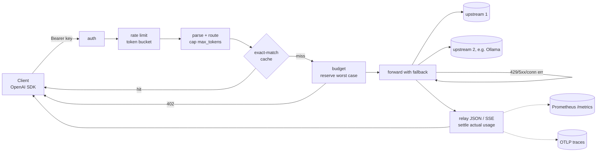

# Tollgate v0.1 Implementation Plan

> **For agentic workers:** REQUIRED SUB-SKILL: Use superpowers:subagent-driven-development (recommended) or superpowers:executing-plans to implement this plan task-by-task. Steps use checkbox (`- [ ]`) syntax for tracking.

**Goal:** Ship a demoable OpenAI-compatible LLM gateway in Go that enforces per-key budgets, rate limits, output caps and provider fallback before forwarding, with an exact-match cache, GenAI OTel spans, Prometheus metrics, and a benchmark whose real numbers go in the README.

**Architecture:** One `net/http` server. The handler runs a fixed pipeline: authenticate → rate limit → parse → route → cap `max_tokens` → cache lookup → reserve budget → forward with fallback → relay (JSON or SSE) → settle usage. All state lives in memory. Each concern is its own small package under `internal/`, and `internal/gateway` composes them.

**Tech Stack:** Go 1.25 (run only through Docker image `golang:1.25`), `gopkg.in/yaml.v3`, `github.com/prometheus/client_golang`, `go.opentelemetry.io/otel` (+ `sdk`, `trace`, `exporters/otlp/otlptrace/otlptracehttp`). Tests use only `net/http/httptest` fakes.

**Spec:** `docs/superpowers/specs/2026-10-03-tollgate.md`. Decisions: `docs/adr/0001`–`0008`. Developer docs: `docs/DEVDOCS.md`.

**Status at handoff:** Planning only. Spec, ADRs, DEVDOCS and this plan exist uncommitted on `main` (no commits yet). **No code exists yet; every task below is still to do.**

## Global Constraints

- Repo root: `C:\Users\sathwik\projects\taskarinchu\tollgate`. Never touch sibling directories under `taskarinchu/`.
- Go module path: `github.com/sathwikbairaboina2/tollgate`. Go directive: `go 1.25`.
- **Go is not installed on the host and must not be installed.** Every `go` command runs through `scripts/go.ps1` (PowerShell) or `scripts/go.sh` (Git Bash), created in Task 1. They wrap:
  `docker run --rm -v "<repo>:/src" -v tollgate-gomod:/go/pkg/mod -v tollgate-gobuild:/root/.cache/go-build -w /src golang:1.25 go <args>`.
  Docker Desktop must be running (`docker version` succeeds). Verified on 2026-10-03: `golang:1.25` → `go1.25.14 linux/amd64`.
- In this plan, `GO <args>` means the PowerShell command `powershell -NoProfile -File scripts/go.ps1 <args>`, run from the repo root. From Git Bash, use `sh scripts/go.sh <args>`.
- Tests never touch the network or Ollama, except module download through `go mod tidy`. Every upstream is an `httptest.Server`.
- If you run the server locally, use port **8787**.
- No secrets in files. Upstream API keys and virtual keys come from env vars named in the config (`api_key_env`, `key_env`). A literal `key:` is allowed only in tests and bench code.
- Error body shape is always `{"error":{"message":string,"type":string,"code":string}}`. Statuses: 401 `invalid_api_key`, 400 `invalid_request`, 404 `model_not_found`, 429 `rate_limited` (+ `Retry-After`), 402 `budget_exceeded`, 502 `upstream_unavailable`. Non-retryable upstream statuses pass through unchanged.
- Response headers set by the gateway: `X-Tollgate-Provider`, `X-Tollgate-Attempts`, and `X-Tollgate-Cache: hit|miss` (the cache header only when the cache is enabled).
- Never invent benchmark numbers. The README quotes `bench/results/latest.json` produced by a real run.
- Commits: **do not run `git commit`**. Commit authorization is pending with the user (an attempted commit was denied on 2026-10-03). Keep the task boundaries anyway. Each task's commit subject is listed so the user can commit later, one commit per task. Once authorized, each message ends with a blank line, then `Co-Authored-By: Claude Sonnet 5.5 <noreply@anthropic.com>`. Never squash, amend, backdate or push. Only edit files inside the repo.
- Everything runs in Docker (user rule). The demo stack (gateway, fake upstream, Prometheus, Jaeger) is `docker-compose.yml` (Task 18). Tollgate uses no AWS, so it has no LocalStack.
- Style: `gofmt` clean, small files, doc comments on exported identifiers, no comments that restate code.

## Review Focus

1. **Client disconnect mid-stream.** The gateway must stop reading upstream, close the body and still settle the reservation (never leak `held`). This is covered by the settle-after-loop structure in `relayStream`. Reviewers should check that `defer resp.Body.Close()` runs and that `settle` runs after a write error.
2. **Upstream 200 with no `usage` field.** The gateway must charge the worst case (non-stream) or observed bytes (stream), never zero. Tests: `TestChat_ChargesWorstCaseWhenUsageMissing` (Task 9) and `TestStream_ChargesObservedBytesWhenUsageMissing` (Task 14).
3. **Both `max_tokens` and `max_completion_tokens` present, or either one huge.** Both fields must be rewritten to the same capped value. Tests: `TestCapMaxTokens` (Task 8) and `TestChat_CapsMaxTokens` (Task 9).
4. **Concurrent requests racing for the last of a budget.** Reservations must serialise, so admitted requests never exceed the budget. Test: `TestBudget_ConcurrentRequestsNeverOverspend` (Task 10), run under `-race`.
5. **Every upstream fails, or the upstream rejects with a 4xx.** The reservation must be released (`held == 0`, `spent == 0`), and a 4xx must not trigger fallback. Tests: `TestFallback_AllFail502ReleasesReservation` and `TestFallback_NotOn4xx` (Task 12).

## File Structure

```
tollgate/
  go.mod, go.sum                       module github.com/sathwikbairaboina2/tollgate
  .gitignore, .gitattributes, .dockerignore
  Makefile                             docker-wrapped targets
  Dockerfile                           multi-stage, distroless, port 8787
  config.example.yaml                  Ollama demo config (secrets via env)
  scripts/go.ps1, scripts/go.sh        run `go` inside golang:1.25
  cmd/tollgate/main.go                 binary: flags, server, graceful shutdown
  cmd/fakeupstream/main.go             deterministic fake OpenAI server (demo + bench)
  internal/fakeupstream/               shared fake handler (fakeupstream.go, fakeupstream_test.go)
  docker-compose.yml                   gateway + fake upstream + Prometheus + Jaeger (+ bench profile)
  deploy/compose.tollgate.yaml         gateway config used by compose
  deploy/prometheus.yml                scrape config
  internal/config/                     YAML load + validate (config.go, config_test.go)
  internal/ratelimit/                  token bucket (bucket.go, bucket_test.go)
  internal/budget/                     reservation ledger + Cost (ledger.go, ledger_test.go)
  internal/cache/                      Cache interface, LRU, Key (cache.go, cache_test.go)
  internal/provider/                   OpenAI-compatible upstream client (provider.go, provider_test.go)
  internal/telemetry/                  Prometheus metrics, OTLP setup (metrics.go, tracing.go, *_test.go)
  internal/gateway/
    gateway.go      Gateway, Options, New, Handler, Usage
    attrs.go        span attribute keys
    errors.go       writeError
    request.go      chatRequest, parseRequest, capMaxTokens, bodyFor, promptTokenBound
    chat.go         handleChat pipeline + steps (authenticate, allow, serveCached, reserve, forward, relay, relayJSON, settle)
    stream.go       relayStream
    request_test.go, helpers_test.go, gateway_test.go, limits_test.go, fallback_test.go, cache_test.go, stream_test.go
  bench/
    main.go, stats.go, stats_test.go   replay harness
    genworkload/main.go                deterministic workload generator
    workload.jsonl                     generated, committed
    results/latest.json                written by a real bench run, committed
  .github/workflows/ci.yml
  README.md
  docs/ (spec, plan, adr/, DEVDOCS.md, handoff.md)
```

---

### Task 1: Scaffold module and dockerised toolchain

**Files:**
- Create: `go.mod`, `.gitignore`, `.gitattributes`, `.dockerignore`, `scripts/go.ps1`, `scripts/go.sh`, `Makefile`

**Interfaces:** Produces the `GO` command used by every later task.

- [x] **Step 1: Create `go.mod`**

```
module github.com/sathwikbairaboina2/tollgate

go 1.25
```

- [x] **Step 2: Create `.gitignore`, `.gitattributes`, `.dockerignore`**

`.gitignore`:
```
/tollgate
/dist/
*.test
*.out
.env
.env.*
!.env.example
tollgate.yaml
```

`.gitattributes`:
```
* text=auto eol=lf
*.ps1 text eol=crlf
```

`.dockerignore`:
```
.git
docs
bench/results
*.md
```

- [x] **Step 3: Create `scripts/go.ps1`**

```powershell
# Runs the Go toolchain inside Docker so the host needs no Go install.
$root = (Resolve-Path "$PSScriptRoot\..").Path -replace '\\', '/'
docker run --rm -v "${root}:/src" -v tollgate-gomod:/go/pkg/mod -v tollgate-gobuild:/root/.cache/go-build -w /src golang:1.25 go @args
exit $LASTEXITCODE
```

- [x] **Step 4: Create `scripts/go.sh`**

```sh
#!/usr/bin/env sh
# Runs the Go toolchain inside Docker so the host needs no Go install.
set -e
cd "$(dirname "$0")/.."
root="$(pwd -W 2>/dev/null || pwd)"
MSYS_NO_PATHCONV=1 exec docker run --rm -v "$root:/src" -v tollgate-gomod:/go/pkg/mod \
  -v tollgate-gobuild:/root/.cache/go-build -w /src golang:1.25 go "$@"
```

- [x] **Step 5: Create `Makefile`** (recipe lines start with a TAB)

```make
GO_IMAGE ?= golang:1.25
DOCKER_GO = docker run --rm -v "$(CURDIR):/src" -v tollgate-gomod:/go/pkg/mod \
	-v tollgate-gobuild:/root/.cache/go-build -w /src $(GO_IMAGE)

.PHONY: test vet fmt-check tidy bench workload build run

test:
	$(DOCKER_GO) go test -race ./...

vet:
	$(DOCKER_GO) go vet ./...

fmt-check:
	$(DOCKER_GO) sh -c 'test -z "$$(gofmt -l .)" || (gofmt -l . && exit 1)'

tidy:
	$(DOCKER_GO) go mod tidy

workload:
	$(DOCKER_GO) go run ./bench/genworkload -out bench/workload.jsonl

bench:
	$(DOCKER_GO) go run ./bench -workload bench/workload.jsonl -out bench/results/latest.json

build:
	docker build -t tollgate:dev .

run: build
	docker run --rm -p 8787:8787 -e TOLLGATE_DEMO_KEY \
		-v "$(CURDIR)/config.example.yaml:/etc/tollgate/tollgate.yaml:ro" tollgate:dev
```

- [x] **Step 6: Verify the toolchain wrapper**

Run: `GO version`
Expected: `go version go1.25.<n> linux/amd64`

Run: `GO env GOMOD`
Expected: `/src/go.mod`

- [ ] **Step 7: Commit** — `chore: scaffold Go module and dockerised toolchain`

**Acceptance:** Both commands above print the expected output. `git status` shows only the files listed.

---

### Task 2: Config loading and validation

**Files:**
- Create: `internal/config/config.go`, `internal/config/config_test.go`

**Interfaces:**
- Produces:
  - `type Config struct { Listen string; Providers []Provider; Routes []Route; Pricing map[string]Price; Keys []Key; Cache Cache }`
  - `type Provider struct { Name, BaseURL, APIKeyEnv string; Timeout Duration; APIKey string /* resolved, yaml:"-" */ }`
  - `type Route struct { Model string; Targets []Target }`, `type Target struct { Provider, Model string }`
  - `type Price struct { Input, Output float64 }` (USD per 1M tokens)
  - `type Key struct { ID, Key, KeyEnv string; Budget Budget; RateLimit RateLimit; MaxOutputTokens int }`
  - `type Budget struct { USD float64; Tokens int64 }` (0 = unlimited)
  - `type RateLimit struct { RequestsPerSecond float64; Burst int }` (0 rps = unlimited)
  - `type Cache struct { Enabled bool; MaxEntries int; TTL Duration }`
  - `type Duration struct{ time.Duration }`
  - `func Load(path string) (*Config, error)`, `func Parse(data []byte, getenv func(string) string) (*Config, error)`
  - consts `DefaultListen=":8787"`, `DefaultTimeout=60s`, `DefaultMaxOutputTokens=4096`, `DefaultCacheEntries=10000`, `DefaultCacheTTL=10m`

- [x] **Step 1: Write the failing tests** — `internal/config/config_test.go`

```go
package config

import (
	"strings"
	"testing"
	"time"
)

const valid = `
providers:
  - name: openai
    base_url: https://api.openai.com/v1
    api_key_env: OPENAI_API_KEY
  - name: ollama
    base_url: http://localhost:11434/v1
    timeout: 120s
routes:
  - model: chat-default
    targets:
      - { provider: openai, model: gpt-4o-mini }
      - { provider: ollama, model: llama3.2 }
pricing:
  gpt-4o-mini: { input: 0.15, output: 0.60 }
  llama3.2: { input: 0, output: 0 }
keys:
  - id: team-a
    key_env: TEAM_A_KEY
    budget: { usd: 5, tokens: 1000 }
    rate_limit: { requests_per_second: 2, burst: 4 }
    max_output_tokens: 256
cache:
  enabled: true
`

func env(m map[string]string) func(string) string {
	return func(k string) string { return m[k] }
}

var goodEnv = env(map[string]string{"OPENAI_API_KEY": "sk-test", "TEAM_A_KEY": "tg-a"})

func TestParse_Valid(t *testing.T) {
	c, err := Parse([]byte(valid), goodEnv)
	if err != nil {
		t.Fatalf("Parse: %v", err)
	}
	if c.Providers[0].APIKey != "sk-test" {
		t.Errorf("provider key not resolved from env: %q", c.Providers[0].APIKey)
	}
	if c.Keys[0].Key != "tg-a" {
		t.Errorf("virtual key not resolved from env: %q", c.Keys[0].Key)
	}
	if c.Providers[1].Timeout.Duration != 120*time.Second {
		t.Errorf("timeout = %v", c.Providers[1].Timeout.Duration)
	}
	if got := c.Routes[0].Targets[1]; got.Provider != "ollama" || got.Model != "llama3.2" {
		t.Errorf("target = %+v", got)
	}
	if c.Keys[0].Budget.USD != 5 || c.Keys[0].Budget.Tokens != 1000 || c.Keys[0].RateLimit.Burst != 4 {
		t.Errorf("key limits = %+v", c.Keys[0])
	}
}

func TestParse_Defaults(t *testing.T) {
	c, err := Parse([]byte(valid), goodEnv)
	if err != nil {
		t.Fatal(err)
	}
	if c.Listen != DefaultListen {
		t.Errorf("listen = %q", c.Listen)
	}
	if c.Providers[0].Timeout.Duration != DefaultTimeout {
		t.Errorf("default timeout = %v", c.Providers[0].Timeout.Duration)
	}
	if c.Cache.MaxEntries != DefaultCacheEntries || c.Cache.TTL.Duration != DefaultCacheTTL {
		t.Errorf("cache defaults = %+v", c.Cache)
	}
	noCap := strings.Replace(valid, "    max_output_tokens: 256\n", "", 1)
	c, err = Parse([]byte(noCap), goodEnv)
	if err != nil {
		t.Fatal(err)
	}
	if c.Keys[0].MaxOutputTokens != DefaultMaxOutputTokens {
		t.Errorf("default max_output_tokens = %d", c.Keys[0].MaxOutputTokens)
	}
}

func TestParse_Rejects(t *testing.T) {
	cases := map[string]struct {
		yaml    string
		env     func(string) string
		wantErr string
	}{
		"unknown field": {strings.Replace(valid, "cache:", "cahce:", 1), goodEnv, "cahce"},
		"missing provider env": {valid, env(map[string]string{"TEAM_A_KEY": "tg-a"}), "OPENAI_API_KEY"},
		"missing key env": {valid, env(map[string]string{"OPENAI_API_KEY": "x"}), "TEAM_A_KEY"},
		"unknown provider in route": {strings.Replace(valid, "{ provider: ollama,", "{ provider: nope,", 1), goodEnv, `unknown provider "nope"`},
		"unpriced model with usd budget": {strings.Replace(valid, "  llama3.2: { input: 0, output: 0 }\n", "", 1), goodEnv, `"llama3.2" has no pricing`},
		"duplicate key id": {valid + `  - id: team-a
    key: other
`, goodEnv, `duplicate id`},
		"duplicate key value": {valid + `  - id: team-b
    key: tg-a
`, goodEnv, `duplicate key value`},
		"negative budget": {strings.Replace(valid, "usd: 5", "usd: -1", 1), goodEnv, "negative"},
		"bad duration": {strings.Replace(valid, "timeout: 120s", "timeout: soon", 1), goodEnv, "invalid duration"},
		"route without targets": {strings.Replace(valid, "    targets:\n      - { provider: openai, model: gpt-4o-mini }\n      - { provider: ollama, model: llama3.2 }\n", "    targets: []\n", 1), goodEnv, "at least one target"},
	}
	for name, tc := range cases {
		t.Run(name, func(t *testing.T) {
			_, err := Parse([]byte(tc.yaml), tc.env)
			if err == nil {
				t.Fatalf("expected error containing %q, got nil", tc.wantErr)
			}
			if !strings.Contains(err.Error(), tc.wantErr) {
				t.Fatalf("error %q does not contain %q", err, tc.wantErr)
			}
		})
	}
}
```

Note: the "duplicate key" cases append to `valid`, which ends with the `cache:` block, so the appended list item would land under `cache`. To keep the YAML valid, put the extra keys before `cache:`. Use `strings.Replace(valid, "cache:\n", "<extra key block>cache:\n", 1)` in both duplicate cases. The final test file must use that form:

```go
		"duplicate key id": {strings.Replace(valid, "cache:\n", "  - id: team-a\n    key: other\ncache:\n", 1), goodEnv, `duplicate id`},
		"duplicate key value": {strings.Replace(valid, "cache:\n", "  - id: team-b\n    key: tg-a\ncache:\n", 1), goodEnv, `duplicate key value`},
```

- [x] **Step 2: Run the tests to verify they fail**

Run: `GO test ./internal/config/`
Expected: FAIL, compile errors such as `undefined: Parse` and `undefined: DefaultListen`.

- [x] **Step 3: Write the implementation** — `internal/config/config.go`

```go
// Package config loads and validates Tollgate's YAML configuration.
package config

import (
	"bytes"
	"errors"
	"fmt"
	"os"
	"time"

	"gopkg.in/yaml.v3"
)

const (
	DefaultListen          = ":8787"
	DefaultTimeout         = 60 * time.Second
	DefaultMaxOutputTokens = 4096
	DefaultCacheEntries    = 10000
	DefaultCacheTTL        = 10 * time.Minute
)

// Duration is a time.Duration that unmarshals from strings such as "60s".
type Duration struct{ time.Duration }

// UnmarshalYAML parses a Go duration string.
func (d *Duration) UnmarshalYAML(n *yaml.Node) error {
	var s string
	if err := n.Decode(&s); err != nil {
		return err
	}
	v, err := time.ParseDuration(s)
	if err != nil {
		return fmt.Errorf("invalid duration %q: %w", s, err)
	}
	d.Duration = v
	return nil
}

// Config is the whole gateway configuration.
type Config struct {
	Listen    string           `yaml:"listen"`
	Providers []Provider       `yaml:"providers"`
	Routes    []Route          `yaml:"routes"`
	Pricing   map[string]Price `yaml:"pricing"`
	Keys      []Key            `yaml:"keys"`
	Cache     Cache            `yaml:"cache"`
}

// Provider is an OpenAI-compatible upstream.
type Provider struct {
	Name      string   `yaml:"name"`
	BaseURL   string   `yaml:"base_url"`
	APIKeyEnv string   `yaml:"api_key_env"`
	Timeout   Duration `yaml:"timeout"`
	APIKey    string   `yaml:"-"` // resolved from APIKeyEnv at load time
}

// Route maps a public model name to an ordered list of upstream targets.
type Route struct {
	Model   string   `yaml:"model"`
	Targets []Target `yaml:"targets"`
}

// Target is one provider/model pair in a route.
type Target struct {
	Provider string `yaml:"provider"`
	Model    string `yaml:"model"`
}

// Price is USD per one million tokens.
type Price struct {
	Input  float64 `yaml:"input"`
	Output float64 `yaml:"output"`
}

// Key is a virtual API key with its limits.
type Key struct {
	ID              string    `yaml:"id"`
	Key             string    `yaml:"key"`
	KeyEnv          string    `yaml:"key_env"`
	Budget          Budget    `yaml:"budget"`
	RateLimit       RateLimit `yaml:"rate_limit"`
	MaxOutputTokens int       `yaml:"max_output_tokens"`
}

// Budget caps lifetime spend for a key. Zero means unlimited.
type Budget struct {
	USD    float64 `yaml:"usd"`
	Tokens int64   `yaml:"tokens"`
}

// RateLimit is a token bucket. Zero RequestsPerSecond means unlimited.
type RateLimit struct {
	RequestsPerSecond float64 `yaml:"requests_per_second"`
	Burst             int     `yaml:"burst"`
}

// Cache configures the exact-match response cache.
type Cache struct {
	Enabled    bool     `yaml:"enabled"`
	MaxEntries int      `yaml:"max_entries"`
	TTL        Duration `yaml:"ttl"`
}

// Load reads and parses the config file at path, resolving secrets from the environment.
func Load(path string) (*Config, error) {
	data, err := os.ReadFile(path)
	if err != nil {
		return nil, fmt.Errorf("read config: %w", err)
	}
	return Parse(data, os.Getenv)
}

// Parse decodes, defaults, resolves and validates a config document.
func Parse(data []byte, getenv func(string) string) (*Config, error) {
	var c Config
	dec := yaml.NewDecoder(bytes.NewReader(data))
	dec.KnownFields(true)
	if err := dec.Decode(&c); err != nil {
		return nil, fmt.Errorf("parse config: %w", err)
	}
	c.applyDefaults()
	if err := c.resolveSecrets(getenv); err != nil {
		return nil, err
	}
	if err := c.validate(); err != nil {
		return nil, err
	}
	return &c, nil
}

func (c *Config) applyDefaults() {
	if c.Listen == "" {
		c.Listen = DefaultListen
	}
	for i := range c.Providers {
		if c.Providers[i].Timeout.Duration == 0 {
			c.Providers[i].Timeout.Duration = DefaultTimeout
		}
	}
	for i := range c.Keys {
		if c.Keys[i].MaxOutputTokens == 0 {
			c.Keys[i].MaxOutputTokens = DefaultMaxOutputTokens
		}
	}
	if c.Cache.MaxEntries == 0 {
		c.Cache.MaxEntries = DefaultCacheEntries
	}
	if c.Cache.TTL.Duration == 0 {
		c.Cache.TTL.Duration = DefaultCacheTTL
	}
}

func (c *Config) resolveSecrets(getenv func(string) string) error {
	for i := range c.Providers {
		p := &c.Providers[i]
		if p.APIKeyEnv == "" {
			continue
		}
		if p.APIKey = getenv(p.APIKeyEnv); p.APIKey == "" {
			return fmt.Errorf("provider %q: env var %s is empty", p.Name, p.APIKeyEnv)
		}
	}
	for i := range c.Keys {
		k := &c.Keys[i]
		if k.KeyEnv == "" {
			continue
		}
		if k.Key != "" {
			return fmt.Errorf("key %q: set key or key_env, not both", k.ID)
		}
		if k.Key = getenv(k.KeyEnv); k.Key == "" {
			return fmt.Errorf("key %q: env var %s is empty", k.ID, k.KeyEnv)
		}
	}
	return nil
}

func (c *Config) validate() error {
	var errs []error
	add := func(format string, a ...any) { errs = append(errs, fmt.Errorf(format, a...)) }

	providers := map[string]bool{}
	for _, p := range c.Providers {
		switch {
		case p.Name == "":
			add("provider: name is required")
		case providers[p.Name]:
			add("provider %q: duplicate name", p.Name)
		}
		providers[p.Name] = true
		if p.BaseURL == "" {
			add("provider %q: base_url is required", p.Name)
		}
	}

	usdBudget := false
	ids, values := map[string]bool{}, map[string]bool{}
	for _, k := range c.Keys {
		if k.ID == "" {
			add("key: id is required")
		} else if ids[k.ID] {
			add("key %q: duplicate id", k.ID)
		}
		ids[k.ID] = true
		if k.Key == "" {
			add("key %q: key or key_env is required", k.ID)
		} else if values[k.Key] {
			add("key %q: duplicate key value", k.ID)
		}
		values[k.Key] = true
		if k.Budget.USD < 0 || k.Budget.Tokens < 0 {
			add("key %q: budget must not be negative", k.ID)
		}
		if k.RateLimit.RequestsPerSecond < 0 || k.RateLimit.Burst < 0 {
			add("key %q: rate_limit must not be negative", k.ID)
		}
		if k.MaxOutputTokens < 0 {
			add("key %q: max_output_tokens must not be negative", k.ID)
		}
		if k.Budget.USD > 0 {
			usdBudget = true
		}
	}

	models := map[string]bool{}
	for _, r := range c.Routes {
		if r.Model == "" {
			add("route: model is required")
		} else if models[r.Model] {
			add("route %q: duplicate model", r.Model)
		}
		models[r.Model] = true
		if len(r.Targets) == 0 {
			add("route %q: at least one target is required", r.Model)
		}
		for _, t := range r.Targets {
			if !providers[t.Provider] {
				add("route %q: unknown provider %q", r.Model, t.Provider)
			}
			if t.Model == "" {
				add("route %q: target model is required", r.Model)
			}
			if _, priced := c.Pricing[t.Model]; usdBudget && !priced {
				add("route %q: model %q has no pricing but a key has a USD budget", r.Model, t.Model)
			}
		}
	}

	if len(c.Keys) == 0 {
		errs = append(errs, errors.New("at least one key is required"))
	}
	if len(c.Routes) == 0 {
		errs = append(errs, errors.New("at least one route is required"))
	}
	return errors.Join(errs...)
}
```

- [x] **Step 4: Fetch the dependency and run the tests**

Run: `GO mod tidy` (adds `gopkg.in/yaml.v3` to `go.mod` and `go.sum`)
Run: `GO test -race ./internal/config/ -v`
Expected: PASS for `TestParse_Valid`, `TestParse_Defaults` and all 10 `TestParse_Rejects` subtests.

- [ ] **Step 5: Commit** — `feat(config): load and validate YAML config`

**Acceptance:** Tests pass. A config with an unpriced routed model and a USD budget fails to load.

---

### Task 3: Token-bucket rate limiter

**Files:**
- Create: `internal/ratelimit/bucket.go`, `internal/ratelimit/bucket_test.go`

**Interfaces:**
- Produces: `func NewBucket(rate float64, burst int, now func() time.Time) *Bucket`; `func (b *Bucket) Allow() (bool, time.Duration)`. The duration is the wait until the next token, returned only when the call is not allowed.

- [x] **Step 1: Write the failing tests** — `internal/ratelimit/bucket_test.go`

```go
package ratelimit

import (
	"sync"
	"sync/atomic"
	"testing"
	"time"
)

type clock struct{ t time.Time }

func (c *clock) now() time.Time { return c.t }

func TestBucket_AllowsBurstThenRejects(t *testing.T) {
	c := &clock{t: time.Unix(0, 0)}
	b := NewBucket(1, 3, c.now)
	for i := range 3 {
		if ok, _ := b.Allow(); !ok {
			t.Fatalf("request %d rejected within burst", i)
		}
	}
	ok, wait := b.Allow()
	if ok {
		t.Fatal("request beyond burst was allowed")
	}
	if wait != time.Second {
		t.Fatalf("wait = %v, want 1s", wait)
	}
}

func TestBucket_RefillsAtRate(t *testing.T) {
	c := &clock{t: time.Unix(0, 0)}
	b := NewBucket(2, 1, c.now)
	b.Allow()
	if ok, _ := b.Allow(); ok {
		t.Fatal("second request allowed with burst 1")
	}
	c.t = c.t.Add(500 * time.Millisecond)
	if ok, _ := b.Allow(); !ok {
		t.Fatal("token not refilled after 1/rate seconds")
	}
}

func TestBucket_NeverExceedsBurstAfterIdle(t *testing.T) {
	c := &clock{t: time.Unix(0, 0)}
	b := NewBucket(10, 2, c.now)
	c.t = c.t.Add(time.Hour)
	allowed := 0
	for range 10 {
		if ok, _ := b.Allow(); ok {
			allowed++
		}
	}
	if allowed != 2 {
		t.Fatalf("allowed %d after idle, want burst 2", allowed)
	}
}

func TestBucket_ConcurrentCallersGetExactlyBurst(t *testing.T) {
	c := &clock{t: time.Unix(0, 0)}
	b := NewBucket(1, 10, c.now)
	var allowed atomic.Int64
	var wg sync.WaitGroup
	for range 100 {
		wg.Add(1)
		go func() {
			defer wg.Done()
			if ok, _ := b.Allow(); ok {
				allowed.Add(1)
			}
		}()
	}
	wg.Wait()
	if allowed.Load() != 10 {
		t.Fatalf("allowed %d concurrent requests, want 10", allowed.Load())
	}
}
```

- [x] **Step 2: Run the tests to verify they fail**

Run: `GO test ./internal/ratelimit/`
Expected: FAIL, `undefined: NewBucket`.

- [x] **Step 3: Write the implementation** — `internal/ratelimit/bucket.go`

```go
// Package ratelimit implements a token bucket with an injectable clock.
package ratelimit

import (
	"sync"
	"time"
)

// Bucket is a token bucket that starts full. It is safe for concurrent use.
type Bucket struct {
	mu     sync.Mutex
	rate   float64 // tokens added per second
	burst  float64
	tokens float64
	last   time.Time
	now    func() time.Time
}

// NewBucket returns a full bucket refilling at rate tokens per second up to burst.
func NewBucket(rate float64, burst int, now func() time.Time) *Bucket {
	if burst < 1 {
		burst = 1
	}
	if now == nil {
		now = time.Now
	}
	return &Bucket{rate: rate, burst: float64(burst), tokens: float64(burst), last: now(), now: now}
}

// Allow takes one token. When none is available it returns false and the wait until one is.
func (b *Bucket) Allow() (bool, time.Duration) {
	b.mu.Lock()
	defer b.mu.Unlock()
	now := b.now()
	if elapsed := now.Sub(b.last).Seconds(); elapsed > 0 {
		b.tokens = min(b.burst, b.tokens+elapsed*b.rate)
		b.last = now
	}
	if b.tokens >= 1 {
		b.tokens--
		return true, 0
	}
	wait := (1 - b.tokens) / b.rate
	return false, time.Duration(wait * float64(time.Second))
}
```

- [x] **Step 4: Run the tests**

Run: `GO test -race ./internal/ratelimit/ -v`
Expected: PASS (4 tests).

- [ ] **Step 5: Commit** — `feat(ratelimit): add token bucket with injectable clock`

**Acceptance:** 100 concurrent callers against burst 10 on a frozen clock get exactly 10 admissions, under `-race`.

---

### Task 4: Reservation-based budget ledger

**Files:**
- Create: `internal/budget/ledger.go`, `internal/budget/ledger_test.go`

**Interfaces:**
- Consumes: `config.Budget`, `config.Price` (Task 2).
- Produces:
  - `var ErrExceeded error`
  - `func Cost(p config.Price, inputTokens, outputTokens int64) float64`
  - `type Usage struct { LimitTokens, SpentTokens, HeldTokens int64; LimitUSD, SpentUSD, HeldUSD float64 }`
  - `func NewLedger(b config.Budget) *Ledger`; `func (l *Ledger) Reserve(tokens int64, usd float64) (*Reservation, error)`; `func (l *Ledger) Usage() Usage`
  - `func (r *Reservation) Settle(tokens int64, usd float64)`; `func (r *Reservation) Release()`. Both are idempotent; only the first call counts.

- [x] **Step 1: Write the failing tests** — `internal/budget/ledger_test.go`

```go
package budget

import (
	"errors"
	"math"
	"sync"
	"sync/atomic"
	"testing"

	"github.com/sathwikbairaboina2/tollgate/internal/config"
)

func TestCost(t *testing.T) {
	got := Cost(config.Price{Input: 0.15, Output: 0.60}, 1_000_000, 500_000)
	if math.Abs(got-0.45) > 1e-12 {
		t.Fatalf("Cost = %v, want 0.45", got)
	}
}

func TestLedger_UnlimitedAlwaysReserves(t *testing.T) {
	l := NewLedger(config.Budget{})
	if _, err := l.Reserve(1<<40, 1e9); err != nil {
		t.Fatalf("unlimited ledger rejected: %v", err)
	}
}

func TestLedger_TokenLimitBoundary(t *testing.T) {
	l := NewLedger(config.Budget{Tokens: 100})
	r, err := l.Reserve(100, 0)
	if err != nil {
		t.Fatalf("reservation equal to limit rejected: %v", err)
	}
	r.Release()
	if _, err := l.Reserve(101, 0); !errors.Is(err, ErrExceeded) {
		t.Fatalf("reservation over limit: err = %v, want ErrExceeded", err)
	}
}

func TestLedger_USDLimit(t *testing.T) {
	l := NewLedger(config.Budget{USD: 1.0})
	if _, err := l.Reserve(0, 1.01); !errors.Is(err, ErrExceeded) {
		t.Fatalf("err = %v, want ErrExceeded", err)
	}
	if _, err := l.Reserve(0, 1.0); err != nil {
		t.Fatalf("reservation equal to USD limit rejected: %v", err)
	}
}

func TestLedger_HeldReservationsCountAgainstLimit(t *testing.T) {
	l := NewLedger(config.Budget{Tokens: 100})
	if _, err := l.Reserve(60, 0); err != nil {
		t.Fatal(err)
	}
	if _, err := l.Reserve(60, 0); !errors.Is(err, ErrExceeded) {
		t.Fatalf("second reservation should not fit while first is held, err = %v", err)
	}
}

func TestLedger_SettleReplacesHoldWithActual(t *testing.T) {
	l := NewLedger(config.Budget{Tokens: 100, USD: 10})
	r, _ := l.Reserve(80, 8)
	r.Settle(30, 3)
	u := l.Usage()
	if u.HeldTokens != 0 || u.HeldUSD != 0 || u.SpentTokens != 30 || math.Abs(u.SpentUSD-3) > 1e-12 {
		t.Fatalf("usage after settle = %+v", u)
	}
	r.Settle(30, 3) // idempotent
	if l.Usage().SpentTokens != 30 {
		t.Fatal("double settle charged twice")
	}
}

func TestLedger_ReleaseChargesNothing(t *testing.T) {
	l := NewLedger(config.Budget{Tokens: 100})
	r, _ := l.Reserve(80, 0)
	r.Release()
	if u := l.Usage(); u.HeldTokens != 0 || u.SpentTokens != 0 {
		t.Fatalf("usage after release = %+v", u)
	}
}

func TestLedger_ActualAboveReservationIsRecordedAndBlocks(t *testing.T) {
	l := NewLedger(config.Budget{Tokens: 100})
	r, _ := l.Reserve(10, 0)
	r.Settle(150, 0)
	if l.Usage().SpentTokens != 150 {
		t.Fatalf("spent = %d, want actual 150", l.Usage().SpentTokens)
	}
	if _, err := l.Reserve(1, 0); !errors.Is(err, ErrExceeded) {
		t.Fatalf("overspent ledger still reserving, err = %v", err)
	}
}

func TestLedger_ConcurrentReservationsNeverExceedLimit(t *testing.T) {
	l := NewLedger(config.Budget{Tokens: 250})
	var ok atomic.Int64
	var wg sync.WaitGroup
	for range 100 {
		wg.Add(1)
		go func() {
			defer wg.Done()
			if _, err := l.Reserve(10, 0); err == nil {
				ok.Add(1)
			}
		}()
	}
	wg.Wait()
	if ok.Load() != 25 {
		t.Fatalf("admitted %d reservations of 10 against 250, want 25", ok.Load())
	}
}
```

- [x] **Step 2: Run the tests to verify they fail**

Run: `GO test ./internal/budget/`
Expected: FAIL, `undefined: Cost`, `undefined: NewLedger`.

- [x] **Step 3: Write the implementation** — `internal/budget/ledger.go`

```go
// Package budget enforces per-key spend limits by reserving worst-case cost before a request
// is forwarded and settling to actual usage afterwards.
package budget

import (
	"errors"
	"math"
	"sync"

	"github.com/sathwikbairaboina2/tollgate/internal/config"
)

// ErrExceeded means the reservation would take the key over its budget.
var ErrExceeded = errors.New("budget exceeded")

// Cost prices a request in USD. Prices are per one million tokens.
func Cost(p config.Price, inputTokens, outputTokens int64) float64 {
	return (float64(inputTokens)*p.Input + float64(outputTokens)*p.Output) / 1e6
}

// Usage is a snapshot of a ledger. Zero limits mean unlimited.
type Usage struct {
	LimitTokens, SpentTokens, HeldTokens int64
	LimitUSD, SpentUSD, HeldUSD          float64
}

// Ledger tracks spend and in-flight reservations for one key. Safe for concurrent use.
type Ledger struct {
	mu sync.Mutex
	u  Usage
}

// NewLedger returns an empty ledger with the given limits.
func NewLedger(b config.Budget) *Ledger {
	return &Ledger{u: Usage{LimitTokens: b.Tokens, LimitUSD: b.USD}}
}

// Reserve holds tokens and usd against the budget, or returns ErrExceeded.
func (l *Ledger) Reserve(tokens int64, usd float64) (*Reservation, error) {
	l.mu.Lock()
	defer l.mu.Unlock()
	if l.u.LimitTokens > 0 && l.u.SpentTokens+l.u.HeldTokens+tokens > l.u.LimitTokens {
		return nil, ErrExceeded
	}
	if l.u.LimitUSD > 0 && l.u.SpentUSD+l.u.HeldUSD+usd > l.u.LimitUSD {
		return nil, ErrExceeded
	}
	l.u.HeldTokens += tokens
	l.u.HeldUSD += usd
	return &Reservation{l: l, tokens: tokens, usd: usd}, nil
}

// Usage returns a snapshot of the ledger.
func (l *Ledger) Usage() Usage {
	l.mu.Lock()
	defer l.mu.Unlock()
	return l.u
}

// Reservation is an in-flight hold on a ledger.
type Reservation struct {
	l      *Ledger
	tokens int64
	usd    float64
	done   bool
}

// Settle releases the hold and records actual spend. Only the first Settle or Release counts.
func (r *Reservation) Settle(tokens int64, usd float64) { r.finish(tokens, usd) }

// Release drops the hold without recording spend.
func (r *Reservation) Release() { r.finish(0, 0) }

func (r *Reservation) finish(tokens int64, usd float64) {
	l := r.l
	l.mu.Lock()
	defer l.mu.Unlock()
	if r.done {
		return
	}
	r.done = true
	l.u.HeldTokens -= r.tokens
	l.u.HeldUSD -= r.usd
	if math.Abs(l.u.HeldUSD) < 1e-12 {
		l.u.HeldUSD = 0 // drop float residue so "nothing held" reads as exactly zero
	}
	l.u.SpentTokens += tokens
	l.u.SpentUSD += usd
}
```

- [x] **Step 4: Run the tests**

Run: `GO test -race ./internal/budget/ -v`
Expected: PASS (9 tests).

- [ ] **Step 5: Commit** — `feat(budget): add reservation-based token and USD ledger`

**Acceptance:** A held reservation blocks a second one. 100 concurrent reservations of 10 against a limit of 250 admit exactly 25.

---

### Task 5: Exact-match LRU cache

**Files:**
- Create: `internal/cache/cache.go`, `internal/cache/cache_test.go`

**Interfaces:**
- Produces: `type Cache interface { Get(key string) ([]byte, bool); Set(key string, val []byte) }`; `func NewLRU(maxEntries int, ttl time.Duration, now func() time.Time) *LRU` (also has `Len() int`); `func Key(route string, body map[string]any) string`.

- [x] **Step 1: Write the failing tests** — `internal/cache/cache_test.go`

```go
package cache

import (
	"testing"
	"time"
)

type clock struct{ t time.Time }

func (c *clock) now() time.Time { return c.t }

func TestLRU_GetSet(t *testing.T) {
	c := NewLRU(10, time.Minute, (&clock{t: time.Unix(0, 0)}).now)
	if _, ok := c.Get("a"); ok {
		t.Fatal("empty cache hit")
	}
	c.Set("a", []byte("1"))
	if v, ok := c.Get("a"); !ok || string(v) != "1" {
		t.Fatalf("Get = %q, %v", v, ok)
	}
}

func TestLRU_ExpiresAfterTTL(t *testing.T) {
	clk := &clock{t: time.Unix(0, 0)}
	c := NewLRU(10, time.Minute, clk.now)
	c.Set("a", []byte("1"))
	clk.t = clk.t.Add(time.Minute)
	if _, ok := c.Get("a"); ok {
		t.Fatal("entry served at TTL")
	}
	if c.Len() != 0 {
		t.Fatalf("expired entry not evicted, len = %d", c.Len())
	}
}

func TestLRU_EvictsLeastRecentlyUsed(t *testing.T) {
	c := NewLRU(2, time.Minute, (&clock{t: time.Unix(0, 0)}).now)
	c.Set("a", []byte("1"))
	c.Set("b", []byte("2"))
	c.Get("a") // a is now most recent
	c.Set("c", []byte("3"))
	if _, ok := c.Get("b"); ok {
		t.Fatal("least recently used entry b survived")
	}
	if _, ok := c.Get("a"); !ok {
		t.Fatal("recently used entry a evicted")
	}
}

func TestKey_IgnoresVolatileFieldsAndOrder(t *testing.T) {
	a := map[string]any{"model": "m", "messages": []any{"x"}, "user": "u1", "stream": false}
	b := map[string]any{"stream": true, "messages": []any{"x"}, "model": "m", "user": "u2", "stream_options": map[string]any{"include_usage": true}}
	if Key("r", a) != Key("r", b) {
		t.Fatal("keys differ for requests that differ only in user/stream fields")
	}
}

func TestKey_DistinguishesRouteAndContent(t *testing.T) {
	a := map[string]any{"model": "m", "messages": []any{"x"}}
	b := map[string]any{"model": "m", "messages": []any{"y"}}
	if Key("r", a) == Key("r", b) {
		t.Fatal("different messages share a key")
	}
	if Key("r1", a) == Key("r2", a) {
		t.Fatal("different routes share a key")
	}
}
```

- [x] **Step 2: Run the tests to verify they fail**

Run: `GO test ./internal/cache/`
Expected: FAIL, `undefined: NewLRU`, `undefined: Key`.

- [x] **Step 3: Write the implementation** — `internal/cache/cache.go`

```go
// Package cache holds the response cache interface and its exact-match LRU implementation.
package cache

import (
	"container/list"
	"crypto/sha256"
	"encoding/hex"
	"encoding/json"
	"sync"
	"time"
)

// Cache stores response bodies by key. A semantic cache can implement the same interface.
type Cache interface {
	Get(key string) ([]byte, bool)
	Set(key string, val []byte)
}

// Key hashes the route and the request body, ignoring fields that do not change the answer.
// encoding/json sorts map keys, so field order does not matter.
func Key(route string, body map[string]any) string {
	c := make(map[string]any, len(body))
	for k, v := range body {
		switch k {
		case "stream", "stream_options", "user":
			continue
		}
		c[k] = v
	}
	b, _ := json.Marshal(c)
	h := sha256.New()
	h.Write([]byte(route))
	h.Write([]byte{0})
	h.Write(b)
	return hex.EncodeToString(h.Sum(nil))
}

type entry struct {
	key string
	val []byte
	exp time.Time
}

// LRU is a size-bounded, TTL-expiring cache. Safe for concurrent use.
type LRU struct {
	mu    sync.Mutex
	max   int
	ttl   time.Duration
	now   func() time.Time
	ll    *list.List
	items map[string]*list.Element
}

// NewLRU returns an empty cache holding at most maxEntries for ttl each.
func NewLRU(maxEntries int, ttl time.Duration, now func() time.Time) *LRU {
	if maxEntries < 1 {
		maxEntries = 1
	}
	if now == nil {
		now = time.Now
	}
	return &LRU{max: maxEntries, ttl: ttl, now: now, ll: list.New(), items: map[string]*list.Element{}}
}

// Get returns a live entry and marks it most recently used.
func (c *LRU) Get(key string) ([]byte, bool) {
	c.mu.Lock()
	defer c.mu.Unlock()
	el, ok := c.items[key]
	if !ok {
		return nil, false
	}
	e := el.Value.(*entry)
	if !c.now().Before(e.exp) {
		c.ll.Remove(el)
		delete(c.items, key)
		return nil, false
	}
	c.ll.MoveToFront(el)
	return e.val, true
}

// Set stores val, evicting the least recently used entries beyond capacity.
func (c *LRU) Set(key string, val []byte) {
	c.mu.Lock()
	defer c.mu.Unlock()
	exp := c.now().Add(c.ttl)
	if el, ok := c.items[key]; ok {
		e := el.Value.(*entry)
		e.val, e.exp = val, exp
		c.ll.MoveToFront(el)
		return
	}
	c.items[key] = c.ll.PushFront(&entry{key: key, val: val, exp: exp})
	for c.ll.Len() > c.max {
		last := c.ll.Back()
		c.ll.Remove(last)
		delete(c.items, last.Value.(*entry).key)
	}
}

// Len returns the number of stored entries, including any not yet found to be expired.
func (c *LRU) Len() int {
	c.mu.Lock()
	defer c.mu.Unlock()
	return c.ll.Len()
}
```

- [x] **Step 4: Run the tests**

Run: `GO test -race ./internal/cache/ -v`
Expected: PASS (5 tests).

- [ ] **Step 5: Commit** — `feat(cache): add exact-match LRU cache with TTL`

**Acceptance:** The tests pass. The `Key` doc comment explains why field order does not matter.

---

### Task 6: OpenAI-compatible provider client

**Files:**
- Create: `internal/provider/provider.go`, `internal/provider/provider_test.go`

**Interfaces:**
- Consumes: `config.Provider` (Task 2).
- Produces: `type Provider struct { Name string; ... }`; `func New(cfg config.Provider) *Provider`; `func (p *Provider) Do(ctx context.Context, body []byte) (*http.Response, error)`. Do POSTs to `<base_url>/chat/completions`. The caller closes the body.

- [x] **Step 1: Write the failing tests** — `internal/provider/provider_test.go`

```go
package provider

import (
	"context"
	"io"
	"net/http"
	"net/http/httptest"
	"testing"
	"time"

	"github.com/sathwikbairaboina2/tollgate/internal/config"
)

func TestDo_PostsToChatCompletionsWithAuth(t *testing.T) {
	var gotPath, gotAuth, gotCT, gotBody string
	srv := httptest.NewServer(http.HandlerFunc(func(w http.ResponseWriter, r *http.Request) {
		gotPath, gotAuth, gotCT = r.URL.Path, r.Header.Get("Authorization"), r.Header.Get("Content-Type")
		b, _ := io.ReadAll(r.Body)
		gotBody = string(b)
		w.WriteHeader(http.StatusOK)
	}))
	defer srv.Close()

	p := New(config.Provider{Name: "x", BaseURL: srv.URL + "/v1/", APIKey: "sk-test", Timeout: config.Duration{Duration: time.Second}})
	resp, err := p.Do(context.Background(), []byte(`{"a":1}`))
	if err != nil {
		t.Fatal(err)
	}
	resp.Body.Close()
	if gotPath != "/v1/chat/completions" {
		t.Errorf("path = %q", gotPath)
	}
	if gotAuth != "Bearer sk-test" {
		t.Errorf("auth = %q", gotAuth)
	}
	if gotCT != "application/json" || gotBody != `{"a":1}` {
		t.Errorf("content-type %q body %q", gotCT, gotBody)
	}
}

func TestDo_OmitsAuthWithoutKey(t *testing.T) {
	var gotAuth string
	srv := httptest.NewServer(http.HandlerFunc(func(w http.ResponseWriter, r *http.Request) {
		gotAuth = r.Header.Get("Authorization")
	}))
	defer srv.Close()
	resp, err := New(config.Provider{Name: "ollama", BaseURL: srv.URL}).Do(context.Background(), []byte(`{}`))
	if err != nil {
		t.Fatal(err)
	}
	resp.Body.Close()
	if gotAuth != "" {
		t.Errorf("auth header sent without key: %q", gotAuth)
	}
}

func TestDo_ResponseHeaderTimeout(t *testing.T) {
	release := make(chan struct{})
	srv := httptest.NewServer(http.HandlerFunc(func(w http.ResponseWriter, r *http.Request) { <-release }))
	defer srv.Close()
	defer close(release)
	p := New(config.Provider{Name: "slow", BaseURL: srv.URL, Timeout: config.Duration{Duration: 50 * time.Millisecond}})
	if _, err := p.Do(context.Background(), []byte(`{}`)); err == nil {
		t.Fatal("expected header timeout error")
	}
}
```

- [x] **Step 2: Run the tests to verify they fail**

Run: `GO test ./internal/provider/`
Expected: FAIL, `undefined: New`.

- [x] **Step 3: Write the implementation** — `internal/provider/provider.go`

```go
// Package provider talks to OpenAI-compatible chat-completions upstreams.
package provider

import (
	"bytes"
	"context"
	"net/http"
	"strings"

	"github.com/sathwikbairaboina2/tollgate/internal/config"
)

// Provider is one upstream. Safe for concurrent use.
type Provider struct {
	Name     string
	endpoint string
	apiKey   string
	client   *http.Client
}

// New builds a provider. Timeout bounds the wait for response headers, not the whole body,
// so long streams are not cut off.
func New(cfg config.Provider) *Provider {
	tr := http.DefaultTransport.(*http.Transport).Clone()
	tr.ResponseHeaderTimeout = cfg.Timeout.Duration
	tr.MaxIdleConnsPerHost = 64
	return &Provider{
		Name:     cfg.Name,
		endpoint: strings.TrimRight(cfg.BaseURL, "/") + "/chat/completions",
		apiKey:   cfg.APIKey,
		client:   &http.Client{Transport: tr},
	}
}

// Do POSTs body to the upstream's chat-completions endpoint. The caller closes the response body.
func (p *Provider) Do(ctx context.Context, body []byte) (*http.Response, error) {
	req, err := http.NewRequestWithContext(ctx, http.MethodPost, p.endpoint, bytes.NewReader(body))
	if err != nil {
		return nil, err
	}
	req.Header.Set("Content-Type", "application/json")
	if p.apiKey != "" {
		req.Header.Set("Authorization", "Bearer "+p.apiKey)
	}
	return p.client.Do(req)
}
```

- [x] **Step 4: Run the tests**

Run: `GO test -race ./internal/provider/ -v`
Expected: PASS (3 tests).

- [ ] **Step 5: Commit** — `feat(provider): add OpenAI-compatible upstream client`

**Acceptance:** The tests pass, and a trailing slash in `base_url` is handled.

---

### Task 7: Telemetry: Prometheus metrics and OTLP tracing setup

**Files:**
- Create: `internal/telemetry/metrics.go`, `internal/telemetry/tracing.go`, `internal/telemetry/telemetry_test.go`

**Interfaces:**
- Produces:
  - `type Metrics struct { Requests, Tokens, CostUSD, CacheHits, Fallbacks, Rejections *prometheus.CounterVec; UpstreamLatency *prometheus.HistogramVec }`
    - labels: Requests `{key, model, outcome}`; Tokens `{key, model, direction}`; CostUSD `{key, model}`; CacheHits `{key}`; Fallbacks `{provider, reason}`; Rejections `{key, reason}`; UpstreamLatency `{provider}`
    - names: `tollgate_requests_total`, `tollgate_tokens_total`, `tollgate_cost_usd_total`, `tollgate_cache_hits_total`, `tollgate_fallbacks_total`, `tollgate_rejections_total`, `tollgate_upstream_duration_seconds`
  - `func NewMetrics(reg prometheus.Registerer) *Metrics`
  - `func SetupTracing(ctx context.Context) (trace.TracerProvider, func(context.Context) error, error)`

- [x] **Step 1: Write the failing tests** — `internal/telemetry/telemetry_test.go`

```go
package telemetry

import (
	"context"
	"testing"
	"time"

	"github.com/prometheus/client_golang/prometheus"
	"github.com/prometheus/client_golang/prometheus/testutil"
	sdktrace "go.opentelemetry.io/otel/sdk/trace"
)

func TestNewMetrics_RegistersOnIsolatedRegistries(t *testing.T) {
	for range 2 { // a second registry must not panic on duplicate registration
		reg := prometheus.NewRegistry()
		m := NewMetrics(reg)
		m.Requests.WithLabelValues("k", "m", "ok").Inc()
		m.Tokens.WithLabelValues("k", "m", "input").Add(3)
		m.CostUSD.WithLabelValues("k", "m").Add(0.5)
		m.CacheHits.WithLabelValues("k").Inc()
		m.Fallbacks.WithLabelValues("p", "server_error").Inc()
		m.Rejections.WithLabelValues("k", "budget_exceeded").Inc()
		m.UpstreamLatency.WithLabelValues("p").Observe(0.01)
		if got := testutil.ToFloat64(m.Tokens.WithLabelValues("k", "m", "input")); got != 3 {
			t.Fatalf("tokens = %v", got)
		}
		families, err := reg.Gather()
		if err != nil {
			t.Fatal(err)
		}
		if len(families) != 7 {
			t.Fatalf("gathered %d metric families, want 7", len(families))
		}
	}
}

func TestSetupTracing_NoopWithoutEndpoint(t *testing.T) {
	t.Setenv("OTEL_EXPORTER_OTLP_ENDPOINT", "")
	t.Setenv("OTEL_EXPORTER_OTLP_TRACES_ENDPOINT", "")
	tp, shutdown, err := SetupTracing(context.Background())
	if err != nil {
		t.Fatal(err)
	}
	defer shutdown(context.Background())
	_, span := tp.Tracer("t").Start(context.Background(), "x")
	if span.SpanContext().IsValid() {
		t.Fatal("expected a no-op tracer when no OTLP endpoint is configured")
	}
}

func TestSetupTracing_SDKWithEndpoint(t *testing.T) {
	t.Setenv("OTEL_EXPORTER_OTLP_ENDPOINT", "http://127.0.0.1:1")
	tp, shutdown, err := SetupTracing(context.Background())
	if err != nil {
		t.Fatal(err)
	}
	if _, ok := tp.(*sdktrace.TracerProvider); !ok {
		t.Fatalf("provider type = %T, want *sdktrace.TracerProvider", tp)
	}
	ctx, cancel := context.WithTimeout(context.Background(), time.Second)
	defer cancel()
	_ = shutdown(ctx)
}
```

- [x] **Step 2: Run the tests to verify they fail**

Run: `GO test ./internal/telemetry/`
Expected: FAIL. Imports may be missing until the module is tidied (`no required module provides package github.com/prometheus/...`), or compile errors such as `undefined: NewMetrics`.

- [x] **Step 3: Write `internal/telemetry/metrics.go`**

```go
// Package telemetry owns Tollgate's Prometheus metrics and OpenTelemetry tracer setup.
package telemetry

import "github.com/prometheus/client_golang/prometheus"

// Metrics are the gateway's Prometheus collectors.
type Metrics struct {
	Requests        *prometheus.CounterVec
	Tokens          *prometheus.CounterVec
	CostUSD         *prometheus.CounterVec
	CacheHits       *prometheus.CounterVec
	Fallbacks       *prometheus.CounterVec
	Rejections      *prometheus.CounterVec
	UpstreamLatency *prometheus.HistogramVec
}

// NewMetrics creates the collectors and registers them on reg.
func NewMetrics(reg prometheus.Registerer) *Metrics {
	m := &Metrics{
		Requests: prometheus.NewCounterVec(prometheus.CounterOpts{
			Name: "tollgate_requests_total", Help: "Chat requests by key, public model and outcome.",
		}, []string{"key", "model", "outcome"}),
		Tokens: prometheus.NewCounterVec(prometheus.CounterOpts{
			Name: "tollgate_tokens_total", Help: "Settled tokens by key, upstream model and direction.",
		}, []string{"key", "model", "direction"}),
		CostUSD: prometheus.NewCounterVec(prometheus.CounterOpts{
			Name: "tollgate_cost_usd_total", Help: "Settled spend in USD by key and upstream model.",
		}, []string{"key", "model"}),
		CacheHits: prometheus.NewCounterVec(prometheus.CounterOpts{
			Name: "tollgate_cache_hits_total", Help: "Responses served from the cache.",
		}, []string{"key"}),
		Fallbacks: prometheus.NewCounterVec(prometheus.CounterOpts{
			Name: "tollgate_fallbacks_total", Help: "Upstream attempts abandoned for the next target.",
		}, []string{"provider", "reason"}),
		Rejections: prometheus.NewCounterVec(prometheus.CounterOpts{
			Name: "tollgate_rejections_total", Help: "Requests refused by a limit before forwarding.",
		}, []string{"key", "reason"}),
		UpstreamLatency: prometheus.NewHistogramVec(prometheus.HistogramOpts{
			Name: "tollgate_upstream_duration_seconds", Help: "Time to upstream response headers.",
			Buckets: prometheus.ExponentialBuckets(0.005, 2, 14),
		}, []string{"provider"}),
	}
	reg.MustRegister(m.Requests, m.Tokens, m.CostUSD, m.CacheHits, m.Fallbacks, m.Rejections, m.UpstreamLatency)
	return m
}
```

- [x] **Step 4: Write `internal/telemetry/tracing.go`**

```go
package telemetry

import (
	"context"
	"fmt"
	"os"

	"go.opentelemetry.io/otel"
	"go.opentelemetry.io/otel/attribute"
	"go.opentelemetry.io/otel/exporters/otlp/otlptrace/otlptracehttp"
	"go.opentelemetry.io/otel/sdk/resource"
	sdktrace "go.opentelemetry.io/otel/sdk/trace"
	"go.opentelemetry.io/otel/trace"
	"go.opentelemetry.io/otel/trace/noop"
)

// SetupTracing exports spans over OTLP/HTTP when an OTLP endpoint env var is set, and
// returns a no-op provider otherwise. The returned func flushes and shuts down the exporter.
func SetupTracing(ctx context.Context) (trace.TracerProvider, func(context.Context) error, error) {
	if os.Getenv("OTEL_EXPORTER_OTLP_ENDPOINT") == "" && os.Getenv("OTEL_EXPORTER_OTLP_TRACES_ENDPOINT") == "" {
		return noop.NewTracerProvider(), func(context.Context) error { return nil }, nil
	}
	exp, err := otlptracehttp.New(ctx)
	if err != nil {
		return nil, nil, fmt.Errorf("otlp exporter: %w", err)
	}
	tp := sdktrace.NewTracerProvider(
		sdktrace.WithBatcher(exp),
		sdktrace.WithResource(resource.NewSchemaless(attribute.String("service.name", "tollgate"))),
	)
	otel.SetTracerProvider(tp)
	return tp, tp.Shutdown, nil
}
```

- [x] **Step 5: Tidy and run the tests**

Run: `GO mod tidy`
Run: `GO test -race ./internal/telemetry/ -v`
Expected: PASS (3 tests).

- [ ] **Step 6: Commit** — `feat(telemetry): add Prometheus metrics and OTLP tracing setup`

**Acceptance:** The tests pass. No global Prometheus registry is used anywhere.

---

### Task 8: Gateway request parsing, output cap and prompt bound

**Files:**
- Create: `internal/gateway/request.go`, `internal/gateway/errors.go`, `internal/gateway/request_test.go`

**Interfaces:**
- Produces (package `gateway`, unexported):
  - `type chatRequest struct { body map[string]any; Model string; Stream bool; MaxTokens int; WantsUsage bool }`
  - `func parseRequest(raw []byte) (*chatRequest, error)`
  - `func (r *chatRequest) capMaxTokens(limit int)`: sets `MaxTokens` and rewrites the body
  - `func (r *chatRequest) bodyFor(model string) []byte`: upstream body with `model` replaced and, for streams, `stream_options.include_usage=true`
  - `func promptTokenBound(body map[string]any) int64`
  - `func writeError(w http.ResponseWriter, status int, code, msg string)`

- [x] **Step 1: Write the failing tests** — `internal/gateway/request_test.go`

```go
package gateway

import (
	"encoding/json"
	"net/http/httptest"
	"testing"
)

const helloBody = `{"model":"chat-default","messages":[{"role":"user","content":"hi"}]}`

func TestParseRequest_Valid(t *testing.T) {
	r, err := parseRequest([]byte(`{"model":"m","messages":[{"role":"user","content":"hi"}],"stream":true,"stream_options":{"include_usage":true},"max_tokens":50}`))
	if err != nil {
		t.Fatal(err)
	}
	if r.Model != "m" || !r.Stream || !r.WantsUsage || r.MaxTokens != 50 {
		t.Fatalf("parsed = %+v", r)
	}
}

func TestParseRequest_TakesSmallerOfBothTokenFields(t *testing.T) {
	r, err := parseRequest([]byte(`{"model":"m","messages":[{}],"max_tokens":80,"max_completion_tokens":30}`))
	if err != nil {
		t.Fatal(err)
	}
	if r.MaxTokens != 30 {
		t.Fatalf("MaxTokens = %d, want 30", r.MaxTokens)
	}
}

func TestParseRequest_Rejects(t *testing.T) {
	for name, body := range map[string]string{
		"not json":         `not json`,
		"array":            `[]`,
		"no model":         `{"messages":[{}]}`,
		"no messages":      `{"model":"m"}`,
		"empty messages":   `{"model":"m","messages":[]}`,
		"stream not bool":  `{"model":"m","messages":[{}],"stream":"yes"}`,
		"max_tokens text":  `{"model":"m","messages":[{}],"max_tokens":"ten"}`,
		"max_tokens float": `{"model":"m","messages":[{}],"max_tokens":1.5}`,
		"max_tokens neg":   `{"model":"m","messages":[{}],"max_tokens":-1}`,
	} {
		t.Run(name, func(t *testing.T) {
			if _, err := parseRequest([]byte(body)); err == nil {
				t.Fatalf("accepted %s", body)
			}
		})
	}
}

func TestCapMaxTokens(t *testing.T) {
	cases := []struct {
		name string
		body string
		want map[string]float64 // field -> value expected in the rewritten body
		none string             // field that must stay absent
	}{
		{"missing gets cap", `{"model":"m","messages":[{}]}`, map[string]float64{"max_tokens": 100}, "max_completion_tokens"},
		{"oversized clamped", `{"model":"m","messages":[{}],"max_tokens":5000}`, map[string]float64{"max_tokens": 100}, "max_completion_tokens"},
		{"small kept", `{"model":"m","messages":[{}],"max_tokens":10}`, map[string]float64{"max_tokens": 10}, "max_completion_tokens"},
		{"completion field clamped", `{"model":"m","messages":[{}],"max_completion_tokens":5000}`, map[string]float64{"max_completion_tokens": 100}, "max_tokens"},
		{"both fields aligned", `{"model":"m","messages":[{}],"max_tokens":5000,"max_completion_tokens":40}`, map[string]float64{"max_tokens": 40, "max_completion_tokens": 40}, ""},
	}
	for _, tc := range cases {
		t.Run(tc.name, func(t *testing.T) {
			r, err := parseRequest([]byte(tc.body))
			if err != nil {
				t.Fatal(err)
			}
			r.capMaxTokens(100)
			var out map[string]any
			if err := json.Unmarshal(r.bodyFor("up"), &out); err != nil {
				t.Fatal(err)
			}
			for f, v := range tc.want {
				if out[f] != v {
					t.Errorf("%s = %v, want %v", f, out[f], v)
				}
			}
			if _, ok := out[tc.none]; tc.none != "" && ok {
				t.Errorf("%s unexpectedly present", tc.none)
			}
		})
	}
}

func TestBodyFor_RewritesModelAndRequestsStreamUsage(t *testing.T) {
	r, _ := parseRequest([]byte(`{"model":"public","messages":[{}],"stream":true,"stream_options":{"foo":1}}`))
	var out map[string]any
	_ = json.Unmarshal(r.bodyFor("upstream-0"), &out)
	if out["model"] != "upstream-0" {
		t.Errorf("model = %v", out["model"])
	}
	so := out["stream_options"].(map[string]any)
	if so["include_usage"] != true || so["foo"] != float64(1) {
		t.Errorf("stream_options = %v", so)
	}
	if r.body["model"] != "public" {
		t.Error("bodyFor mutated the original request")
	}
}

func TestPromptTokenBound(t *testing.T) {
	r, _ := parseRequest([]byte(helloBody))
	// {"content":"hi","role":"user"} is 30 bytes, plus 8 bytes of per-request overhead.
	if got := promptTokenBound(r.body); got != 38 {
		t.Fatalf("bound = %d, want 38", got)
	}
}

func TestWriteError_OpenAIShape(t *testing.T) {
	rec := httptest.NewRecorder()
	writeError(rec, 402, "budget_exceeded", "nope")
	var body struct {
		Error struct{ Message, Type, Code string } `json:"error"`
	}
	_ = json.Unmarshal(rec.Body.Bytes(), &body)
	if rec.Code != 402 || body.Error.Code != "budget_exceeded" || body.Error.Type != "invalid_request_error" || body.Error.Message != "nope" {
		t.Fatalf("got %d %+v", rec.Code, body)
	}
	if rec.Header().Get("Content-Type") != "application/json" {
		t.Fatal("missing JSON content type")
	}
}
```

- [x] **Step 2: Run the tests to verify they fail**

Run: `GO test ./internal/gateway/`
Expected: FAIL, `undefined: parseRequest`, `undefined: writeError`, `undefined: promptTokenBound`.

- [x] **Step 3: Write `internal/gateway/errors.go`**

```go
package gateway

import (
	"encoding/json"
	"net/http"
)

// writeError writes an OpenAI-shaped error body.
func writeError(w http.ResponseWriter, status int, code, msg string) {
	typ := "invalid_request_error"
	if status >= 500 {
		typ = "api_error"
	}
	w.Header().Set("Content-Type", "application/json")
	w.WriteHeader(status)
	_ = json.NewEncoder(w).Encode(map[string]any{
		"error": map[string]any{"message": msg, "type": typ, "code": code},
	})
}
```

- [x] **Step 4: Write `internal/gateway/request.go`**

```go
package gateway

import (
	"bytes"
	"encoding/json"
	"errors"
	"fmt"
)

// tokenFields are the OpenAI output-limit parameters, newest first.
var tokenFields = []string{"max_completion_tokens", "max_tokens"}

// chatRequest is a client request kept as a JSON map so unknown fields pass through untouched.
type chatRequest struct {
	body       map[string]any
	Model      string
	Stream     bool
	MaxTokens  int // 0 when the client sent no limit
	WantsUsage bool
}

func parseRequest(raw []byte) (*chatRequest, error) {
	dec := json.NewDecoder(bytes.NewReader(raw))
	dec.UseNumber()
	var body map[string]any
	if err := dec.Decode(&body); err != nil || body == nil {
		return nil, errors.New("request body must be a JSON object")
	}
	r := &chatRequest{body: body}
	if r.Model, _ = body["model"].(string); r.Model == "" {
		return nil, errors.New("model is required")
	}
	if msgs, _ := body["messages"].([]any); len(msgs) == 0 {
		return nil, errors.New("messages must be a non-empty array")
	}
	if v, ok := body["stream"]; ok {
		b, ok := v.(bool)
		if !ok {
			return nil, errors.New("stream must be a boolean")
		}
		r.Stream = b
	}
	if so, ok := body["stream_options"].(map[string]any); ok {
		r.WantsUsage, _ = so["include_usage"].(bool)
	}
	for _, f := range tokenFields {
		v, ok := body[f]
		if !ok || v == nil {
			continue
		}
		num, ok := v.(json.Number)
		if !ok {
			return nil, fmt.Errorf("%s must be an integer", f)
		}
		n, err := num.Int64()
		if err != nil || n < 0 {
			return nil, fmt.Errorf("%s must be a non-negative integer", f)
		}
		if n > 0 && (r.MaxTokens == 0 || int(n) < r.MaxTokens) {
			r.MaxTokens = int(n)
		}
	}
	return r, nil
}

// capMaxTokens bounds the output so the worst-case cost is known before forwarding.
// Every token-limit field the client sent is rewritten; if none was sent, max_tokens is added.
func (r *chatRequest) capMaxTokens(limit int) {
	if r.MaxTokens <= 0 || r.MaxTokens > limit {
		r.MaxTokens = limit
	}
	set := false
	for _, f := range tokenFields {
		if _, ok := r.body[f]; ok {
			r.body[f] = r.MaxTokens
			set = true
		}
	}
	if !set {
		r.body["max_tokens"] = r.MaxTokens
	}
}

// bodyFor returns the upstream request body for a target model. For streams it asks the
// upstream to report usage so the reservation can be settled exactly.
func (r *chatRequest) bodyFor(model string) []byte {
	b := make(map[string]any, len(r.body)+1)
	for k, v := range r.body {
		b[k] = v
	}
	b["model"] = model
	if r.Stream {
		so := map[string]any{}
		if old, ok := r.body["stream_options"].(map[string]any); ok {
			for k, v := range old {
				so[k] = v
			}
		}
		so["include_usage"] = true
		b["stream_options"] = so
	}
	out, _ := json.Marshal(b)
	return out
}

// promptTokenBound is an upper bound on prompt tokens: byte-level BPE tokenizers emit at most
// one token per UTF-8 byte, so the JSON byte length of messages and tools bounds the count.
// See docs/adr/0001-reservation-budgets.md.
func promptTokenBound(body map[string]any) int64 {
	const perRequest = 8
	n := int64(perRequest)
	msgs, _ := body["messages"].([]any)
	for _, m := range msgs {
		b, _ := json.Marshal(m)
		n += int64(len(b))
	}
	if tools, ok := body["tools"]; ok {
		b, _ := json.Marshal(tools)
		n += int64(len(b))
	}
	return n
}
```

- [x] **Step 5: Run the tests**

Run: `GO test -race ./internal/gateway/ -v`
Expected: PASS (all tests in `request_test.go`).

- [ ] **Step 6: Commit** — `feat(gateway): parse chat requests and cap max_tokens`

**Acceptance:** The tests pass. `bodyFor` never mutates `r.body`.

---

### Task 9: Gateway handler: authenticated non-streaming proxy with usage settlement and telemetry

This task writes the full pipeline shape. Four steps are **deliberate stubs**, replaced by Tasks 10–14: `allow` (rate limit), `reserve` (budget), `serveCached` (cache), and `forward`, which tries only the first target. Each stub is marked `// STUB(task N)`.

**Files:**
- Create: `internal/gateway/gateway.go`, `internal/gateway/attrs.go`, `internal/gateway/chat.go`, `internal/gateway/helpers_test.go`, `internal/gateway/gateway_test.go`

**Interfaces:**
- Consumes: `config.Config` and `config.Parse` (T2), `ratelimit.NewBucket` (T3), `budget.*` (T4), `cache.*` (T5), `provider.New` and `(*Provider).Do` (T6), `telemetry.NewMetrics` (T7), `parseRequest` and the other request helpers (T8).
- Produces:
  - `type Options struct { Now func() time.Time; Tracer trace.Tracer; Registry *prometheus.Registry }`
  - `func New(cfg *config.Config, opts Options) (*Gateway, error)`
  - `func (g *Gateway) Handler() http.Handler`: routes `POST /v1/chat/completions`, `GET /healthz`, `GET /metrics`
  - `func (g *Gateway) Usage(keyID string) (budget.Usage, bool)`
  - test helpers in `helpers_test.go` (used by Tasks 10–14): `newUpstream`, `okCompletion`, `noUsageCompletion`, `status`, `newHarness`, `oneRoute`, `(*harness).post`, `(*harness).postKey`, `readBody`, `errCode`, `waitFor`, `spanAttrs`, constant `testKey`

- [x] **Step 1: Write the test helpers** — `internal/gateway/helpers_test.go`

```go
package gateway

import (
	"bytes"
	"encoding/json"
	"fmt"
	"io"
	"net/http"
	"net/http/httptest"
	"strings"
	"sync"
	"sync/atomic"
	"testing"
	"time"

	"github.com/prometheus/client_golang/prometheus"
	"go.opentelemetry.io/otel/attribute"
	sdktrace "go.opentelemetry.io/otel/sdk/trace"
	"go.opentelemetry.io/otel/sdk/trace/tracetest"

	"github.com/sathwikbairaboina2/tollgate/internal/config"
)

const testKey = "tg-test-key"

// upstream is a fake OpenAI-compatible server that records hits and request bodies.
type upstream struct {
	*httptest.Server
	hits   atomic.Int64
	mu     sync.Mutex
	bodies []map[string]any
}

func newUpstream(t *testing.T, h http.HandlerFunc) *upstream {
	t.Helper()
	u := &upstream{}
	u.Server = httptest.NewServer(http.HandlerFunc(func(w http.ResponseWriter, r *http.Request) {
		u.hits.Add(1)
		raw, _ := io.ReadAll(r.Body)
		var b map[string]any
		_ = json.Unmarshal(raw, &b)
		u.mu.Lock()
		u.bodies = append(u.bodies, b)
		u.mu.Unlock()
		r.Body = io.NopCloser(bytes.NewReader(raw))
		h(w, r)
	}))
	t.Cleanup(u.Close)
	return u
}

func (u *upstream) baseURL() string { return u.URL + "/v1" }

func (u *upstream) lastBody() map[string]any {
	u.mu.Lock()
	defer u.mu.Unlock()
	if len(u.bodies) == 0 {
		return nil
	}
	return u.bodies[len(u.bodies)-1]
}

// okCompletion answers like OpenAI with fixed usage. It 404s on the wrong path.
func okCompletion(prompt, completion int) http.HandlerFunc {
	return func(w http.ResponseWriter, r *http.Request) {
		if r.URL.Path != "/v1/chat/completions" {
			http.NotFound(w, r)
			return
		}
		w.Header().Set("Content-Type", "application/json")
		fmt.Fprintf(w, `{"id":"cmpl-1","object":"chat.completion","model":"upstream-model","choices":[{"index":0,"message":{"role":"assistant","content":"hello"},"finish_reason":"stop"}],"usage":{"prompt_tokens":%d,"completion_tokens":%d,"total_tokens":%d}}`, prompt, completion, prompt+completion)
	}
}

// noUsageCompletion answers without a usage block.
func noUsageCompletion(w http.ResponseWriter, _ *http.Request) {
	w.Header().Set("Content-Type", "application/json")
	io.WriteString(w, `{"id":"cmpl-2","object":"chat.completion","model":"upstream-model","choices":[{"index":0,"message":{"role":"assistant","content":"hello"},"finish_reason":"stop"}]}`)
}

func status(code int) http.HandlerFunc {
	return func(w http.ResponseWriter, _ *http.Request) {
		w.Header().Set("Content-Type", "application/json")
		w.WriteHeader(code)
		io.WriteString(w, `{"error":{"message":"boom"}}`)
	}
}

type fakeClock struct {
	mu sync.Mutex
	t  time.Time
}

func (c *fakeClock) Now() time.Time { c.mu.Lock(); defer c.mu.Unlock(); return c.t }
func (c *fakeClock) Advance(d time.Duration) {
	c.mu.Lock()
	defer c.mu.Unlock()
	c.t = c.t.Add(d)
}

type harness struct {
	t     *testing.T
	gw    *Gateway
	srv   *httptest.Server
	spans *tracetest.SpanRecorder
	reg   *prometheus.Registry
	clock *fakeClock
}

func newHarness(t *testing.T, yamlCfg string) *harness {
	t.Helper()
	cfg, err := config.Parse([]byte(yamlCfg), func(string) string { return "" })
	if err != nil {
		t.Fatalf("config: %v\n%s", err, yamlCfg)
	}
	sr := tracetest.NewSpanRecorder()
	tp := sdktrace.NewTracerProvider(sdktrace.WithSpanProcessor(sr))
	reg := prometheus.NewRegistry()
	clk := &fakeClock{t: time.Unix(1_700_000_000, 0)}
	gw, err := New(cfg, Options{Now: clk.Now, Tracer: tp.Tracer("test"), Registry: reg})
	if err != nil {
		t.Fatalf("gateway: %v", err)
	}
	srv := httptest.NewServer(gw.Handler())
	t.Cleanup(srv.Close)
	return &harness{t: t, gw: gw, srv: srv, spans: sr, reg: reg, clock: clk}
}

// oneRoute builds a config with key "team-a" and route "chat-default" over the given upstreams,
// in order. Target i is provider "p<i>" with model "upstream-<i>", priced at $1 per token
// so USD equals tokens. keyExtra holds extra key fields, indented by four spaces.
func oneRoute(keyExtra string, upstreamURLs ...string) string {
	var b strings.Builder
	b.WriteString("providers:\n")
	for i, u := range upstreamURLs {
		fmt.Fprintf(&b, "  - name: p%d\n    base_url: %s\n", i, u)
	}
	b.WriteString("routes:\n  - model: chat-default\n    targets:\n")
	for i := range upstreamURLs {
		fmt.Fprintf(&b, "      - { provider: p%d, model: upstream-%d }\n", i, i)
	}
	b.WriteString("pricing:\n")
	for i := range upstreamURLs {
		fmt.Fprintf(&b, "  upstream-%d: { input: 1000000, output: 1000000 }\n", i)
	}
	fmt.Fprintf(&b, "keys:\n  - id: team-a\n    key: %s\n", testKey)
	b.WriteString(keyExtra)
	return b.String()
}

func (h *harness) post(body string) *http.Response { return h.postKey("Bearer "+testKey, body) }

func (h *harness) postKey(auth, body string) *http.Response {
	h.t.Helper()
	req, _ := http.NewRequest(http.MethodPost, h.srv.URL+"/v1/chat/completions", strings.NewReader(body))
	req.Header.Set("Content-Type", "application/json")
	if auth != "" {
		req.Header.Set("Authorization", auth)
	}
	resp, err := http.DefaultClient.Do(req)
	if err != nil {
		h.t.Fatalf("post: %v", err)
	}
	return resp
}

func readBody(t *testing.T, resp *http.Response) string {
	t.Helper()
	defer resp.Body.Close()
	b, err := io.ReadAll(resp.Body)
	if err != nil {
		t.Fatal(err)
	}
	return string(b)
}

func errCode(t *testing.T, body string) string {
	t.Helper()
	var e struct {
		Error struct{ Code string } `json:"error"`
	}
	if err := json.Unmarshal([]byte(body), &e); err != nil {
		t.Fatalf("not an error body: %q", body)
	}
	return e.Error.Code
}

// waitFor polls cond for up to 2s. Spans end and streams settle after the response is written.
func waitFor(t *testing.T, what string, cond func() bool) {
	t.Helper()
	deadline := time.Now().Add(2 * time.Second)
	for !cond() {
		if time.Now().After(deadline) {
			t.Fatalf("timed out waiting for %s", what)
		}
		time.Sleep(5 * time.Millisecond)
	}
}

func spanAttrs(s sdktrace.ReadOnlySpan) map[string]attribute.Value {
	m := map[string]attribute.Value{}
	for _, kv := range s.Attributes() {
		m[string(kv.Key)] = kv.Value
	}
	return m
}
```

- [x] **Step 2: Write the failing tests** — `internal/gateway/gateway_test.go`

```go
package gateway

import (
	"io"
	"net/http"
	"strings"
	"testing"
)

func TestChat_RejectsMissingOrUnknownKey(t *testing.T) {
	up := newUpstream(t, okCompletion(10, 5))
	h := newHarness(t, oneRoute("", up.baseURL()))
	for _, auth := range []string{"", "Bearer nope", "Basic " + testKey, "Bearer "} {
		resp := h.postKey(auth, helloBody)
		body := readBody(t, resp)
		if resp.StatusCode != http.StatusUnauthorized || errCode(t, body) != "invalid_api_key" {
			t.Errorf("auth %q: %d %s", auth, resp.StatusCode, body)
		}
	}
	if up.hits.Load() != 0 {
		t.Fatalf("unauthenticated requests reached upstream %d times", up.hits.Load())
	}
}

func TestChat_RejectsBadRequests(t *testing.T) {
	up := newUpstream(t, okCompletion(10, 5))
	h := newHarness(t, oneRoute("", up.baseURL()))
	for _, body := range []string{
		`not json`, `{}`, `{"model":"chat-default"}`, `{"model":"chat-default","messages":[]}`,
		`{"model":"chat-default","messages":[{}],"stream":"yes"}`,
	} {
		resp := h.post(body)
		got := readBody(t, resp)
		if resp.StatusCode != http.StatusBadRequest || errCode(t, got) != "invalid_request" {
			t.Errorf("%s: %d %s", body, resp.StatusCode, got)
		}
	}
	if up.hits.Load() != 0 {
		t.Fatal("bad requests reached upstream")
	}
}

func TestChat_UnknownModel(t *testing.T) {
	up := newUpstream(t, okCompletion(10, 5))
	h := newHarness(t, oneRoute("", up.baseURL()))
	resp := h.post(`{"model":"nope","messages":[{"role":"user","content":"hi"}]}`)
	body := readBody(t, resp)
	if resp.StatusCode != http.StatusNotFound || errCode(t, body) != "model_not_found" {
		t.Fatalf("%d %s", resp.StatusCode, body)
	}
}

func TestChat_ProxiesNonStreaming(t *testing.T) {
	up := newUpstream(t, okCompletion(10, 5))
	h := newHarness(t, oneRoute("", up.baseURL()))
	resp := h.post(helloBody)
	body := readBody(t, resp)
	if resp.StatusCode != http.StatusOK || !strings.Contains(body, `"content":"hello"`) {
		t.Fatalf("%d %s", resp.StatusCode, body)
	}
	if got := up.lastBody()["model"]; got != "upstream-0" {
		t.Errorf("upstream saw model %v, want upstream-0", got)
	}
	if resp.Header.Get("X-Tollgate-Provider") != "p0" || resp.Header.Get("X-Tollgate-Attempts") != "1" {
		t.Errorf("headers = %v", resp.Header)
	}
	if resp.Header.Get("X-Tollgate-Cache") != "" {
		t.Error("cache header set while cache disabled")
	}
}

func TestChat_CapsMaxTokens(t *testing.T) {
	up := newUpstream(t, okCompletion(10, 5))
	h := newHarness(t, oneRoute("    max_output_tokens: 100\n", up.baseURL()))
	for body, want := range map[string]float64{
		helloBody: 100,
		`{"model":"chat-default","messages":[{"role":"user","content":"hi"}],"max_tokens":5000}`: 100,
		`{"model":"chat-default","messages":[{"role":"user","content":"hi"}],"max_tokens":10}`:   10,
	} {
		readBody(t, h.post(body))
		if got := up.lastBody()["max_tokens"]; got != want {
			t.Errorf("%s: upstream max_tokens = %v, want %v", body, got, want)
		}
	}
}

func TestChat_SettlesUsageFromUpstream(t *testing.T) {
	up := newUpstream(t, okCompletion(10, 5))
	h := newHarness(t, oneRoute("", up.baseURL()))
	readBody(t, h.post(helloBody))
	u, _ := h.gw.Usage("team-a")
	if u.SpentTokens != 15 || u.SpentUSD != 15 || u.HeldTokens != 0 || u.HeldUSD != 0 {
		t.Fatalf("usage = %+v, want 15 tokens / $15 spent, nothing held", u)
	}
}

func TestChat_ChargesWorstCaseWhenUsageMissing(t *testing.T) {
	up := newUpstream(t, noUsageCompletion)
	h := newHarness(t, oneRoute("    max_output_tokens: 100\n", up.baseURL()))
	readBody(t, h.post(helloBody))
	u, _ := h.gw.Usage("team-a")
	if u.SpentTokens != 38+100 {
		t.Fatalf("spent = %d, want prompt bound 38 + cap 100", u.SpentTokens)
	}
}

func TestChat_EmitsGenAISpan(t *testing.T) {
	up := newUpstream(t, okCompletion(10, 5))
	h := newHarness(t, oneRoute("    max_output_tokens: 100\n", up.baseURL()))
	readBody(t, h.post(helloBody))
	waitFor(t, "span to end", func() bool { return len(h.spans.Ended()) == 1 })
	s := h.spans.Ended()[0]
	if s.Name() != "chat chat-default" {
		t.Errorf("span name = %q", s.Name())
	}
	a := spanAttrs(s)
	checks := map[string]string{
		"gen_ai.operation.name": "chat", "gen_ai.request.model": "chat-default",
		"gen_ai.provider.name": "p0", "gen_ai.response.model": "upstream-model", "tollgate.key_id": "team-a",
	}
	for k, want := range checks {
		if got := a[k].AsString(); got != want {
			t.Errorf("%s = %q, want %q", k, got, want)
		}
	}
	if a["gen_ai.request.max_tokens"].AsInt64() != 100 || a["gen_ai.usage.input_tokens"].AsInt64() != 10 || a["gen_ai.usage.output_tokens"].AsInt64() != 5 {
		t.Errorf("numeric attrs = %v %v %v", a["gen_ai.request.max_tokens"], a["gen_ai.usage.input_tokens"], a["gen_ai.usage.output_tokens"])
	}
	if fr := a["gen_ai.response.finish_reasons"].AsStringSlice(); len(fr) != 1 || fr[0] != "stop" {
		t.Errorf("finish reasons = %v", fr)
	}
}

func TestMetricsAndHealthEndpoints(t *testing.T) {
	up := newUpstream(t, okCompletion(10, 5))
	h := newHarness(t, oneRoute("", up.baseURL()))
	readBody(t, h.post(helloBody))
	resp, err := http.Get(h.srv.URL + "/metrics")
	if err != nil {
		t.Fatal(err)
	}
	b, _ := io.ReadAll(resp.Body)
	resp.Body.Close()
	for _, want := range []string{
		`tollgate_requests_total{key="team-a",model="chat-default",outcome="ok"} 1`,
		`tollgate_tokens_total{direction="input",key="team-a",model="upstream-0"} 10`,
		`tollgate_tokens_total{direction="output",key="team-a",model="upstream-0"} 5`,
	} {
		if !strings.Contains(string(b), want) {
			t.Errorf("metrics missing %q", want)
		}
	}
	resp, err = http.Get(h.srv.URL + "/healthz")
	if err != nil || resp.StatusCode != http.StatusOK {
		t.Fatalf("healthz: %v %v", err, resp)
	}
	resp.Body.Close()
}
```

- [x] **Step 3: Run the tests to verify they fail**

Run: `GO test ./internal/gateway/`
Expected: FAIL, compile errors `undefined: New`, `undefined: Options`.

- [x] **Step 4: Write `internal/gateway/attrs.go`**

```go
package gateway

// Span attribute keys. gen_ai.* follow the OpenTelemetry GenAI semantic conventions;
// see docs/adr/0006-genai-attribute-keys.md for why these are constants.
const (
	attrOperation        = "gen_ai.operation.name"
	attrProviderName     = "gen_ai.provider.name"
	attrRequestModel     = "gen_ai.request.model"
	attrRequestMaxTokens = "gen_ai.request.max_tokens"
	attrResponseModel    = "gen_ai.response.model"
	attrUsageInput       = "gen_ai.usage.input_tokens"
	attrUsageOutput      = "gen_ai.usage.output_tokens"
	attrFinishReasons    = "gen_ai.response.finish_reasons"
	attrKeyID            = "tollgate.key_id"
	attrCacheHit         = "tollgate.cache_hit"
	attrAttempts         = "tollgate.attempts"
	attrCostUSD          = "tollgate.cost_usd"
)
```

- [x] **Step 5: Write `internal/gateway/gateway.go`**

```go
// Package gateway is the HTTP front door: it authenticates, enforces limits, routes,
// forwards with fallback and settles usage for every chat request.
package gateway

import (
	"fmt"
	"net/http"
	"time"

	"github.com/prometheus/client_golang/prometheus"
	"github.com/prometheus/client_golang/prometheus/promhttp"
	"go.opentelemetry.io/otel"
	"go.opentelemetry.io/otel/trace"

	"github.com/sathwikbairaboina2/tollgate/internal/budget"
	"github.com/sathwikbairaboina2/tollgate/internal/cache"
	"github.com/sathwikbairaboina2/tollgate/internal/config"
	"github.com/sathwikbairaboina2/tollgate/internal/provider"
	"github.com/sathwikbairaboina2/tollgate/internal/ratelimit"
	"github.com/sathwikbairaboina2/tollgate/internal/telemetry"
)

const (
	maxBodyBytes     = 10 << 20 // client request bodies
	maxUpstreamBytes = 50 << 20 // non-streaming upstream bodies
	maxSSELineBytes  = 1 << 20  // one SSE line
)

// Options are injectable dependencies. Zero values select production defaults.
type Options struct {
	Now      func() time.Time
	Tracer   trace.Tracer
	Registry *prometheus.Registry
}

// Gateway holds routing tables and per-key state. All state is in memory (ADR 0002).
type Gateway struct {
	keys    map[string]*keyState // by bearer token
	byID    map[string]*keyState
	routes  map[string][]target
	cache   cache.Cache // nil when disabled
	metrics *telemetry.Metrics
	reg     *prometheus.Registry
	tracer  trace.Tracer
	now     func() time.Time
}

type keyState struct {
	id     string
	maxOut int
	ledger *budget.Ledger
	bucket *ratelimit.Bucket // nil means unlimited
}

type target struct {
	provider *provider.Provider
	model    string
	price    config.Price
}

// New builds a gateway from a validated config.
func New(cfg *config.Config, opts Options) (*Gateway, error) {
	if opts.Now == nil {
		opts.Now = time.Now
	}
	if opts.Tracer == nil {
		opts.Tracer = otel.Tracer("tollgate")
	}
	if opts.Registry == nil {
		opts.Registry = prometheus.NewRegistry()
	}
	g := &Gateway{
		keys:    map[string]*keyState{},
		byID:    map[string]*keyState{},
		routes:  map[string][]target{},
		metrics: telemetry.NewMetrics(opts.Registry),
		reg:     opts.Registry,
		tracer:  opts.Tracer,
		now:     opts.Now,
	}
	providers := map[string]*provider.Provider{}
	for _, p := range cfg.Providers {
		providers[p.Name] = provider.New(p)
	}
	for _, r := range cfg.Routes {
		for _, t := range r.Targets {
			p, ok := providers[t.Provider]
			if !ok {
				return nil, fmt.Errorf("route %q: unknown provider %q", r.Model, t.Provider)
			}
			g.routes[r.Model] = append(g.routes[r.Model], target{provider: p, model: t.Model, price: cfg.Pricing[t.Model]})
		}
	}
	for _, k := range cfg.Keys {
		ks := &keyState{id: k.ID, maxOut: k.MaxOutputTokens, ledger: budget.NewLedger(k.Budget)}
		if ks.maxOut <= 0 {
			ks.maxOut = config.DefaultMaxOutputTokens
		}
		if k.RateLimit.RequestsPerSecond > 0 {
			ks.bucket = ratelimit.NewBucket(k.RateLimit.RequestsPerSecond, k.RateLimit.Burst, opts.Now)
		}
		g.keys[k.Key] = ks
		g.byID[k.ID] = ks
	}
	if cfg.Cache.Enabled {
		g.cache = cache.NewLRU(cfg.Cache.MaxEntries, cfg.Cache.TTL.Duration, opts.Now)
	}
	return g, nil
}

// Handler returns the HTTP routes.
func (g *Gateway) Handler() http.Handler {
	mux := http.NewServeMux()
	mux.HandleFunc("POST /v1/chat/completions", g.handleChat)
	mux.HandleFunc("GET /healthz", func(w http.ResponseWriter, _ *http.Request) { _, _ = w.Write([]byte("ok\n")) })
	mux.Handle("GET /metrics", promhttp.HandlerFor(g.reg, promhttp.HandlerOpts{}))
	return mux
}

// Usage returns the ledger snapshot for a key id.
func (g *Gateway) Usage(keyID string) (budget.Usage, bool) {
	ks, ok := g.byID[keyID]
	if !ok {
		return budget.Usage{}, false
	}
	return ks.ledger.Usage(), true
}
```

- [x] **Step 6: Write `internal/gateway/chat.go`** (with the stubs)

```go
package gateway

import (
	"context"
	"encoding/json"
	"fmt"
	"io"
	"net/http"
	"strconv"
	"strings"
	"time"

	"go.opentelemetry.io/otel/attribute"
	"go.opentelemetry.io/otel/codes"
	"go.opentelemetry.io/otel/trace"

	"github.com/sathwikbairaboina2/tollgate/internal/budget"
	"github.com/sathwikbairaboina2/tollgate/internal/cache"
)

// handleChat is the request pipeline. Every limit is checked before any byte goes upstream.
func (g *Gateway) handleChat(w http.ResponseWriter, r *http.Request) {
	ctx, span := g.tracer.Start(r.Context(), "chat", trace.WithSpanKind(trace.SpanKindClient))
	defer span.End()
	span.SetAttributes(attribute.String(attrOperation, "chat"))

	ks := g.authenticate(r)
	if ks == nil {
		writeError(w, http.StatusUnauthorized, "invalid_api_key", "missing or unknown API key")
		return
	}
	span.SetAttributes(attribute.String(attrKeyID, ks.id))
	if !g.allow(w, ks) {
		return
	}
	raw, err := io.ReadAll(http.MaxBytesReader(w, r.Body, maxBodyBytes))
	if err != nil {
		writeError(w, http.StatusBadRequest, "invalid_request", "could not read request body")
		return
	}
	req, err := parseRequest(raw)
	if err != nil {
		writeError(w, http.StatusBadRequest, "invalid_request", err.Error())
		return
	}
	targets, ok := g.routes[req.Model]
	if !ok {
		writeError(w, http.StatusNotFound, "model_not_found", fmt.Sprintf("no route for model %q", req.Model))
		return
	}
	span.SetName("chat " + req.Model)
	req.capMaxTokens(ks.maxOut)
	span.SetAttributes(attribute.String(attrRequestModel, req.Model), attribute.Int(attrRequestMaxTokens, req.MaxTokens))

	cacheKey := ""
	if g.cache != nil && !req.Stream {
		cacheKey = cache.Key(req.Model, req.body)
		if g.serveCached(w, span, ks, req, cacheKey) {
			return
		}
	}
	promptBound := promptTokenBound(req.body)
	res, ok := g.reserve(w, ks, targets, promptBound, int64(req.MaxTokens))
	if !ok {
		return
	}
	g.forward(ctx, w, span, ks, req, targets, res, promptBound, cacheKey)
}

func (g *Gateway) authenticate(r *http.Request) *keyState {
	tok, ok := strings.CutPrefix(r.Header.Get("Authorization"), "Bearer ")
	if !ok || tok == "" {
		return nil
	}
	return g.keys[tok]
}

// STUB(task 11): rate limiting.
func (g *Gateway) allow(w http.ResponseWriter, ks *keyState) bool { return true }

// STUB(task 13): cache lookup.
func (g *Gateway) serveCached(w http.ResponseWriter, span trace.Span, ks *keyState, req *chatRequest, key string) bool {
	return false
}

// STUB(task 10): budget reservation. Reserve(0, 0) never fails.
func (g *Gateway) reserve(w http.ResponseWriter, ks *keyState, targets []target, promptBound, maxOut int64) (*budget.Reservation, bool) {
	res, _ := ks.ledger.Reserve(0, 0)
	return res, true
}

// STUB(task 12): forward tries only the first target; fallback comes later.
func (g *Gateway) forward(ctx context.Context, w http.ResponseWriter, span trace.Span, ks *keyState, req *chatRequest, targets []target, res *budget.Reservation, promptBound int64, cacheKey string) {
	t := targets[0]
	start := time.Now()
	resp, err := t.provider.Do(ctx, req.bodyFor(t.model))
	g.metrics.UpstreamLatency.WithLabelValues(t.provider.Name).Observe(time.Since(start).Seconds())
	if err != nil {
		res.Release()
		span.SetStatus(codes.Error, "upstream failed")
		writeError(w, http.StatusBadGateway, "upstream_unavailable", "all upstream targets failed")
		return
	}
	defer resp.Body.Close()
	span.SetAttributes(attribute.String(attrProviderName, t.provider.Name), attribute.Int(attrAttempts, 1))
	w.Header().Set("X-Tollgate-Provider", t.provider.Name)
	w.Header().Set("X-Tollgate-Attempts", "1")
	if resp.StatusCode != http.StatusOK {
		res.Release()
		g.metrics.Requests.WithLabelValues(ks.id, req.Model, "upstream_rejected").Inc()
		g.passThrough(w, resp)
		return
	}
	g.relay(w, span, ks, req, t, resp, res, promptBound, cacheKey)
}

func (g *Gateway) passThrough(w http.ResponseWriter, resp *http.Response) {
	if ct := resp.Header.Get("Content-Type"); ct != "" {
		w.Header().Set("Content-Type", ct)
	}
	w.WriteHeader(resp.StatusCode)
	_, _ = io.Copy(w, io.LimitReader(resp.Body, maxUpstreamBytes))
}

// relay writes a successful upstream response to the client. Task 14 adds the streaming branch.
func (g *Gateway) relay(w http.ResponseWriter, span trace.Span, ks *keyState, req *chatRequest, t target, resp *http.Response, res *budget.Reservation, promptBound int64, cacheKey string) {
	g.relayJSON(w, span, ks, req, t, resp, res, promptBound, cacheKey)
}

type upstreamUsage struct {
	PromptTokens     int64 `json:"prompt_tokens"`
	CompletionTokens int64 `json:"completion_tokens"`
}

type completion struct {
	Model   string `json:"model"`
	Choices []struct {
		FinishReason *string `json:"finish_reason"`
	} `json:"choices"`
	Usage *upstreamUsage `json:"usage"`
}

func (g *Gateway) relayJSON(w http.ResponseWriter, span trace.Span, ks *keyState, req *chatRequest, t target, resp *http.Response, res *budget.Reservation, promptBound int64, cacheKey string) {
	worstIn, worstOut := promptBound, int64(req.MaxTokens)
	body, err := io.ReadAll(io.LimitReader(resp.Body, maxUpstreamBytes))
	if err != nil {
		// The upstream may already have billed us: charge the full reservation.
		g.settle(span, ks, req, t, res, worstIn, worstOut, "", nil)
		writeError(w, http.StatusBadGateway, "upstream_unavailable", "upstream response was cut off")
		return
	}
	var c completion
	_ = json.Unmarshal(body, &c)
	in, out := worstIn, worstOut // no usage reported: charge the worst case
	if c.Usage != nil {
		in, out = c.Usage.PromptTokens, c.Usage.CompletionTokens
	}
	var finish []string
	for _, ch := range c.Choices {
		if ch.FinishReason != nil && *ch.FinishReason != "" {
			finish = append(finish, *ch.FinishReason)
		}
	}
	g.settle(span, ks, req, t, res, in, out, c.Model, finish)
	if cacheKey != "" {
		g.cache.Set(cacheKey, body)
		w.Header().Set("X-Tollgate-Cache", "miss")
	}
	w.Header().Set("Content-Type", "application/json")
	w.WriteHeader(http.StatusOK)
	_, _ = w.Write(body)
}

// settle converts the reservation into actual spend and records metrics and span attributes.
func (g *Gateway) settle(span trace.Span, ks *keyState, req *chatRequest, t target, res *budget.Reservation, in, out int64, respModel string, finish []string) {
	cost := budget.Cost(t.price, in, out)
	res.Settle(in+out, cost)
	g.metrics.Tokens.WithLabelValues(ks.id, t.model, "input").Add(float64(in))
	g.metrics.Tokens.WithLabelValues(ks.id, t.model, "output").Add(float64(out))
	g.metrics.CostUSD.WithLabelValues(ks.id, t.model).Add(cost)
	g.metrics.Requests.WithLabelValues(ks.id, req.Model, "ok").Inc()
	span.SetAttributes(
		attribute.Int64(attrUsageInput, in),
		attribute.Int64(attrUsageOutput, out),
		attribute.Float64(attrCostUSD, cost),
	)
	if respModel != "" {
		span.SetAttributes(attribute.String(attrResponseModel, respModel))
	}
	if len(finish) > 0 {
		span.SetAttributes(attribute.StringSlice(attrFinishReasons, finish))
	}
}

// retryAfterSeconds rounds a wait up to whole seconds, minimum 1.
func retryAfterSeconds(d time.Duration) string {
	s := int((d + time.Second - 1) / time.Second)
	if s < 1 {
		s = 1
	}
	return strconv.Itoa(s)
}
```

Notes for the implementer:
- Some imports (`strconv`, `retryAfterSeconds`) are only needed from Task 11 on. If `go vet` flags `retryAfterSeconds` as unused, that is fine: unused functions are not compile errors. Unused imports are, so keep `strconv` only because `retryAfterSeconds` uses it.
- `relayJSON` calls `settle` before writing, so `Usage` and metrics are already updated when the client sees the body.

- [x] **Step 7: Tidy and run the tests**

Run: `GO mod tidy`
Run: `GO test -race ./internal/gateway/ -v`
Expected: PASS for all tests in `gateway_test.go` and `request_test.go`.

- [ ] **Step 8: Commit** — `feat(gateway): proxy non-streaming chat completions with usage settlement`

**Acceptance:** 401/400/404 paths never reach the upstream. The span carries every GenAI attribute in the test. `/metrics` exposes request and token counters.

---

### Task 10: Enforce per-key budgets before forwarding

**Files:**
- Modify: `internal/gateway/chat.go` (replace the `reserve` stub)
- Create: `internal/gateway/limits_test.go`

**Interfaces:**
- Consumes: `budget.Ledger.Reserve`, `budget.Cost`, harness helpers (Task 9).
- Produces: the 402 `budget_exceeded` behaviour and the `tollgate_rejections_total{reason="budget_exceeded"}` metric.

- [x] **Step 1: Write the failing tests** — `internal/gateway/limits_test.go`

```go
package gateway

import (
	"fmt"
	"net/http"
	"sync"
	"sync/atomic"
	"testing"
)

// With max_output_tokens 100, helloBody reserves 38 (prompt bound) + 100 = 138 tokens.
const capped = "    max_output_tokens: 100\n"

func TestBudget_RejectsBeforeForwardingWhenReservationExceedsTokens(t *testing.T) {
	up := newUpstream(t, okCompletion(1, 1))
	h := newHarness(t, oneRoute(capped+"    budget: { tokens: 137 }\n", up.baseURL()))
	resp := h.post(helloBody)
	body := readBody(t, resp)
	if resp.StatusCode != http.StatusPaymentRequired || errCode(t, body) != "budget_exceeded" {
		t.Fatalf("%d %s", resp.StatusCode, body)
	}
	if up.hits.Load() != 0 {
		t.Fatal("over-budget request reached upstream")
	}

	up2 := newUpstream(t, okCompletion(1, 1))
	h2 := newHarness(t, oneRoute(capped+"    budget: { tokens: 138 }\n", up2.baseURL()))
	if resp := h2.post(helloBody); resp.StatusCode != http.StatusOK {
		t.Fatalf("reservation exactly at budget rejected: %d", resp.StatusCode)
	}
}

func TestBudget_RejectsOnceSettledSpendLeavesNoRoom(t *testing.T) {
	up := newUpstream(t, okCompletion(100, 100))
	h := newHarness(t, oneRoute(capped+"    budget: { tokens: 300 }\n", up.baseURL()))
	if resp := h.post(helloBody); resp.StatusCode != http.StatusOK {
		t.Fatalf("first request: %d", resp.StatusCode)
	}
	resp := h.post(helloBody) // 200 spent + 138 reserved > 300
	if body := readBody(t, resp); resp.StatusCode != http.StatusPaymentRequired {
		t.Fatalf("second request: %d %s", resp.StatusCode, body)
	}
	if up.hits.Load() != 1 {
		t.Fatalf("upstream hits = %d, want 1", up.hits.Load())
	}
}

func TestBudget_EnforcesUSD(t *testing.T) {
	up := newUpstream(t, okCompletion(1, 1))
	h := newHarness(t, oneRoute(capped+"    budget: { usd: 137.5 }\n", up.baseURL())) // $1/token, needs $138
	resp := h.post(helloBody)
	if body := readBody(t, resp); resp.StatusCode != http.StatusPaymentRequired {
		t.Fatalf("%d %s", resp.StatusCode, body)
	}
	if up.hits.Load() != 0 {
		t.Fatal("over-budget request reached upstream")
	}
}

func TestBudget_ReservesAgainstMostExpensiveTarget(t *testing.T) {
	cheap := newUpstream(t, okCompletion(1, 1))
	pricey := newUpstream(t, okCompletion(1, 1))
	cfg := fmt.Sprintf(`providers:
  - { name: cheap, base_url: %s }
  - { name: pricey, base_url: %s }
routes:
  - model: chat-default
    targets:
      - { provider: cheap, model: c }
      - { provider: pricey, model: p }
pricing:
  c: { input: 1000000, output: 1000000 }
  p: { input: 2000000, output: 2000000 }
keys:
  - id: team-a
    key: %s
    max_output_tokens: 100
    budget: { usd: 200 }
`, cheap.baseURL(), pricey.baseURL(), testKey)
	h := newHarness(t, cfg)
	resp := h.post(helloBody) // cheap would cost $138, but fallback could cost $276
	if body := readBody(t, resp); resp.StatusCode != http.StatusPaymentRequired {
		t.Fatalf("%d %s", resp.StatusCode, body)
	}
	if cheap.hits.Load()+pricey.hits.Load() != 0 {
		t.Fatal("request reached an upstream")
	}
}

func TestBudget_ConcurrentRequestsNeverOverspend(t *testing.T) {
	release := make(chan struct{})
	up := newUpstream(t, func(w http.ResponseWriter, r *http.Request) {
		<-release
		okCompletion(1, 1)(w, r)
	})
	h := newHarness(t, oneRoute(capped+"    budget: { tokens: 414 }\n", up.baseURL())) // exactly 3 x 138

	var ok, rejected atomic.Int64
	var wg sync.WaitGroup
	for range 20 {
		wg.Add(1)
		go func() {
			defer wg.Done()
			resp := h.post(helloBody)
			readBody(t, resp)
			switch resp.StatusCode {
			case http.StatusOK:
				ok.Add(1)
			case http.StatusPaymentRequired:
				rejected.Add(1)
			}
		}()
	}
	waitFor(t, "3 admitted and 17 rejected", func() bool { return up.hits.Load() == 3 && rejected.Load() == 17 })
	close(release)
	wg.Wait()
	if ok.Load() != 3 || rejected.Load() != 17 {
		t.Fatalf("ok=%d rejected=%d, want 3/17", ok.Load(), rejected.Load())
	}
}
```

- [x] **Step 2: Run the tests to verify they fail**

Run: `GO test ./internal/gateway/ -run TestBudget -v`
Expected: FAIL. `TestBudget_RejectsBefore...` reports `200 ...` where 402 was expected, and the concurrency test times out waiting for "3 admitted and 17 rejected".

- [x] **Step 3: Replace the `reserve` stub in `internal/gateway/chat.go`**

Delete the `// STUB(task 10)` function and put this in its place:

```go
// reserve holds the worst-case cost (prompt bound + output cap, priced at the most expensive
// target in the route) or answers 402. See docs/adr/0001-reservation-budgets.md.
func (g *Gateway) reserve(w http.ResponseWriter, ks *keyState, targets []target, promptBound, maxOut int64) (*budget.Reservation, bool) {
	worst := 0.0
	for _, t := range targets {
		worst = max(worst, budget.Cost(t.price, promptBound, maxOut))
	}
	res, err := ks.ledger.Reserve(promptBound+maxOut, worst)
	if err != nil {
		g.metrics.Rejections.WithLabelValues(ks.id, "budget_exceeded").Inc()
		writeError(w, http.StatusPaymentRequired, "budget_exceeded", "request would exceed the key's budget")
		return nil, false
	}
	return res, true
}
```

- [x] **Step 4: Run all gateway tests**

Run: `GO test -race ./internal/gateway/ -v`
Expected: PASS, including the 5 `TestBudget_*` tests.

- [ ] **Step 5: Commit** — `feat(gateway): enforce per-key budgets before forwarding`

**Acceptance:** Over-budget requests never reach any upstream. 20 concurrent requests against a budget for 3 admit exactly 3, under `-race`.

---

### Task 11: Enforce per-key token-bucket rate limits

**Files:**
- Modify: `internal/gateway/chat.go` (replace the `allow` stub)
- Modify: `internal/gateway/limits_test.go` (append tests)

**Interfaces:**
- Consumes: `keyState.bucket`, `retryAfterSeconds` (Task 9).
- Produces: 429 `rate_limited` with `Retry-After`, and `tollgate_rejections_total{reason="rate_limited"}`.

- [x] **Step 1: Append the failing tests to `internal/gateway/limits_test.go`**

Add `"time"` to the import block.

```go
func TestRateLimit_RejectsBeyondBurstWithRetryAfter(t *testing.T) {
	up := newUpstream(t, okCompletion(1, 1))
	h := newHarness(t, oneRoute("    rate_limit: { requests_per_second: 1, burst: 2 }\n", up.baseURL()))
	for i := range 2 {
		if resp := h.post(helloBody); resp.StatusCode != http.StatusOK {
			t.Fatalf("request %d within burst: %d", i, resp.StatusCode)
		}
	}
	resp := h.post(helloBody)
	body := readBody(t, resp)
	if resp.StatusCode != http.StatusTooManyRequests || errCode(t, body) != "rate_limited" {
		t.Fatalf("%d %s", resp.StatusCode, body)
	}
	if got := resp.Header.Get("Retry-After"); got != "1" {
		t.Errorf("Retry-After = %q, want 1", got)
	}
	if up.hits.Load() != 2 {
		t.Fatalf("upstream hits = %d, want 2", up.hits.Load())
	}
	h.clock.Advance(time.Second)
	if resp := h.post(helloBody); resp.StatusCode != http.StatusOK {
		t.Fatalf("after refill: %d", resp.StatusCode)
	}
}

func TestRateLimit_RetryAfterRoundsUp(t *testing.T) {
	up := newUpstream(t, okCompletion(1, 1))
	h := newHarness(t, oneRoute("    rate_limit: { requests_per_second: 0.4, burst: 1 }\n", up.baseURL()))
	readBody(t, h.post(helloBody))
	resp := h.post(helloBody)
	readBody(t, resp)
	if got := resp.Header.Get("Retry-After"); got != "3" { // 2.5s rounds up to 3
		t.Fatalf("Retry-After = %q, want 3", got)
	}
	if u, _ := h.gw.Usage("team-a"); u.SpentTokens != 2 {
		t.Fatalf("rate-limited request changed spend: %+v", u)
	}
}
```

- [x] **Step 2: Run the tests to verify they fail**

Run: `GO test ./internal/gateway/ -run TestRateLimit -v`
Expected: FAIL, with the third request returning `200` where 429 was expected.

- [x] **Step 3: Replace the `allow` stub in `internal/gateway/chat.go`**

```go
// allow takes a rate-limit token or answers 429 with Retry-After. It runs before the body is
// read, so a flood of requests costs no parsing.
func (g *Gateway) allow(w http.ResponseWriter, ks *keyState) bool {
	if ks.bucket == nil {
		return true
	}
	ok, wait := ks.bucket.Allow()
	if ok {
		return true
	}
	w.Header().Set("Retry-After", retryAfterSeconds(wait))
	g.metrics.Rejections.WithLabelValues(ks.id, "rate_limited").Inc()
	writeError(w, http.StatusTooManyRequests, "rate_limited", "rate limit exceeded")
	return false
}
```

- [x] **Step 4: Run all gateway tests**

Run: `GO test -race ./internal/gateway/ -v`
Expected: PASS.

- [ ] **Step 5: Commit** — `feat(gateway): enforce per-key token-bucket rate limits`

**Acceptance:** The burst is honoured, the third request gets 429 with `Retry-After: 1`, and the bucket refills on the fake clock.

---

### Task 12: Provider fallback on transport errors, 429 and 5xx

**Files:**
- Modify: `internal/gateway/chat.go` (replace the `forward` stub, add `retryReason` and `drainClose`)
- Create: `internal/gateway/fallback_test.go`

**Interfaces:**
- Produces: the fallback behaviour from ADR 0003, and `tollgate_fallbacks_total{provider,reason}` with reasons `transport_error|rate_limited|server_error`.

- [x] **Step 1: Write the failing tests** — `internal/gateway/fallback_test.go`

```go
package gateway

import (
	"net/http"
	"net/http/httptest"
	"strings"
	"testing"

	"github.com/prometheus/client_golang/prometheus/testutil"
)

func TestFallback_OnRetryableFailures(t *testing.T) {
	for name, tc := range map[string]struct {
		handler http.HandlerFunc
		reason  string
	}{
		"5xx": {status(http.StatusServiceUnavailable), "server_error"},
		"429": {status(http.StatusTooManyRequests), "rate_limited"},
	} {
		t.Run(name, func(t *testing.T) {
			primary := newUpstream(t, tc.handler)
			secondary := newUpstream(t, okCompletion(10, 5))
			h := newHarness(t, oneRoute("", primary.baseURL(), secondary.baseURL()))
			resp := h.post(helloBody)
			body := readBody(t, resp)
			if resp.StatusCode != http.StatusOK {
				t.Fatalf("%d %s", resp.StatusCode, body)
			}
			if resp.Header.Get("X-Tollgate-Provider") != "p1" || resp.Header.Get("X-Tollgate-Attempts") != "2" {
				t.Errorf("headers = %v", resp.Header)
			}
			if primary.hits.Load() != 1 || secondary.hits.Load() != 1 {
				t.Errorf("hits primary=%d secondary=%d", primary.hits.Load(), secondary.hits.Load())
			}
			if secondary.lastBody()["model"] != "upstream-1" {
				t.Errorf("secondary saw model %v", secondary.lastBody()["model"])
			}
			if got := testutil.ToFloat64(h.gw.metrics.Fallbacks.WithLabelValues("p0", tc.reason)); got != 1 {
				t.Errorf("fallback metric = %v", got)
			}
		})
	}
}

func TestFallback_OnTransportError(t *testing.T) {
	dead := httptest.NewServer(http.NotFoundHandler())
	deadURL := dead.URL + "/v1"
	dead.Close()
	secondary := newUpstream(t, okCompletion(10, 5))
	h := newHarness(t, oneRoute("", deadURL, secondary.baseURL()))
	resp := h.post(helloBody)
	if body := readBody(t, resp); resp.StatusCode != http.StatusOK {
		t.Fatalf("%d %s", resp.StatusCode, body)
	}
	if got := testutil.ToFloat64(h.gw.metrics.Fallbacks.WithLabelValues("p0", "transport_error")); got != 1 {
		t.Errorf("fallback metric = %v", got)
	}
}

func TestFallback_NotOn4xx(t *testing.T) {
	primary := newUpstream(t, status(http.StatusBadRequest))
	secondary := newUpstream(t, okCompletion(10, 5))
	h := newHarness(t, oneRoute("", primary.baseURL(), secondary.baseURL()))
	resp := h.post(helloBody)
	body := readBody(t, resp)
	if resp.StatusCode != http.StatusBadRequest || !strings.Contains(body, "boom") {
		t.Fatalf("upstream 400 not passed through: %d %s", resp.StatusCode, body)
	}
	if secondary.hits.Load() != 0 {
		t.Fatal("a 400 triggered fallback")
	}
	if u, _ := h.gw.Usage("team-a"); u.SpentTokens != 0 || u.HeldTokens != 0 {
		t.Fatalf("usage after upstream 400 = %+v", u)
	}
}

func TestFallback_AllFail502ReleasesReservation(t *testing.T) {
	a := newUpstream(t, status(http.StatusInternalServerError))
	b := newUpstream(t, status(http.StatusBadGateway))
	h := newHarness(t, oneRoute("    budget: { tokens: 100000 }\n", a.baseURL(), b.baseURL()))
	resp := h.post(helloBody)
	body := readBody(t, resp)
	if resp.StatusCode != http.StatusBadGateway || errCode(t, body) != "upstream_unavailable" {
		t.Fatalf("%d %s", resp.StatusCode, body)
	}
	if u, _ := h.gw.Usage("team-a"); u.SpentTokens != 0 || u.HeldTokens != 0 {
		t.Fatalf("usage after total failure = %+v", u)
	}
}
```

- [x] **Step 2: Run the tests to verify they fail**

Run: `GO test ./internal/gateway/ -run TestFallback -v`
Expected: FAIL. `5xx` reports `503 ...`, `429` reports `429 ...`, the transport case reports `502`, and `AllFail` gets the passed-through `500` instead of a 502.

- [x] **Step 3: Replace the `forward` stub in `internal/gateway/chat.go` and add helpers**

```go
// forward tries each target in order. Transport errors, 429 and 5xx move on to the next target;
// any other non-200 is the client's problem and passes through (ADR 0003).
func (g *Gateway) forward(ctx context.Context, w http.ResponseWriter, span trace.Span, ks *keyState, req *chatRequest, targets []target, res *budget.Reservation, promptBound int64, cacheKey string) {
	for i, t := range targets {
		start := time.Now()
		resp, err := t.provider.Do(ctx, req.bodyFor(t.model))
		g.metrics.UpstreamLatency.WithLabelValues(t.provider.Name).Observe(time.Since(start).Seconds())
		if ctx.Err() != nil { // client went away; nothing left to answer
			if resp != nil {
				drainClose(resp)
			}
			res.Release()
			return
		}
		if reason := retryReason(resp, err); reason != "" {
			if resp != nil {
				drainClose(resp)
			}
			g.metrics.Fallbacks.WithLabelValues(t.provider.Name, reason).Inc()
			span.AddEvent("upstream_failed", trace.WithAttributes(
				attribute.String("tollgate.provider", t.provider.Name),
				attribute.String("tollgate.reason", reason),
			))
			continue
		}
		defer resp.Body.Close()
		span.SetAttributes(attribute.String(attrProviderName, t.provider.Name), attribute.Int(attrAttempts, i+1))
		w.Header().Set("X-Tollgate-Provider", t.provider.Name)
		w.Header().Set("X-Tollgate-Attempts", strconv.Itoa(i+1))
		if resp.StatusCode != http.StatusOK {
			res.Release()
			g.metrics.Requests.WithLabelValues(ks.id, req.Model, "upstream_rejected").Inc()
			g.passThrough(w, resp)
			return
		}
		g.relay(w, span, ks, req, t, resp, res, promptBound, cacheKey)
		return
	}
	res.Release()
	g.metrics.Requests.WithLabelValues(ks.id, req.Model, "upstream_unavailable").Inc()
	span.SetStatus(codes.Error, "all upstream targets failed")
	writeError(w, http.StatusBadGateway, "upstream_unavailable", "all upstream targets failed")
}

// retryReason names why an attempt should fall through to the next target, or "" if it should not.
func retryReason(resp *http.Response, err error) string {
	switch {
	case err != nil:
		return "transport_error"
	case resp.StatusCode == http.StatusTooManyRequests:
		return "rate_limited"
	case resp.StatusCode >= 500:
		return "server_error"
	}
	return ""
}

// drainClose discards a small amount of the body so the connection can be reused, then closes it.
func drainClose(resp *http.Response) {
	_, _ = io.Copy(io.Discard, io.LimitReader(resp.Body, 64<<10))
	_ = resp.Body.Close()
}
```

- [x] **Step 4: Run all gateway tests**

Run: `GO test -race ./internal/gateway/ -v`
Expected: PASS.

- [ ] **Step 5: Commit** — `feat(gateway): fall back across route targets on 429, 5xx and transport errors`

**Acceptance:** A 400 never triggers fallback. Total failure returns 502 with nothing held or spent.

---

### Task 13: Serve exact-match cache hits without spending budget

**Files:**
- Modify: `internal/gateway/chat.go` (replace the `serveCached` stub)
- Create: `internal/gateway/cache_test.go`

**Interfaces:**
- Produces: `X-Tollgate-Cache: hit|miss`, `tollgate_cache_hits_total{key}`, `tollgate_requests_total{outcome="cache_hit"}`.

- [x] **Step 1: Write the failing tests** — `internal/gateway/cache_test.go`

```go
package gateway

import (
	"net/http"
	"testing"
)

const cacheOn = "cache:\n  enabled: true\n"

func TestCache_HitSkipsUpstreamAndBudget(t *testing.T) {
	up := newUpstream(t, okCompletion(10, 5))
	h := newHarness(t, oneRoute("", up.baseURL())+cacheOn)
	first := h.post(helloBody)
	firstBody := readBody(t, first)
	spent, _ := h.gw.Usage("team-a")
	second := h.post(helloBody)
	secondBody := readBody(t, second)
	if first.Header.Get("X-Tollgate-Cache") != "miss" || second.Header.Get("X-Tollgate-Cache") != "hit" {
		t.Fatalf("cache headers %q then %q", first.Header.Get("X-Tollgate-Cache"), second.Header.Get("X-Tollgate-Cache"))
	}
	if firstBody != secondBody {
		t.Fatal("cached body differs from original")
	}
	if up.hits.Load() != 1 {
		t.Fatalf("upstream hits = %d, want 1", up.hits.Load())
	}
	if after, _ := h.gw.Usage("team-a"); after != spent {
		t.Fatalf("cache hit changed spend: %+v -> %+v", spent, after)
	}
}

func TestCache_KeyIgnoresUserButNotMessages(t *testing.T) {
	up := newUpstream(t, okCompletion(10, 5))
	h := newHarness(t, oneRoute("", up.baseURL())+cacheOn)
	readBody(t, h.post(`{"model":"chat-default","messages":[{"role":"user","content":"hi"}],"user":"a"}`))
	resp := h.post(`{"user":"b","messages":[{"role":"user","content":"hi"}],"model":"chat-default"}`)
	readBody(t, resp)
	if resp.Header.Get("X-Tollgate-Cache") != "hit" {
		t.Fatal("user field or key order caused a miss")
	}
	resp = h.post(`{"model":"chat-default","messages":[{"role":"user","content":"different"}]}`)
	readBody(t, resp)
	if resp.Header.Get("X-Tollgate-Cache") != "miss" {
		t.Fatal("different messages hit the cache")
	}
}

func TestCache_DoesNotStoreErrors(t *testing.T) {
	up := newUpstream(t, status(http.StatusBadRequest))
	h := newHarness(t, oneRoute("", up.baseURL())+cacheOn)
	readBody(t, h.post(helloBody))
	readBody(t, h.post(helloBody))
	if up.hits.Load() != 2 {
		t.Fatalf("error response was cached: hits = %d", up.hits.Load())
	}
}

func TestCache_HitsStillCountAgainstRateLimit(t *testing.T) {
	up := newUpstream(t, okCompletion(10, 5))
	h := newHarness(t, oneRoute("    rate_limit: { requests_per_second: 1, burst: 1 }\n", up.baseURL())+cacheOn)
	readBody(t, h.post(helloBody))
	resp := h.post(helloBody)
	readBody(t, resp)
	if resp.StatusCode != http.StatusTooManyRequests {
		t.Fatalf("cached request bypassed rate limit: %d", resp.StatusCode)
	}
}
```

- [x] **Step 2: Run the tests to verify they fail**

Run: `GO test ./internal/gateway/ -run TestCache -v`
Expected: FAIL, with `cache headers "miss" then "miss"` and `upstream hits = 2, want 1`.

- [x] **Step 3: Replace the `serveCached` stub in `internal/gateway/chat.go`**

```go
// serveCached answers from the exact-match cache. Hits spend no budget (ADR 0004).
func (g *Gateway) serveCached(w http.ResponseWriter, span trace.Span, ks *keyState, req *chatRequest, key string) bool {
	body, ok := g.cache.Get(key)
	span.SetAttributes(attribute.Bool(attrCacheHit, ok))
	if !ok {
		return false
	}
	g.metrics.CacheHits.WithLabelValues(ks.id).Inc()
	g.metrics.Requests.WithLabelValues(ks.id, req.Model, "cache_hit").Inc()
	w.Header().Set("Content-Type", "application/json")
	w.Header().Set("X-Tollgate-Cache", "hit")
	w.WriteHeader(http.StatusOK)
	_, _ = w.Write(body)
	return true
}
```

- [x] **Step 4: Run all gateway tests**

Run: `GO test -race ./internal/gateway/ -v`
Expected: PASS.

- [ ] **Step 5: Commit** — `feat(gateway): serve exact-match cache hits without spending budget`

**Acceptance:** A hit makes no upstream call and leaves `Usage` unchanged, but it still consumes a rate-limit token.

---

### Task 14: Relay SSE streams and settle streamed usage

**Files:**
- Create: `internal/gateway/stream.go`, `internal/gateway/stream_test.go`
- Modify: `internal/gateway/chat.go` (the `relay` function gains a streaming branch)

**Interfaces:**
- Produces: `func (g *Gateway) relayStream(w http.ResponseWriter, span trace.Span, ks *keyState, req *chatRequest, t target, resp *http.Response, res *budget.Reservation, promptBound int64)`.

- [x] **Step 1: Write the failing tests** — `internal/gateway/stream_test.go`

```go
package gateway

import (
	"bufio"
	"encoding/json"
	"fmt"
	"io"
	"net/http"
	"strings"
	"testing"
)

const streamBody = `{"model":"chat-default","messages":[{"role":"user","content":"hi"}],"stream":true}`

// sseCompletion streams "Hel" + "lo". It sends a usage chunk only when the request asked
// for one (like OpenAI), unless neverUsage is set.
func sseCompletion(neverUsage bool) http.HandlerFunc {
	return func(w http.ResponseWriter, r *http.Request) {
		var req struct {
			StreamOptions struct {
				IncludeUsage bool `json:"include_usage"`
			} `json:"stream_options"`
		}
		_ = json.NewDecoder(r.Body).Decode(&req)
		w.Header().Set("Content-Type", "text/event-stream")
		f := w.(http.Flusher)
		send := func(s string) { fmt.Fprintf(w, "data: %s\n\n", s); f.Flush() }
		send(`{"id":"c","object":"chat.completion.chunk","model":"upstream-model","choices":[{"index":0,"delta":{"role":"assistant","content":"Hel"},"finish_reason":null}]}`)
		send(`{"id":"c","object":"chat.completion.chunk","model":"upstream-model","choices":[{"index":0,"delta":{"content":"lo"},"finish_reason":null}]}`)
		send(`{"id":"c","object":"chat.completion.chunk","model":"upstream-model","choices":[{"index":0,"delta":{},"finish_reason":"stop"}]}`)
		if req.StreamOptions.IncludeUsage && !neverUsage {
			send(`{"id":"c","object":"chat.completion.chunk","model":"upstream-model","choices":[],"usage":{"prompt_tokens":7,"completion_tokens":2,"total_tokens":9}}`)
		}
		send("[DONE]")
	}
}

// dataLines returns the payloads of all "data:" lines in an SSE body.
func dataLines(t *testing.T, r io.Reader) []string {
	t.Helper()
	var out []string
	sc := bufio.NewScanner(r)
	for sc.Scan() {
		if d, ok := strings.CutPrefix(sc.Text(), "data: "); ok {
			out = append(out, d)
		}
	}
	return out
}

func contentOf(lines []string) (content string, sawUsage bool) {
	for _, l := range lines {
		var c streamChunk
		if json.Unmarshal([]byte(l), &c) != nil {
			continue
		}
		for _, ch := range c.Choices {
			content += ch.Delta.Content
		}
		if c.Usage != nil {
			sawUsage = true
		}
	}
	return content, sawUsage
}

func TestStream_RelaysChunksInOrderAndSettlesUsage(t *testing.T) {
	up := newUpstream(t, sseCompletion(false))
	h := newHarness(t, oneRoute("", up.baseURL()))
	resp := h.post(streamBody)
	defer resp.Body.Close()
	if resp.StatusCode != http.StatusOK || !strings.HasPrefix(resp.Header.Get("Content-Type"), "text/event-stream") {
		t.Fatalf("%d %q", resp.StatusCode, resp.Header.Get("Content-Type"))
	}
	lines := dataLines(t, resp.Body)
	content, sawUsage := contentOf(lines)
	if content != "Hello" {
		t.Errorf("content = %q", content)
	}
	if sawUsage {
		t.Error("injected usage chunk leaked to a client that did not ask for it")
	}
	if lines[len(lines)-1] != "[DONE]" {
		t.Errorf("last data line = %q", lines[len(lines)-1])
	}
	waitFor(t, "stream usage settled", func() bool {
		u, _ := h.gw.Usage("team-a")
		return u.SpentTokens == 9 && u.HeldTokens == 0
	})
}

func TestStream_InjectsIncludeUsageUpstream(t *testing.T) {
	up := newUpstream(t, sseCompletion(false))
	h := newHarness(t, oneRoute("", up.baseURL()))
	readBody(t, h.post(streamBody))
	so, _ := up.lastBody()["stream_options"].(map[string]any)
	if so["include_usage"] != true {
		t.Fatalf("upstream stream_options = %v", up.lastBody()["stream_options"])
	}
}

func TestStream_ForwardsUsageChunkWhenClientAsked(t *testing.T) {
	up := newUpstream(t, sseCompletion(false))
	h := newHarness(t, oneRoute("", up.baseURL()))
	resp := h.post(`{"model":"chat-default","messages":[{"role":"user","content":"hi"}],"stream":true,"stream_options":{"include_usage":true}}`)
	defer resp.Body.Close()
	if _, sawUsage := contentOf(dataLines(t, resp.Body)); !sawUsage {
		t.Fatal("client asked for usage but did not get the usage chunk")
	}
}

func TestStream_ChargesObservedBytesWhenUsageMissing(t *testing.T) {
	up := newUpstream(t, sseCompletion(true))
	h := newHarness(t, oneRoute("    max_output_tokens: 100\n", up.baseURL()))
	readBody(t, h.post(streamBody))
	waitFor(t, "fallback settlement", func() bool {
		u, _ := h.gw.Usage("team-a")
		return u.SpentTokens == 38+5 && u.HeldTokens == 0 // prompt bound + len("Hello")
	})
}

func TestStream_FallsBackBeforeFirstByte(t *testing.T) {
	primary := newUpstream(t, status(http.StatusServiceUnavailable))
	secondary := newUpstream(t, sseCompletion(false))
	h := newHarness(t, oneRoute("", primary.baseURL(), secondary.baseURL()))
	resp := h.post(streamBody)
	defer resp.Body.Close()
	if resp.Header.Get("X-Tollgate-Provider") != "p1" {
		t.Fatalf("provider = %q", resp.Header.Get("X-Tollgate-Provider"))
	}
	if content, _ := contentOf(dataLines(t, resp.Body)); content != "Hello" {
		t.Fatalf("content = %q", content)
	}
}

func TestStream_BypassesCache(t *testing.T) {
	up := newUpstream(t, sseCompletion(false))
	h := newHarness(t, oneRoute("", up.baseURL())+cacheOn)
	readBody(t, h.post(streamBody))
	readBody(t, h.post(streamBody))
	if up.hits.Load() != 2 {
		t.Fatalf("streaming request served from cache: hits = %d", up.hits.Load())
	}
}
```

- [x] **Step 2: Run the tests to verify they fail**

Run: `GO test ./internal/gateway/ -run TestStream -v`
Expected: FAIL, with compile error `undefined: streamChunk`.

- [x] **Step 3: Write `internal/gateway/stream.go`**

```go
package gateway

import (
	"bufio"
	"encoding/json"
	"io"
	"net/http"
	"strings"

	"go.opentelemetry.io/otel/trace"

	"github.com/sathwikbairaboina2/tollgate/internal/budget"
)

type streamChunk struct {
	Model   string `json:"model"`
	Choices []struct {
		Delta struct {
			Content string `json:"content"`
		} `json:"delta"`
		FinishReason *string `json:"finish_reason"`
	} `json:"choices"`
	Usage *upstreamUsage `json:"usage"`
}

// relayStream copies SSE events to the client as they arrive, watching for usage. If the client
// did not ask for usage, the usage-only chunk the gateway requested is dropped. Settlement runs
// after the loop, so a client disconnect still settles the reservation.
func (g *Gateway) relayStream(w http.ResponseWriter, span trace.Span, ks *keyState, req *chatRequest, t target, resp *http.Response, res *budget.Reservation, promptBound int64) {
	h := w.Header()
	h.Set("Content-Type", "text/event-stream")
	h.Set("Cache-Control", "no-cache")
	h.Set("X-Accel-Buffering", "no")
	w.WriteHeader(http.StatusOK)
	flusher, _ := w.(http.Flusher)

	var (
		usage        *upstreamUsage
		model        string
		finish       []string
		contentBytes int64
		skipBlank    bool
	)
	sc := bufio.NewScanner(resp.Body)
	sc.Buffer(make([]byte, 64<<10), maxSSELineBytes)
	for sc.Scan() {
		line := sc.Text()
		if line == "" && skipBlank {
			skipBlank = false // the blank line that ended a dropped event
			continue
		}
		if data, ok := strings.CutPrefix(line, "data:"); ok {
			data = strings.TrimSpace(data)
			var c streamChunk
			if data != "[DONE]" && json.Unmarshal([]byte(data), &c) == nil {
				if c.Model != "" {
					model = c.Model
				}
				for _, ch := range c.Choices {
					contentBytes += int64(len(ch.Delta.Content))
					if ch.FinishReason != nil && *ch.FinishReason != "" {
						finish = append(finish, *ch.FinishReason)
					}
				}
				if c.Usage != nil {
					usage = c.Usage
					if !req.WantsUsage && len(c.Choices) == 0 {
						skipBlank = true
						continue
					}
				}
			}
		}
		if _, err := io.WriteString(w, line+"\n"); err != nil {
			break // client went away; stop reading and settle below
		}
		if line == "" && flusher != nil {
			flusher.Flush()
		}
	}
	if flusher != nil {
		flusher.Flush()
	}
	// Without reported usage, charge the prompt bound plus observed content bytes, an upper
	// bound on output tokens for byte-level tokenizers (ADR 0001), capped at max_tokens.
	in, out := promptBound, min(contentBytes, int64(req.MaxTokens))
	if usage != nil {
		in, out = usage.PromptTokens, usage.CompletionTokens
	}
	g.settle(span, ks, req, t, res, in, out, model, finish)
}
```

- [x] **Step 4: Update `relay` in `internal/gateway/chat.go`**

Replace the whole `relay` function with:

```go
// relay writes a successful upstream response to the client.
func (g *Gateway) relay(w http.ResponseWriter, span trace.Span, ks *keyState, req *chatRequest, t target, resp *http.Response, res *budget.Reservation, promptBound int64, cacheKey string) {
	if req.Stream {
		g.relayStream(w, span, ks, req, t, resp, res, promptBound)
		return
	}
	g.relayJSON(w, span, ks, req, t, resp, res, promptBound, cacheKey)
}
```

- [x] **Step 5: Run the whole suite**

Run: `GO test -race ./...`
Expected: PASS for every package.

Run: `GO vet ./...`
Expected: no output, exit 0.

- [ ] **Step 6: Commit** — `feat(gateway): relay SSE streams and settle streamed usage`

**Acceptance:** Chunks arrive in order, the injected usage chunk is hidden unless the client asked for it, a missing usage block still settles, and streams never touch the cache.

---

### Task 15: Server binary, example config and Docker image

**Files:**
- Create: `cmd/tollgate/main.go`, `config.example.yaml`, `Dockerfile`

**Interfaces:**
- Consumes: `config.Load`, `telemetry.SetupTracing`, `gateway.New`, `(*Gateway).Handler`.

- [x] **Step 1: Write `cmd/tollgate/main.go`**

```go
// Command tollgate runs the LLM gateway.
package main

import (
	"context"
	"errors"
	"flag"
	"log/slog"
	"net/http"
	"os"
	"os/signal"
	"syscall"
	"time"

	"github.com/sathwikbairaboina2/tollgate/internal/config"
	"github.com/sathwikbairaboina2/tollgate/internal/gateway"
	"github.com/sathwikbairaboina2/tollgate/internal/telemetry"
)

func main() {
	if err := run(); err != nil {
		slog.Error("tollgate exited", "err", err)
		os.Exit(1)
	}
}

func run() error {
	configPath := flag.String("config", "tollgate.yaml", "path to the YAML config")
	flag.Parse()

	cfg, err := config.Load(*configPath)
	if err != nil {
		return err
	}
	ctx, stop := signal.NotifyContext(context.Background(), os.Interrupt, syscall.SIGTERM)
	defer stop()

	tp, shutdownTracing, err := telemetry.SetupTracing(ctx)
	if err != nil {
		return err
	}
	defer func() { _ = shutdownTracing(context.Background()) }()

	gw, err := gateway.New(cfg, gateway.Options{Tracer: tp.Tracer("tollgate")})
	if err != nil {
		return err
	}
	srv := &http.Server{Addr: cfg.Listen, Handler: gw.Handler(), ReadHeaderTimeout: 10 * time.Second}
	errc := make(chan error, 1)
	go func() {
		slog.Info("tollgate listening", "addr", cfg.Listen, "routes", len(cfg.Routes), "keys", len(cfg.Keys))
		errc <- srv.ListenAndServe()
	}()
	select {
	case err := <-errc:
		if errors.Is(err, http.ErrServerClosed) {
			return nil
		}
		return err
	case <-ctx.Done():
	}
	shutdownCtx, cancel := context.WithTimeout(context.Background(), 10*time.Second)
	defer cancel()
	return srv.Shutdown(shutdownCtx)
}
```

- [x] **Step 2: Write `config.example.yaml`**

```yaml
# Tollgate example config: one local Ollama upstream.
# Secrets never live in this file. Each *_env field names an environment variable.
listen: ":8787"

providers:
  - name: ollama
    base_url: http://localhost:11434/v1   # inside Docker: http://host.docker.internal:11434/v1
    timeout: 120s
  # - name: openai
  #   base_url: https://api.openai.com/v1
  #   api_key_env: OPENAI_API_KEY
  #   timeout: 60s

routes:
  - model: chat-default
    targets:
      - { provider: ollama, model: llama3.2 }
      # - { provider: openai, model: gpt-4o-mini }   # fallback once enabled

pricing:            # USD per 1M tokens, keyed by upstream model
  llama3.2: { input: 0, output: 0 }
  gpt-4o-mini: { input: 0.15, output: 0.60 }

keys:
  - id: demo
    key_env: TOLLGATE_DEMO_KEY
    budget: { tokens: 200000 }
    rate_limit: { requests_per_second: 5, burst: 10 }
    max_output_tokens: 512

cache:
  enabled: true
  max_entries: 10000
  ttl: 10m
```

- [x] **Step 3: Add a test that the example config parses** — create `internal/config/example_test.go`

```go
package config

import (
	"os"
	"testing"
)

func TestExampleConfigParses(t *testing.T) {
	data, err := os.ReadFile("../../config.example.yaml")
	if err != nil {
		t.Fatal(err)
	}
	if _, err := Parse(data, func(k string) string { return "set-" + k }); err != nil {
		t.Fatalf("config.example.yaml is invalid: %v", err)
	}
}
```

Run: `GO test ./internal/config/ -run TestExampleConfigParses -v`
Expected: PASS.

- [x] **Step 4: Write `Dockerfile`**

```dockerfile
FROM golang:1.25 AS build
WORKDIR /src
COPY go.mod go.sum ./
RUN go mod download
COPY . .
RUN CGO_ENABLED=0 go build -trimpath -ldflags="-s -w" -o /out/tollgate ./cmd/tollgate

FROM gcr.io/distroless/static-debian12:nonroot
COPY --from=build /out/tollgate /tollgate
COPY config.example.yaml /etc/tollgate/tollgate.yaml
EXPOSE 8787
USER nonroot:nonroot
ENTRYPOINT ["/tollgate", "-config", "/etc/tollgate/tollgate.yaml"]
```

`.dockerignore` excludes `*.md` and `docs`. The Dockerfile copies `config.example.yaml` (not markdown), so that is fine.

- [x] **Step 5: Build the binary and image**

Run: `GO build ./...`
Expected: exit 0, no output.

Run: `docker build -t tollgate:dev .`
Expected: `naming to docker.io/library/tollgate:dev` (or the equivalent success line).

- [x] **Step 6: Smoke-test the container on port 8787** (PowerShell)

```powershell
docker run -d --name tollgate-smoke -p 8787:8787 -e TOLLGATE_DEMO_KEY=local-demo tollgate:dev
Start-Sleep -Seconds 2
curl.exe -s http://localhost:8787/healthz
curl.exe -s -o NUL -w "%{http_code}\n" -X POST http://localhost:8787/v1/chat/completions -H "Content-Type: application/json" -d '{\"model\":\"chat-default\",\"messages\":[{\"role\":\"user\",\"content\":\"hi\"}]}'
curl.exe -s -w "%{http_code}\n" -X POST http://localhost:8787/v1/chat/completions -H "Authorization: Bearer local-demo" -H "Content-Type: application/json" -d '{\"model\":\"chat-default\",\"messages\":[{\"role\":\"user\",\"content\":\"hi\"}]}'
docker rm -f tollgate-smoke
```

Expected: `ok`, then `401`, then a `502` with `upstream_unavailable`, because inside the container `localhost:11434` is not Ollama. This proves the transport-error path. If port 8787 is busy, stop and report it rather than picking another port.

- [ ] **Step 7: Commit** — `feat: add tollgate server binary, example config and Docker image`

**Acceptance:** The image builds, `/healthz` returns `ok`, and an unauthenticated request returns 401.

---

### Task 16: Deterministic benchmark workload

**Files:**
- Create: `bench/genworkload/main.go`, `bench/workload.jsonl` (generated)

**Interfaces:**
- Produces: `bench/workload.jsonl`, one JSON object per line: `{"model":"chat-default","messages":[{"role":"system","content":...},{"role":"user","content":...}],"max_tokens":256}`.

- [x] **Step 1: Write `bench/genworkload/main.go`**

```go
// Command genworkload writes a deterministic synthetic chat workload. Prompts are drawn from a
// fixed pool with a Zipf distribution, the way FAQ-style support traffic repeats. The output is
// committed so every benchmark run replays the same requests.
package main

import (
	"bufio"
	"encoding/json"
	"flag"
	"fmt"
	"log"
	"math/rand"
	"os"
)

type message struct {
	Role    string `json:"role"`
	Content string `json:"content"`
}

type record struct {
	Model     string    `json:"model"`
	Messages  []message `json:"messages"`
	MaxTokens int       `json:"max_tokens"`
}

var topics = []string{
	"resetting a password", "changing the billing email", "exporting invoices as CSV",
	"enabling two-factor authentication", "rotating an API key", "upgrading to the team plan",
	"cancelling a subscription", "adding a teammate", "removing a teammate", "configuring SSO",
	"webhook retries", "rate limit errors", "deleting an account", "changing the timezone",
	"downloading usage reports", "connecting Slack", "restoring a deleted project",
	"setting a spending cap", "moving a project between workspaces", "verifying a domain",
}

var templates = []string{
	"How do I handle %s?",
	"What are the steps for %s?",
	"I'm stuck on %s. Can you help?",
	"Is there documentation about %s?",
	"Explain %s in two sentences.",
	"What usually goes wrong with %s?",
}

func main() {
	n := flag.Int("n", 1000, "number of requests")
	seed := flag.Int64("seed", 42, "PRNG seed")
	out := flag.String("out", "bench/workload.jsonl", "output path")
	flag.Parse()

	var pool []string
	for _, t := range templates {
		for _, topic := range topics {
			pool = append(pool, fmt.Sprintf(t, topic))
		}
	}
	r := rand.New(rand.NewSource(*seed))
	zipf := rand.NewZipf(r, 1.2, 2, uint64(len(pool)-1))

	f, err := os.Create(*out)
	if err != nil {
		log.Fatal(err)
	}
	defer f.Close()
	w := bufio.NewWriter(f)
	defer w.Flush()
	enc := json.NewEncoder(w)
	for range *n {
		rec := record{
			Model: "chat-default",
			Messages: []message{
				{Role: "system", Content: "You are a concise support assistant for a SaaS product."},
				{Role: "user", Content: pool[zipf.Uint64()]},
			},
			MaxTokens: 256,
		}
		if err := enc.Encode(rec); err != nil {
			log.Fatal(err)
		}
	}
}
```

- [x] **Step 2: Generate the workload twice and confirm it is deterministic**

Run: `GO run ./bench/genworkload -out bench/workload.jsonl`
Run (PowerShell): `(Get-FileHash bench/workload.jsonl).Hash`
Run the generator again and hash again.
Expected: identical hashes, and `(Get-Content bench/workload.jsonl | Measure-Object -Line).Lines` reports `1000`.

- [ ] **Step 3: Commit** — `feat(bench): add deterministic Zipf workload generator`

**Acceptance:** 1000 lines, and the hash is stable across runs.

---

### Task 17: Benchmark harness: added latency and cache savings

**Files:**
- Create: `bench/stats.go`, `bench/stats_test.go`, `bench/main.go`, `bench/results/latest.json` (written by the run)

**Interfaces:**
- Consumes: `config.Parse`, `gateway.New`, `budget.Cost`.
- Produces: `func percentile(sorted []time.Duration, p float64) time.Duration` (nearest-rank on a sorted slice); `bench/results/latest.json` with the `results` struct below.

- [x] **Step 1: Write the failing test** — `bench/stats_test.go`

```go
package main

import (
	"testing"
	"time"
)

func TestPercentile(t *testing.T) {
	var s []time.Duration
	for i := 1; i <= 100; i++ {
		s = append(s, time.Duration(i)*time.Millisecond)
	}
	if got := percentile(s, 0.50); got != 50*time.Millisecond {
		t.Errorf("p50 = %v", got)
	}
	if got := percentile(s, 0.99); got != 99*time.Millisecond {
		t.Errorf("p99 = %v", got)
	}
	if got := percentile(s[:1], 0.99); got != time.Millisecond {
		t.Errorf("single-sample p99 = %v", got)
	}
}
```

Run: `GO test ./bench/`
Expected: FAIL, `undefined: percentile`. A missing `main` func may also be reported; both go away after Steps 2–3.

- [x] **Step 2: Write `bench/stats.go`**

```go
package main

import (
	"math"
	"time"
)

// percentile returns the nearest-rank percentile of an ascending slice.
func percentile(sorted []time.Duration, p float64) time.Duration {
	if len(sorted) == 0 {
		return 0
	}
	rank := int(math.Ceil(p*float64(len(sorted)))) - 1
	rank = max(0, min(rank, len(sorted)-1))
	return sorted[rank]
}

func ms(d time.Duration) float64 { return float64(d.Microseconds()) / 1000 }
```

- [x] **Step 3: Write `bench/main.go`**

```go
// Command bench replays a fixed workload through Tollgate against an in-process fake upstream.
// It reports the latency the gateway adds over calling the upstream directly, and what the
// exact-match cache saves on the same workload. Every number it prints is measured.
package main

import (
	"bufio"
	"bytes"
	"crypto/sha256"
	"encoding/hex"
	"encoding/json"
	"flag"
	"fmt"
	"hash/fnv"
	"io"
	"log"
	"net/http"
	"net/http/httptest"
	"os"
	"path/filepath"
	"runtime"
	"slices"
	"time"

	"github.com/sathwikbairaboina2/tollgate/internal/budget"
	"github.com/sathwikbairaboina2/tollgate/internal/config"
	"github.com/sathwikbairaboina2/tollgate/internal/gateway"
)

const benchKey = "tg-bench-key"

// Prices are gpt-4o-mini list prices, used only to turn tokens into dollars.
var price = config.Price{Input: 0.15, Output: 0.60}

type results struct {
	Timestamp        string  `json:"timestamp"`
	GoVersion        string  `json:"go_version"`
	OS               string  `json:"os"`
	Arch             string  `json:"arch"`
	NumCPU           int     `json:"num_cpu"`
	WorkloadFile     string  `json:"workload_file"`
	WorkloadSHA256   string  `json:"workload_sha256"`
	Requests         int     `json:"requests"`
	Rounds           int     `json:"rounds"`
	UpstreamDelay    string  `json:"upstream_delay"`
	DirectP50Ms      float64 `json:"direct_p50_ms"`
	DirectP99Ms      float64 `json:"direct_p99_ms"`
	GatewayP50Ms     float64 `json:"gateway_p50_ms"`
	GatewayP99Ms     float64 `json:"gateway_p99_ms"`
	AddedP50Ms       float64 `json:"added_p50_ms"`
	AddedP99Ms       float64 `json:"added_p99_ms"`
	CacheHits        int     `json:"cache_hits"`
	CacheHitRate     float64 `json:"cache_hit_rate"`
	CostNoCacheUSD   float64 `json:"cost_no_cache_usd"`
	CostWithCacheUSD float64 `json:"cost_with_cache_usd"`
	CostSavedPct     float64 `json:"cost_saved_pct"`
}

func main() {
	workload := flag.String("workload", "bench/workload.jsonl", "JSONL request set to replay")
	rounds := flag.Int("rounds", 5, "times to replay the workload in the latency phase")
	delay := flag.Duration("upstream-delay", 0, "artificial latency added by the fake upstream")
	out := flag.String("out", "", "write JSON results to this path")
	flag.Parse()

	reqs, sum := load(*workload)
	up := httptest.NewServer(fakeUpstream(*delay))
	defer up.Close()
	client := &http.Client{Transport: &http.Transport{MaxIdleConnsPerHost: 16}}

	res := results{
		Timestamp: time.Now().UTC().Format(time.RFC3339), GoVersion: runtime.Version(),
		OS: runtime.GOOS, Arch: runtime.GOARCH, NumCPU: runtime.NumCPU(),
		WorkloadFile: *workload, WorkloadSHA256: sum, Requests: len(reqs), Rounds: *rounds,
		UpstreamDelay: delay.String(),
	}
	latency(client, up.URL, reqs, *rounds, &res)
	cacheSavings(client, up.URL, reqs, &res)
	report(res)
	if *out != "" {
		if err := os.MkdirAll(filepath.Dir(*out), 0o755); err != nil {
			log.Fatal(err)
		}
		b, _ := json.MarshalIndent(res, "", "  ")
		if err := os.WriteFile(*out, append(b, '\n'), 0o644); err != nil {
			log.Fatal(err)
		}
	}
}

func load(path string) ([][]byte, string) {
	raw, err := os.ReadFile(path)
	if err != nil {
		log.Fatal(err)
	}
	h := sha256.Sum256(raw)
	var reqs [][]byte
	sc := bufio.NewScanner(bytes.NewReader(raw))
	sc.Buffer(make([]byte, 1<<20), 1<<20)
	for sc.Scan() {
		if line := bytes.TrimSpace(sc.Bytes()); len(line) > 0 {
			reqs = append(reqs, append([]byte(nil), line...))
		}
	}
	return reqs, hex.EncodeToString(h[:])
}

// fakeUpstream answers every chat request with deterministic usage derived from the prompt.
func fakeUpstream(delay time.Duration) http.Handler {
	return http.HandlerFunc(func(w http.ResponseWriter, r *http.Request) {
		var req struct {
			Messages []struct {
				Content string `json:"content"`
			} `json:"messages"`
		}
		_ = json.NewDecoder(r.Body).Decode(&req)
		chars := 0
		h := fnv.New32a()
		for _, m := range req.Messages {
			chars += len(m.Content)
			h.Write([]byte(m.Content))
		}
		prompt := chars/4 + 4*len(req.Messages)
		completion := 32 + int(h.Sum32()%224)
		if delay > 0 {
			time.Sleep(delay)
		}
		w.Header().Set("Content-Type", "application/json")
		fmt.Fprintf(w, `{"id":"bench","object":"chat.completion","model":"gpt-4o-mini","choices":[{"index":0,"message":{"role":"assistant","content":"ok"},"finish_reason":"stop"}],"usage":{"prompt_tokens":%d,"completion_tokens":%d,"total_tokens":%d}}`, prompt, completion, prompt+completion)
	})
}

func newGateway(upstreamURL string, cacheOn bool) *httptest.Server {
	yml := fmt.Sprintf(`providers:
  - { name: fake, base_url: %s/v1 }
routes:
  - model: chat-default
    targets: [ { provider: fake, model: gpt-4o-mini } ]
pricing:
  gpt-4o-mini: { input: 0.15, output: 0.60 }
keys:
  - id: bench
    key: %s
    budget: { usd: 1000000, tokens: 1000000000000 }
    rate_limit: { requests_per_second: 1000000000, burst: 1000000000 }
    max_output_tokens: 1024
cache:
  enabled: %t
`, upstreamURL, benchKey, cacheOn)
	cfg, err := config.Parse([]byte(yml), os.Getenv)
	if err != nil {
		log.Fatal(err)
	}
	gw, err := gateway.New(cfg, gateway.Options{})
	if err != nil {
		log.Fatal(err)
	}
	return httptest.NewServer(gw.Handler())
}

func post(c *http.Client, url string, body []byte, auth bool) (*http.Response, []byte, time.Duration) {
	req, _ := http.NewRequest(http.MethodPost, url, bytes.NewReader(body))
	req.Header.Set("Content-Type", "application/json")
	if auth {
		req.Header.Set("Authorization", "Bearer "+benchKey)
	}
	start := time.Now()
	resp, err := c.Do(req)
	if err != nil {
		log.Fatal(err)
	}
	b, _ := io.ReadAll(resp.Body)
	resp.Body.Close()
	d := time.Since(start)
	if resp.StatusCode != http.StatusOK {
		log.Fatalf("POST %s: %d %s", url, resp.StatusCode, b)
	}
	return resp, b, d
}

// latency interleaves direct-to-upstream and through-gateway calls for the same request, with
// the cache off, so every gateway call does the full pipeline: auth, limits, reserve, forward, settle.
func latency(c *http.Client, upstreamURL string, reqs [][]byte, rounds int, res *results) {
	gw := newGateway(upstreamURL, false)
	defer gw.Close()
	direct, through := upstreamURL+"/v1/chat/completions", gw.URL+"/v1/chat/completions"
	for _, b := range reqs[:min(100, len(reqs))] { // warm-up: connections, allocations
		post(c, direct, b, false)
		post(c, through, b, true)
	}
	var d, g []time.Duration
	for range rounds {
		for _, b := range reqs {
			_, _, dd := post(c, direct, b, false)
			_, _, gd := post(c, through, b, true)
			d, g = append(d, dd), append(g, gd)
		}
	}
	slices.Sort(d)
	slices.Sort(g)
	res.DirectP50Ms, res.DirectP99Ms = ms(percentile(d, 0.50)), ms(percentile(d, 0.99))
	res.GatewayP50Ms, res.GatewayP99Ms = ms(percentile(g, 0.50)), ms(percentile(g, 0.99))
	res.AddedP50Ms, res.AddedP99Ms = res.GatewayP50Ms-res.DirectP50Ms, res.GatewayP99Ms-res.DirectP99Ms
}

// cacheSavings replays the workload once with the cache on. Cost without the cache prices
// every response; cost with the cache prices only misses, since hits never reach a provider.
func cacheSavings(c *http.Client, upstreamURL string, reqs [][]byte, res *results) {
	gw := newGateway(upstreamURL, true)
	defer gw.Close()
	var all, paid float64
	for _, b := range reqs {
		resp, body, _ := post(c, gw.URL+"/v1/chat/completions", b, true)
		var parsed struct {
			Usage struct {
				PromptTokens     int64 `json:"prompt_tokens"`
				CompletionTokens int64 `json:"completion_tokens"`
			} `json:"usage"`
		}
		_ = json.Unmarshal(body, &parsed)
		cost := budget.Cost(price, parsed.Usage.PromptTokens, parsed.Usage.CompletionTokens)
		all += cost
		if resp.Header.Get("X-Tollgate-Cache") == "hit" {
			res.CacheHits++
		} else {
			paid += cost
		}
	}
	res.CacheHitRate = float64(res.CacheHits) / float64(len(reqs))
	res.CostNoCacheUSD, res.CostWithCacheUSD = all, paid
	if all > 0 {
		res.CostSavedPct = 100 * (all - paid) / all
	}
}

func report(r results) {
	fmt.Printf("Tollgate bench: %d requests x %d rounds, upstream delay %s, %s %s/%s, %d CPUs\n\n",
		r.Requests, r.Rounds, r.UpstreamDelay, r.GoVersion, r.OS, r.Arch, r.NumCPU)
	fmt.Println("| metric | p50 | p99 |")
	fmt.Println("|---|---|---|")
	fmt.Printf("| direct to upstream (ms) | %.3f | %.3f |\n", r.DirectP50Ms, r.DirectP99Ms)
	fmt.Printf("| through Tollgate (ms) | %.3f | %.3f |\n", r.GatewayP50Ms, r.GatewayP99Ms)
	fmt.Printf("| **added by Tollgate (ms)** | **%.3f** | **%.3f** |\n\n", r.AddedP50Ms, r.AddedP99Ms)
	fmt.Printf("cache: %d/%d hits (%.1f%%), cost $%.6f -> $%.6f (%.1f%% saved)\n",
		r.CacheHits, r.Requests, 100*r.CacheHitRate, r.CostNoCacheUSD, r.CostWithCacheUSD, r.CostSavedPct)
}
```

- [x] **Step 4: Run the unit test, then the benchmark**

Run: `GO test ./bench/ -v`
Expected: PASS, `TestPercentile`.

Run: `GO run ./bench -workload bench/workload.jsonl -rounds 5 -out bench/results/latest.json`
Expected: a markdown table, a `cache:` line, and a written `bench/results/latest.json`. **Copy the real output into the task report.** Run it a second time and record both runs. If the added p99 differs by more than 2x between runs, say so in the README and quote the later run.

- [ ] **Step 5: Commit** — `feat(bench): measure gateway overhead and cache savings`

**Acceptance:** `latest.json` exists and every field is populated by a real run.

---

### Task 18: Fake upstream binary and docker-compose demo stack

The user rule says everything runs in Docker. This task adds `docker compose up` for a full demo: the gateway, a deterministic fake upstream, Prometheus scraping `/metrics`, and Jaeger receiving OTLP traces. Optionally it reaches the host's Ollama at `host.docker.internal:11434`. There is no LocalStack, because Tollgate uses no AWS.

**Files:**
- Create: `internal/fakeupstream/fakeupstream.go`, `internal/fakeupstream/fakeupstream_test.go`, `cmd/fakeupstream/main.go`, `deploy/compose.tollgate.yaml`, `deploy/prometheus.yml`, `docker-compose.yml`
- Modify: `bench/main.go` (delete its `fakeUpstream` func and the now-unused imports `hash/fnv`; use `fakeupstream.Handler`), `Dockerfile` (build and ship both binaries), `internal/config/example_test.go` (also parse `deploy/compose.tollgate.yaml`)

**Interfaces:**
- Produces: `func fakeupstream.Handler(delay time.Duration) http.Handler`. It serves any POST path ending in `/chat/completions`, both non-streaming and SSE. Usage is deterministic from the prompt: `prompt = chars/4 + 4*len(messages)`, `completion = 32 + fnv32a(contents) % 224`. The response `model` echoes the request model.

- [x] **Step 1: Write the failing tests** — `internal/fakeupstream/fakeupstream_test.go`

```go
package fakeupstream

import (
	"encoding/json"
	"io"
	"net/http"
	"net/http/httptest"
	"strings"
	"testing"
)

func post(t *testing.T, srv *httptest.Server, path, body string) (*http.Response, string) {
	t.Helper()
	resp, err := http.Post(srv.URL+path, "application/json", strings.NewReader(body))
	if err != nil {
		t.Fatal(err)
	}
	b, _ := io.ReadAll(resp.Body)
	resp.Body.Close()
	return resp, string(b)
}

const req = `{"model":"gpt-4o-mini","messages":[{"role":"user","content":"How do I rotate an API key?"}]}`

func TestHandler_DeterministicUsage(t *testing.T) {
	srv := httptest.NewServer(Handler(0))
	defer srv.Close()
	_, a := post(t, srv, "/v1/chat/completions", req)
	_, b := post(t, srv, "/v1/chat/completions", req)
	if a != b {
		t.Fatalf("responses differ:\n%s\n%s", a, b)
	}
	var c struct {
		Model string `json:"model"`
		Usage struct {
			PromptTokens     int `json:"prompt_tokens"`
			CompletionTokens int `json:"completion_tokens"`
		} `json:"usage"`
	}
	if err := json.Unmarshal([]byte(a), &c); err != nil {
		t.Fatal(err)
	}
	// "How do I rotate an API key?" is 27 chars: 27/4 + 4*1 = 10.
	if c.Model != "gpt-4o-mini" || c.Usage.PromptTokens != 10 || c.Usage.CompletionTokens < 32 || c.Usage.CompletionTokens >= 256 {
		t.Fatalf("parsed = %+v", c)
	}
}

func TestHandler_StreamsWithUsageWhenAsked(t *testing.T) {
	srv := httptest.NewServer(Handler(0))
	defer srv.Close()
	body := strings.Replace(req, `"messages"`, `"stream":true,"stream_options":{"include_usage":true},"messages"`, 1)
	resp, out := post(t, srv, "/v1/chat/completions", body)
	if !strings.HasPrefix(resp.Header.Get("Content-Type"), "text/event-stream") {
		t.Fatalf("content-type = %q", resp.Header.Get("Content-Type"))
	}
	if !strings.Contains(out, `"usage":{"prompt_tokens":10`) || !strings.HasSuffix(strings.TrimSpace(out), "data: [DONE]") {
		t.Fatalf("stream = %s", out)
	}
	noUsage := strings.Replace(req, `"messages"`, `"stream":true,"messages"`, 1)
	if _, out := post(t, srv, "/v1/chat/completions", noUsage); strings.Contains(out, `"usage"`) {
		t.Fatal("usage chunk sent without include_usage")
	}
}

func TestHandler_RejectsWrongPathAndBadJSON(t *testing.T) {
	srv := httptest.NewServer(Handler(0))
	defer srv.Close()
	if resp, _ := post(t, srv, "/v1/embeddings", req); resp.StatusCode != http.StatusNotFound {
		t.Errorf("wrong path: %d", resp.StatusCode)
	}
	if resp, _ := post(t, srv, "/v1/chat/completions", "nope"); resp.StatusCode != http.StatusBadRequest {
		t.Errorf("bad json: %d", resp.StatusCode)
	}
}
```

- [x] **Step 2: Run the tests to verify they fail**

Run: `GO test ./internal/fakeupstream/`
Expected: FAIL, `undefined: Handler`.

- [x] **Step 3: Write `internal/fakeupstream/fakeupstream.go`**

```go
// Package fakeupstream is a deterministic OpenAI-compatible chat server for the benchmark and
// the docker-compose demo. Usage is derived from the prompt, so replays are repeatable.
package fakeupstream

import (
	"encoding/json"
	"fmt"
	"hash/fnv"
	"net/http"
	"strings"
	"time"
)

// Handler answers chat-completions requests after an optional artificial delay.
func Handler(delay time.Duration) http.Handler {
	return http.HandlerFunc(func(w http.ResponseWriter, r *http.Request) {
		if r.Method != http.MethodPost || !strings.HasSuffix(r.URL.Path, "/chat/completions") {
			http.NotFound(w, r)
			return
		}
		var req struct {
			Model         string `json:"model"`
			Stream        bool   `json:"stream"`
			StreamOptions struct {
				IncludeUsage bool `json:"include_usage"`
			} `json:"stream_options"`
			Messages []struct {
				Content string `json:"content"`
			} `json:"messages"`
		}
		if err := json.NewDecoder(r.Body).Decode(&req); err != nil {
			w.Header().Set("Content-Type", "application/json")
			w.WriteHeader(http.StatusBadRequest)
			fmt.Fprint(w, `{"error":{"message":"invalid JSON","type":"invalid_request_error"}}`)
			return
		}
		chars, h := 0, fnv.New32a()
		for _, m := range req.Messages {
			chars += len(m.Content)
			h.Write([]byte(m.Content))
		}
		prompt := chars/4 + 4*len(req.Messages)
		completion := 32 + int(h.Sum32()%224)
		model := req.Model
		if model == "" {
			model = "fake"
		}
		if delay > 0 {
			time.Sleep(delay)
		}
		if req.Stream {
			stream(w, model, prompt, completion, req.StreamOptions.IncludeUsage)
			return
		}
		w.Header().Set("Content-Type", "application/json")
		fmt.Fprintf(w, `{"id":"fake","object":"chat.completion","model":%q,"choices":[{"index":0,"message":{"role":"assistant","content":"ok"},"finish_reason":"stop"}],"usage":{"prompt_tokens":%d,"completion_tokens":%d,"total_tokens":%d}}`,
			model, prompt, completion, prompt+completion)
	})
}

func stream(w http.ResponseWriter, model string, prompt, completion int, usage bool) {
	w.Header().Set("Content-Type", "text/event-stream")
	f, _ := w.(http.Flusher)
	send := func(data string) {
		fmt.Fprintf(w, "data: %s\n\n", data)
		if f != nil {
			f.Flush()
		}
	}
	for _, part := range []string{"o", "k"} {
		send(fmt.Sprintf(`{"id":"fake","object":"chat.completion.chunk","model":%q,"choices":[{"index":0,"delta":{"content":%q},"finish_reason":null}]}`, model, part))
	}
	send(fmt.Sprintf(`{"id":"fake","object":"chat.completion.chunk","model":%q,"choices":[{"index":0,"delta":{},"finish_reason":"stop"}]}`, model))
	if usage {
		send(fmt.Sprintf(`{"id":"fake","object":"chat.completion.chunk","model":%q,"choices":[],"usage":{"prompt_tokens":%d,"completion_tokens":%d,"total_tokens":%d}}`, model, prompt, completion, prompt+completion))
	}
	send("[DONE]")
}
```

- [x] **Step 4: Run the tests**

Run: `GO test -race ./internal/fakeupstream/ -v`
Expected: PASS (3 tests).

- [x] **Step 5: Point the bench at the shared handler**

In `bench/main.go`, delete the whole `fakeUpstream` function, remove the `"hash/fnv"` import, add the import `"github.com/sathwikbairaboina2/tollgate/internal/fakeupstream"`, and change the server line to:

```go
	up := httptest.NewServer(fakeupstream.Handler(*delay))
```

Run: `GO vet ./bench/` → exit 0. Then `GO run ./bench -rounds 1` → the table prints. The numbers will change slightly from Task 17 because the fake now echoes the request model; that is expected. The README (Task 19) quotes the run made **after** this task.

- [x] **Step 6: Write `cmd/fakeupstream/main.go`**

```go
// Command fakeupstream serves a deterministic OpenAI-compatible chat API for demos and benchmarks.
package main

import (
	"flag"
	"log/slog"
	"net/http"
	"os"
	"time"

	"github.com/sathwikbairaboina2/tollgate/internal/fakeupstream"
)

func main() {
	addr := flag.String("addr", ":9000", "listen address")
	delay := flag.Duration("delay", 0, "artificial latency per request")
	flag.Parse()
	slog.Info("fake upstream listening", "addr", *addr, "delay", delay.String())
	srv := &http.Server{Addr: *addr, Handler: fakeupstream.Handler(*delay), ReadHeaderTimeout: 10 * time.Second}
	if err := srv.ListenAndServe(); err != nil {
		slog.Error("fake upstream exited", "err", err)
		os.Exit(1)
	}
}
```

- [x] **Step 7: Make the image ship both binaries** — replace `Dockerfile` with:

```dockerfile
FROM golang:1.25 AS build
WORKDIR /src
COPY go.mod go.sum ./
RUN go mod download
COPY . .
RUN CGO_ENABLED=0 go build -trimpath -ldflags="-s -w" -o /out/tollgate ./cmd/tollgate \
 && CGO_ENABLED=0 go build -trimpath -ldflags="-s -w" -o /out/fakeupstream ./cmd/fakeupstream

FROM gcr.io/distroless/static-debian12:nonroot
COPY --from=build /out/tollgate /tollgate
COPY --from=build /out/fakeupstream /fakeupstream
COPY config.example.yaml /etc/tollgate/tollgate.yaml
EXPOSE 8787
USER nonroot:nonroot
ENTRYPOINT ["/tollgate", "-config", "/etc/tollgate/tollgate.yaml"]
```

- [x] **Step 8: Write `deploy/compose.tollgate.yaml`**

```yaml
# Gateway config for `docker compose up`. Keys come from env vars set in docker-compose.yml.
listen: ":8787"
providers:
  - name: fake
    base_url: http://fake-upstream:9000/v1
    timeout: 10s
  - name: ollama
    base_url: http://host.docker.internal:11434/v1   # shared host Ollama, optional
    timeout: 120s
routes:
  - model: chat-default
    targets:
      - { provider: fake, model: gpt-4o-mini }
  - model: local-llama
    targets:
      - { provider: ollama, model: llama3.2 }
      - { provider: fake, model: gpt-4o-mini }        # fallback when Ollama is not running
pricing:
  gpt-4o-mini: { input: 0.15, output: 0.60 }
  llama3.2: { input: 0, output: 0 }
keys:
  - id: demo
    key_env: TOLLGATE_DEMO_KEY
    budget: { usd: 1.00, tokens: 2000000 }
    rate_limit: { requests_per_second: 20, burst: 40 }
    max_output_tokens: 512
  - id: tiny
    key_env: TOLLGATE_TINY_KEY
    budget: { tokens: 2000 }                          # runs out after a few requests: demo of 402
    rate_limit: { requests_per_second: 1, burst: 3 }  # demo of 429
    max_output_tokens: 256
cache:
  enabled: true
  ttl: 10m
```

- [x] **Step 9: Write `deploy/prometheus.yml`**

```yaml
global:
  scrape_interval: 5s
scrape_configs:
  - job_name: tollgate
    metrics_path: /metrics
    static_configs:
      - targets: ["tollgate:8787"]
```

- [x] **Step 10: Write `docker-compose.yml`**

```yaml
# Demo stack: gateway + deterministic fake upstream + Prometheus + Jaeger.
# Ports: 8787 gateway, 9090 Prometheus, 16686 Jaeger UI. No AWS, so no LocalStack.
name: tollgate

services:
  fake-upstream:
    build: .
    image: tollgate:dev
    entrypoint: ["/fakeupstream", "-addr", ":9000"]

  tollgate:
    build: .
    image: tollgate:dev
    depends_on: [fake-upstream, jaeger]
    ports: ["8787:8787"]
    environment:
      TOLLGATE_DEMO_KEY: ${TOLLGATE_DEMO_KEY:-local-demo}
      TOLLGATE_TINY_KEY: ${TOLLGATE_TINY_KEY:-local-tiny}
      OTEL_EXPORTER_OTLP_ENDPOINT: http://jaeger:4318
    volumes:
      - ./deploy/compose.tollgate.yaml:/etc/tollgate/tollgate.yaml:ro
    extra_hosts:
      - "host.docker.internal:host-gateway"

  prometheus:
    image: prom/prometheus:latest
    command: ["--config.file=/etc/prometheus/prometheus.yml"]
    volumes:
      - ./deploy/prometheus.yml:/etc/prometheus/prometheus.yml:ro
    ports: ["9090:9090"]
    depends_on: [tollgate]

  jaeger:
    image: jaegertracing/all-in-one:latest
    environment:
      COLLECTOR_OTLP_ENABLED: "true"
    ports: ["16686:16686"]

  bench:
    profiles: ["bench"]
    image: golang:1.25
    working_dir: /src
    volumes:
      - .:/src
      - gomod:/go/pkg/mod
      - gobuild:/root/.cache/go-build
    command: ["go", "run", "./bench", "-workload", "bench/workload.jsonl", "-out", "bench/results/latest.json"]

volumes:
  gomod:
    name: tollgate-gomod
  gobuild:
    name: tollgate-gobuild
```

- [x] **Step 11: Extend the example-config test** — append to `internal/config/example_test.go`:

```go
func TestComposeConfigParses(t *testing.T) {
	data, err := os.ReadFile("../../deploy/compose.tollgate.yaml")
	if err != nil {
		t.Fatal(err)
	}
	if _, err := Parse(data, func(k string) string { return "set-" + k }); err != nil {
		t.Fatalf("deploy/compose.tollgate.yaml is invalid: %v", err)
	}
}
```

Run: `GO test -race ./...` → PASS for all packages.

- [x] **Step 12: Bring the stack up and prove each service** (PowerShell, repo root)

```powershell
docker compose up -d --build
Start-Sleep -Seconds 5
$h = @{ Authorization = "Bearer local-demo"; "Content-Type" = "application/json" }
$body = '{"model":"chat-default","messages":[{"role":"user","content":"hi"}]}'
(Invoke-WebRequest -UseBasicParsing -Method Post http://localhost:8787/v1/chat/completions -Headers $h -Body $body).StatusCode   # expect 200
(Invoke-WebRequest -UseBasicParsing -Method Post http://localhost:8787/v1/chat/completions -Headers $h -Body $body).Headers["X-Tollgate-Cache"]   # expect hit
# tiny key: expect a mix of 200, then 429/402 within 10 tries
$t = @{ Authorization = "Bearer local-tiny"; "Content-Type" = "application/json" }
1..10 | ForEach-Object { $b = '{"model":"chat-default","messages":[{"role":"user","content":"q' + $_ + '"}]}'; try { (Invoke-WebRequest -UseBasicParsing -Method Post http://localhost:8787/v1/chat/completions -Headers $t -Body $b).StatusCode } catch { [int]$_.Exception.Response.StatusCode } }
Start-Sleep -Seconds 10
(Invoke-WebRequest -UseBasicParsing "http://localhost:9090/api/v1/query?query=tollgate_requests_total").Content   # expect "result":[{...
(Invoke-WebRequest -UseBasicParsing http://localhost:16686/api/services).Content   # expect "tollgate" in data
docker compose down
```

Expected: `200`, then `hit`. The tiny-key loop prints at least one `429` or `402`. Prometheus returns a non-empty `result`, and Jaeger lists `tollgate`. If a port is already taken (a sibling stack), stop the conflicting stack only if it belongs to this repo; otherwise report it. Do not change ports silently.

- [x] **Step 13: Run the bench through compose as well**

Run: `docker compose --profile bench run --rm bench`
Expected: the same table format as Task 17, with `bench/results/latest.json` rewritten. **This run's numbers are the ones the README quotes.**

- [ ] **Step 14: Commit** — `feat: add fake upstream and docker-compose demo stack with Prometheus and Jaeger`

**Acceptance:** `docker compose up` gives a working gateway on 8787 with a cache hit, a 402/429 demo on the tiny key, metrics in Prometheus, and traces in Jaeger. The bench runs through compose.

---

### Task 19: README with measured numbers

**Files:**
- Create: `README.md`

- [x] **Step 1: Write `README.md`** with this structure. Fill every `<<...>>` from `bench/results/latest.json`, rounding to the precision shown, and change no other words around the numbers.

````markdown
# Tollgate

**An OpenAI-compatible LLM gateway in Go that adds <<added_p50_ms, 2dp>> ms p50 / <<added_p99_ms, 2dp>> ms p99 and cut cost <<cost_saved_pct, 0dp>>% on a replayed <<requests>>-request workload, while enforcing every budget before a byte leaves.**

> The model proposes, the deterministic core disposes. Keys, money and limits are decided by
> code with tests, before any upstream sees the request.

## What it does
- `/v1/chat/completions`, streaming (SSE) and non-streaming, OpenAI wire format in and out
- Routes a public model name to an ordered list of upstreams (OpenAI, Groq, vLLM, Ollama, ...) and falls back on 429, 5xx and transport errors
- Per-key **budgets** in tokens and USD, enforced by worst-case reservation (`402 budget_exceeded`)
- Per-key **token-bucket rate limits** (`429` + `Retry-After`)
- A per-key **output cap**: `max_tokens` is rewritten so the worst case is always known
- An **exact-match cache** (hits cost nothing, still rate-limited)
- **OpenTelemetry** spans using GenAI semantic conventions, and **Prometheus** metrics at `/metrics`

## Architecture


## Limits and the tests that prove them
| Limit | Enforced | Test |
|---|---|---|
| Token budget | before forwarding | `TestBudget_RejectsBeforeForwardingWhenReservationExceedsTokens` |
| USD budget (worst-priced target) | before forwarding | `TestBudget_EnforcesUSD`, `TestBudget_ReservesAgainstMostExpensiveTarget` |
| No overspend under concurrency | ledger lock | `TestBudget_ConcurrentRequestsNeverOverspend` |
| Rate limit | before reading the body | `TestRateLimit_RejectsBeyondBurstWithRetryAfter` |
| Output cap | request rewrite | `TestChat_CapsMaxTokens` |
| Fallback policy | per attempt | `TestFallback_*` |

## Benchmark (real run)
<<paste the markdown table and cache line printed by the bench run>>

Method: `bench/` replays `bench/workload.jsonl` (<<requests>> requests, a **synthetic** Zipf-distributed
support-FAQ workload generated by `bench/genworkload` with seed 42; not production traffic) against an
in-process fake upstream with <<upstream_delay>> artificial delay. Direct and gateway calls are interleaved
over <<rounds>> rounds. Cost uses gpt-4o-mini list prices. Hardware: <<num_cpu>> CPUs, <<go_version>>
in Docker (`golang:1.25`) on the author's Windows 11 laptop. Raw results: `bench/results/latest.json`.

## Quickstart
Prerequisite: Docker. No local Go is needed.

Full demo stack (gateway on :8787, fake upstream, Prometheus on :9090, Jaeger on :16686):
```sh
docker compose up -d --build
curl http://localhost:8787/v1/chat/completions -H "Authorization: Bearer local-demo" \
  -H "Content-Type: application/json" -d '{"model":"chat-default","messages":[{"role":"user","content":"hi"}]}'
docker compose --profile bench run --rm bench   # re-measure; writes bench/results/latest.json
```
Key `local-tiny` has a 2,000-token budget and 1 req/s, to show `402` and `429`. Route `local-llama`
uses the host's Ollama and falls back to the fake upstream when Ollama is not running.

Individual targets:
```sh
make test      # go test -race ./... in golang:1.25
make bench     # regenerates bench/results/latest.json
make build     # docker image tollgate:dev
TOLLGATE_DEMO_KEY=local-demo make run   # serves on :8787 using config.example.yaml
```
Without make (PowerShell): `powershell -NoProfile -File scripts/go.ps1 test -race ./...`

Call it with any OpenAI client:
```sh
curl http://localhost:8787/v1/chat/completions \
  -H "Authorization: Bearer local-demo" -H "Content-Type: application/json" \
  -d '{"model":"chat-default","messages":[{"role":"user","content":"hi"}]}'
```
With Ollama on the host, set `base_url: http://host.docker.internal:11434/v1` in the mounted config.

## Configuration
See `config.example.yaml`. Secrets are never in YAML: `api_key_env` and `key_env` name env vars.

## Decisions (what I gave up)
- [0001 Reservation budgets](docs/adr/0001-reservation-budgets.md): conservative byte bound, lower utilisation near the limit
- [0002 In-memory state](docs/adr/0002-in-memory-state.md): one replica only, spend resets on restart
- [0003 Fallback policy](docs/adr/0003-fallback-policy.md): no mid-stream failover
- [0004 Exact-match cache](docs/adr/0004-exact-match-cache.md): no semantic or streaming hits
- [0005 Error statuses](docs/adr/0005-error-statuses.md): 402 instead of OpenAI's 429 for quota
- [0006 GenAI attribute keys](docs/adr/0006-genai-attribute-keys.md): hand-pinned keys
- [0007 OpenAI wire format only](docs/adr/0007-openai-wire-format-only.md): no native Anthropic yet
- [0008 Docker-only toolchain](docs/adr/0008-docker-only-toolchain.md): slower edit-test loop

Developer docs: [docs/DEVDOCS.md](docs/DEVDOCS.md).

## Status
v0.1. Roadmap: Anthropic adapter, semantic cache, Redis-backed ledger, budget periods, Helm chart.
````

- [x] **Step 2: Cross-check every number**

Each number in the README must appear in `bench/results/latest.json` or in the bench stdout captured in Task 17. Grep the README for `<<`; there must be no matches.

- [ ] **Step 3: Commit** — `docs: add README with measured benchmark numbers`

**Acceptance:** No placeholders remain, the numbers match `latest.json`, and the workload is labelled synthetic.

---

### Task 20: CI workflow

**Files:**
- Create: `.github/workflows/ci.yml`

- [x] **Step 1: Write `.github/workflows/ci.yml`**

```yaml
name: ci
on:
  push:
    branches: [main]
  pull_request:

jobs:
  test:
    runs-on: ubuntu-latest
    steps:
      - uses: actions/checkout@v4
      - uses: actions/setup-go@v5
        with:
          go-version: "1.25"
      - name: gofmt
        run: test -z "$(gofmt -l .)" || (gofmt -l . && exit 1)
      - run: go vet ./...
      - run: go test -race ./...
      - name: bench smoke
        run: go run ./bench -rounds 1
      - run: docker build -t tollgate:ci .
```

- [x] **Step 2: Run the CI-equivalent checks locally through Docker**

Run: `GO vet ./...` → exit 0
Run: `powershell -NoProfile -File scripts/go.ps1 run ./bench -rounds 1` → prints the table
Run (format check): `docker run --rm -v "C:/Users/sathwik/projects/taskarinchu/tollgate:/src" -w /src golang:1.25 gofmt -l .` → no output

- [ ] **Step 3: Commit** — `ci: add GitHub Actions workflow for vet, race tests and bench smoke`

**Acceptance:** All three local checks are clean.

---

### Task 21: Handoff and docs sync

**Files:**
- Modify: `docs/handoff.md` (append), `docs/DEVDOCS.md` (benchmarks section: add a link to `bench/results/latest.json`, without copying numbers that are not in it), and this plan (tick the checkboxes)

- [x] **Step 1: Append to `docs/handoff.md`**: date, harness (Claude, Sonnet builder), branch `main`, the tasks completed, the commands run with their real output summaries, the measured numbers, what is left (stretch list from the spec), and anything not run.
- [ ] **Step 2: Commit** — `docs: update handoff after v0.1 build`

---

## Final Verification Checklist

Run all of these from the repo root. Each must be seen to pass, with real output pasted into the report, before claiming done (superpowers:verification-before-completion).

- [x] `powershell -NoProfile -File scripts/go.ps1 test -race ./...` → `ok` for `internal/config`, `internal/ratelimit`, `internal/budget`, `internal/cache`, `internal/provider`, `internal/telemetry`, `internal/gateway`, `internal/fakeupstream`, `bench`
- [x] `powershell -NoProfile -File scripts/go.ps1 vet ./...` → no output
- [x] `docker run --rm -v "C:/Users/sathwik/projects/taskarinchu/tollgate:/src" -w /src golang:1.25 gofmt -l .` → no output
- [x] `docker build -t tollgate:dev .` → success
- [x] Container smoke test (Task 15, Step 6): `ok`, `401`, `502`
- [x] Compose demo (Task 18, Step 12): 200, cache `hit`, a 402 or 429 on `local-tiny`, a Prometheus result, Jaeger lists `tollgate`; then `docker compose down`
- [x] `powershell -NoProfile -File scripts/go.ps1 run ./bench -workload bench/workload.jsonl -out bench/results/latest.json` → table printed, JSON written
- [x] README numbers == `bench/results/latest.json`; `Select-String -Path README.md -Pattern '<<'` → no matches
- [x] Limit tests exist and pass: `GO test ./internal/gateway/ -run "TestBudget|TestRateLimit|TestFallback|TestChat_CapsMaxTokens" -v`
- [x] No secrets: `git grep -nE "sk-[A-Za-z0-9]{20,}|api_key: "` → no matches (the test literal `sk-test` is fine)
- [x] `git status` shows only files from this plan. Nothing was pushed.
